---
layout: doc
---

<style scoped>
:deep(div[class*="language-"]) pre,
:deep(div[class*="language-"]) code {
  word-break: break-all !important;
  white-space: pre-wrap !important;
}

:deep(p) code,
:deep(li) code,
:deep(td) code {
  word-break: break-all;
  white-space: pre-wrap;
}

:deep(.vp-doc) {
  word-break: normal;
  overflow-wrap: break-word;
}
</style>

# VEGAS Pro Troubleshooting Guide: Common Issues and Solutions
<p align="right"><strong>Version: 2026.01&ensp;&ensp;Author: <a href="https://github.com/zzzzzz9125">zzzzzz9125</a></strong></p>

::: warning
This page is AI-translated from the [Chinese original](/zh/) and has not been fully human-reviewed yet. If anything seems ambiguous, you can point them out on the project's [Issues](https://github.com/zzzzzz9125/VegTips/issues) page, or you can make the corrections and submit a pull request to me.

For the time being, I do not accept direct private inquiries about specific issues related to VEGAS Pro. If you have any questions, please post them on [other public forums](#xvii-vegas-communities-forums) for help. I may collect some good solutions from other forums and summarize them here.
:::

## 0. Preface

- This article is not a basic tutorial for beginners. It is a guide for troubleshooting various issues in VEGAS Pro and therefore will not extensively cover basic software operations. This article supports the use of licensed software. For information on purchasing a legitimate license, see the [Software Purchase Channels](#xvi-software-purchase-channels) section at the end.

- This article is over 10,000 words and covers common issues and solutions for VEGAS Pro. It was first published on Chinese website Bilibili and later summarized and translated into this document for online viewing. If you find any omissions, you can point them out [in this post](https://www.vegascreativesoftware.info/us/forum/posts--150586/).

- When consulting this guide, it is recommended to use the table of contents to find your issue category and utilize the **`Ctrl + F`** search function to search for keywords or error codes for faster resolution. Paths mentioned in this article are generally expressed using environment variables, e.g., **`%localappdata%\VEGAS Pro\`**. **You can copy and paste the path text into the address bar of Windows File Explorer and press `Enter` to quickly navigate.** This article sometimes mentions specific build numbers for certain versions, e.g., `23 build 302`, where `302` is the build number. You can see the current build number on the loading screen when VEGAS starts. Content marked with **<u>underline</u>** contains hyperlinks.

- This article is licensed under the **CC BY-NC-SA 4.0** license. When reproducing, adapting, or using this content in any form, please adhere to the principles of **Attribution, NonCommercial, and ShareAlike**. For details, please read the [Full License Text](https://creativecommons.org/licenses/by-nc-sa/4.0/deed.zh).

<br>

## I. About VEGAS Preferences Optimization

**"Optimization guides" are no longer listed here because there is no guarantee they provide positive optimization for VEGAS Pro, and some information may be outdated and misleading.**

**According to MAGIX officials, it is best to keep the default settings, as they are considered optimal for the average user.**

**There is no one-size-fits-all preference setting. Even if you find so-called "optimization guides" elsewhere, modify them according to your specific situation.**

**Additionally, I do not recommend directly using registry files or preference files from others that claim to be "optimized preferences."**

<br>

## II. About VEGAS Preferences, Cache Directory, Presets, etc.

### VEGAS Preferences and Cache Directory

Note: The following paths use **environment variable notation `% %`**. You can copy and paste the path text into the address bar of Windows File Explorer and press `Enter` to quickly navigate. Actual paths are also provided for reference.

- Main VEGAS cache directory: **`%localappdata%\VEGAS Pro\`**
  - i.e., `C:\Users\<Username>\AppData\Local\VEGAS Pro\`
  - Different versions are stored in separate folders for independence, e.g., **`%localappdata%\VEGAS Pro\23.0\`**.

<br>

For VEGAS preferences:
- Older versions (VP18 and earlier) are saved in the registry path **`HKEY_CURRENT_USER\Software\Sony Creative Software\VEGAS Pro\<version>\Metrics\Application\`**, which is difficult to edit manually. For backup, you can use the Registry Editor (`regedit`) to manually back up all contents under that registry path.

- Newer versions (VP19 and later) are saved in the cache directory file **`%localappdata%\VEGAS Pro\<version>\persist.prefs`**. The file content is in `XML` format, making it easier to edit manually. You can copy this file for backup.

<br>

Other directories containing VEGAS-related settings and preset files for manual backup:

- Saved FX presets, plugin chain presets, FX favorites, render templates, etc.: `%appdata%\VEGAS\`  
  i.e., `C:\Users\<Username>\AppData\Roaming\VEGAS\`

- VEGAS window layouts, keyboard settings, etc.: `%appdata%\VEGAS Pro\`  
  i.e., `C:\Users\<Username>\AppData\Roaming\VEGAS Pro\`

- Saved OFX plugin FX presets: `%userprofile%\Documents\OFX Presets\`  
  i.e., `C:\Users\<Username>\Documents\OFX Presets\`  
  or OneDrive path: `C:\Users\<Username>\OneDrive\Documents\OFX Presets\`

VP13 and earlier versions have cache directories within a Sony folder, e.g., **`%localappdata%\Sony\VEGAS Pro\`**, etc.

**For other important paths, refer to: [https://www.vegascreativesoftware.info/us/tutorials/posts--139290/](https://www.vegascreativesoftware.info/us/tutorials/posts--139290/)**

<br>

### Using, Importing, and Exporting VEGAS Plugin Chain Presets

Install and use  `Sony Preset Manager`.

  - Download link: https://web.archive.org/web/20160826164938/http://dspcdn.sonycreativesoftware.com/current/extras/presetmngr20k.exe

<!-- 2. As shown in the diagram:

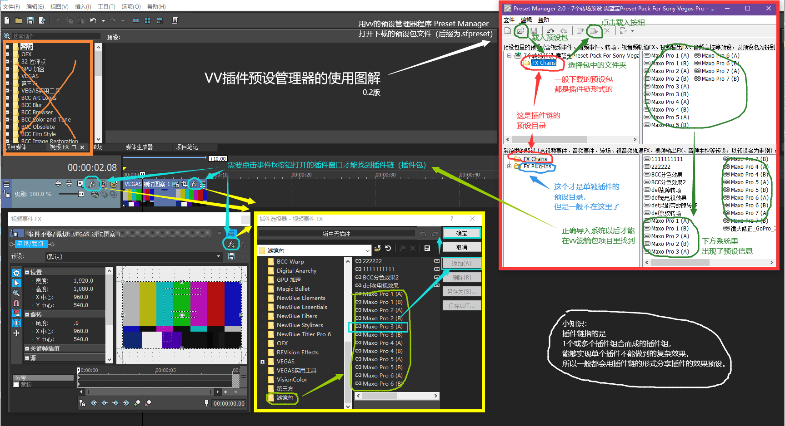

<p align="center">Illustration for using the VEGAS Preset Manager v0.2</p> -->

<br>

### Accessing VEGAS Internal Preferences

- VP18 and above: Hold **`Shift`**, then go to the top menu **`Options -> Internal`**.

- VP18 and below: Hold **`Shift`**, then go to the top menu **`Options -> Preferences`**, switch to the **`Internal`** tab.

<br>

## III. Solutions for Crashes, Freezes, Error Pop-ups Caused by Bugs

(The solutions provided here are general troubleshooting steps. They may not solve every problem.)

### 1. Disable GPU Acceleration

**`Preferences -> Video`**, under **`GPU acceleration of video processing`**, select **`Off`**. This option primarily manages whether video FX use GPU acceleration. While GPU acceleration can make FX preview and rendering smoother, it has **more bugs in lower VEGAS versions and is prone to causing crashes**. When troubleshooting, first try **disabling GPU acceleration**. For newer VEGAS versions (e.g., `22 build 250`), it's still recommended to enable it if your GPU performance is good and there are no other issues.

<br>

### 2. Disable VEGAS Error Reporting Pop-up

A common scenario: When running VEGAS / **clicking `File -> Render As`**, an error pop-up appears immediately.


**In this case, always check the box for `Show Problem Details` first to get the error content.**

Sometimes the error reporting feature itself might be the problem. Completely disabling it can help.

Two ways to disable error reporting pop-ups:

- **Locate the `ErrorReportClient.exe` file in the VEGAS installation directory and rename it.**

- Locate and run **`PRSConfig.exe`** in the VEGAS installation directory, select **`Disabled`**.

Either method will disable VEGAS error reporting pop-ups.

Sometimes the issue may persist. If so, re-enable it and focus on analyzing the error content. **The error content can sometimes provide useful clues. See [Troubleshooting Ideas for Specific Errors](#8-troubleshooting-ideas-for-specific-errors).**

<br>

### 3. Reinstall VEGAS

Reinstalling VEGAS only addresses problems where the software itself was not fully installed or program files are corrupted, so it's rarely needed. Reinstalling alone does not reset preferences.

<br>

### 4. Reinstall Hardware Drivers

Software issues can sometimes be caused by hardware drivers. For audio problems, try reinstalling your sound card drivers. For video problems, try reinstalling your graphics card drivers.

<br>

### 5. Reset Preferences

Encountering inexplicable issues, like **imported audio being completely noisy**, can sometimes be resolved by **resetting preferences**.

**Resetting will clear: [All preferences and cache for the current VEGAS version].**

The standard method: Hold `Ctrl + Shift` and run VEGAS. A "Reset?" prompt will appear. Check `Delete all cached application data` and click `Yes`.


<p align="center">Reset? (Y/N)</p>

However, resetting this way does not create a backup of your previous preferences. The original preferences will be completely cleared, which carries some risk. Therefore, I recommend backing up your preferences before resetting. See [VEGAS Preferences and Cache Directory](#vegas-preferences-and-cache-directory).

<br>

### 6. Install Microsoft Visual C++ and .NET Framework Runtimes

Microsoft Visual C++ Redistributables: https://learn.microsoft.com/cpp/windows/latest-supported-vc-redist

.NET Framework Repair Tool: https://support.microsoft.com/topic/942a01e3-5b8b-7abb-c166-c34a2f4b612a

<br>

### 7. Try a Different Version

**Whether a VEGAS version suits your PC is somewhat random.**

The most stable version is widely considered to be VP13. For a balance of stability and features, **VP18** is recommended. Newer versions are not guaranteed to be stable. Since the video engine update in `21 build 300`, VEGAS's slow video decoding and rendering issues are being gradually addressed. This improvement continues through VP22's final version. **Currently, I most recommend the VP22 final version (`22 build 250`), as it has significant improvements.** The latest VP23 is still not very stable.

VEGAS Pro / VEGAS Post Release History: https://www.vegascreativesoftware.info/us/forum/posts--104998/

<br>

### 8. Troubleshooting Ideas for Specific Errors

If you've tried almost all methods in this article (especially those in the [VEGAS Software Operation Q&A](#iv-vegas-software-operation-q-a) chapter) and the error persists, try this section's approach. Some errors, like `0xC0000005`, have no fixed, definite cause. Encountering such errors and finding that most solutions here don't work is perfectly normal. Searching online for the error code yields many solutions, but finding one that actually works can be like finding a needle in a haystack. This section provides a general troubleshooting idea:

1.  **Find the error details.** If error reporting is [enabled](#2-disable-vegas-error-reporting-pop-up), check the `Show Problem Details` box in the pop-up. Even with error reporting disabled, you might sometimes get error details. These two sources might provide different or additional information; it's advisable to check both.

2.  **Analyze the error details.** Look for two key points: the fault module and the error code. The fault module is on the `Fault Module` line.

    - If the fault module points to a component of another software, try uninstalling that software.
    - If it points to a VEGAS component, try reinstalling VEGAS or switching versions.
    - If it points to a system component, it's less certain.

    The error code is the `0x` followed by an 8-digit hexadecimal number. For example:

    - `0xC06D007F`: Consider video plugin issues. Move OFX plugins out of the OFX folder.
    - `0xE0434352`: Consider .NET component issues. Try repairing .NET Framework, or extension loading issues. Move extensions out of the extensions folder.

    Other clues: If the error content explicitly mentions a specific plugin or the keyword `OFX`, also consider video plugin issues.  

    If none of the above works, you'll have to search online for the error code for various solutions. Some issues might even require a system reinstall to resolve.

<br>

## IV. VEGAS Software Operation Q&A

Q: How to **localize** the VEGAS software interface (Chinese for example)?

A: The VEGAS program internally includes 9 languages: "English, German, French, Portuguese, Spanish, Polish, Chinese, Japanese, Korean". However, the installer provided on the official website is the International Language version, containing only the first 5 languages listed, **excluding Chinese**. There are three localization paths:

1.  **Use a Chinese installer.** Before [purchasing](#xvi-software-purchase-channels), check the language support list to see if Chinese is included. For example, the version on the official website currently does not include Chinese, while versions provided by the Chinese agent and the Steam edition include Chinese. Otherwise, you must try the latter two methods.

2.  **Use a localization pack created by other users.**

3.  **Modify the registry.** Modifying the registry can activate the Chinese language built into VEGAS, but compared to the first two methods, this built-in Chinese might be incomplete or inaccurate.

**Manual Registry Modification Steps:**

**With VEGAS already installed**, press `Win + R`, type `regedit` to open Registry Editor. VEGAS language settings are in the `ULangID` value of the following registry keys:

- VP20 and above:

```text
HKEY_LOCAL_MACHINE\SOFTWARE\VEGAS Creative Software\VEGAS Pro\23.0\Lang
HKEY_LOCAL_MACHINE\SOFTWARE\VEGAS Creative Software\VEGAS Creative Software Video Plug-In Pack\1.0\Lang
HKEY_LOCAL_MACHINE\SOFTWARE\VEGAS Creative Software\VEGAS Creative Software OFX GPU Video Plug-in Pack\1.0\Lang
HKEY_LOCAL_MACHINE\SOFTWARE\VEGAS Creative Software\Error Reporting Client\1.0\Lang
```

- VP19 and below:
```text
HKEY_LOCAL_MACHINE\SOFTWARE\Sony Creative Software\VEGAS Pro\19.0\Lang
HKEY_LOCAL_MACHINE\SOFTWARE\Sony Creative Software\Sony Vegas Video Plug-In Pack\1.0\Lang
HKEY_LOCAL_MACHINE\SOFTWARE\Sony Creative Software\Sony Vegas OFX GPU Video Plug-in Pack\1.0\Lang
HKEY_LOCAL_MACHINE\SOFTWARE\Sony Creative Software\Error Reporting Client\1.0\Lang
```

Here, `23.0` and `19.0` represent the current VEGAS major version. The first line is the main interface language setting, but it's recommended to change all four.


If you installed the English version, the default value for `ULangID` is likely `409`. Change it to **`804` for Chinese**.

<small>
For other language IDs, see Microsoft's documentation: <a href="https://learn.microsoft.com/openspecs/windows_protocols/ms-lcid">https://learn.microsoft.com/openspecs/windows_protocols/ms-lcid</a><br>
</small>

If **after changing the registry, VEGAS fails to start with `Error code: -1`**, navigate to the `language` folder in VEGAS's installation directory (default: `C:\Program Files\VEGAS\VEGAS Pro 23.0\language\`, where `23.0` is the version). **Rename any `local_xx_XX.cfg` file** (e.g., `local_en_US.cfg` for US English) **to `local_zh_CN.cfg`**.

<small>
Another useful tool: <code>Vegas Language Changer</code>: <a href="https://github.com/IZH318/Vegas-Language-Changer">https://github.com/IZH318/Vegas-Language-Changer</a>
</small>

The same principle applies to other MAGIX software like ACID Pro.

After successfully starting VEGAS, if the names of built-in video FX are still in English, you can try [clearing the plugin cache](#x-video-plugin-related-q-a).

<br>

Q: Error during installation: **PC needs to restart to continue installation**?  
`Setup has detected that the system is currently waiting for a reboot to complete a previous installation or update. To avoid problems, please reboot your system before installing.`


A: First, try restarting your PC. If that doesn't work, you need to modify the registry. Open Registry Editor, navigate to **`HKEY_LOCAL_MACHINE\System\CurrentControlSet\Control\Session Manager`**, **delete the value `PendingFileRenameOperations`**, then restart your PC.


<br>

Q: Error: **`An error occurred during the installation -2147163964. Unable to register module xxxxx.dll`**.


A: **Restarting your PC and reinstalling** usually fixes this. If it persists, try **installing a different version**.

<br>

Q: VEGAS won't start no matter what, **not even showing the loading window**?

A: This is an old issue: **VEGAS processes are stuck in the background**. **Open Task Manager, find and end all VEGAS-related processes, then try running VEGAS again.**

<br>

Q: VEGAS **crashes/freezes** at the "**Initializing GPU-accelerated video processing...**" step during startup?

A: First, try reinstalling your graphics card drivers. If that doesn't work, try this registry fix. Open Registry Editor, find the value:**`IntelOpenCL64.dll`** under **`HKEY_LOCAL_MACHINE\SOFTWARE\Khronos\OpenCL\Vendors`** and the value **`IntelOpenCL32.dll`** under **`HKEY_LOCAL_MACHINE\SOFTWARE\Wow6432Node\Khronos\OpenCL\Vendors`**. Change the data for both values **from `0` to `1`**, then restart VEGAS.

<br>

Q: VEGAS **crashes/freezes (Error code `0xC06D007F`)** at the "**Video plugin factory...**" step during startup?


A: This step loads video plugins. It's often an issue with OFX video plugin scanning. Go to the OFX path: **`C:\Program Files\Common Files\OFX\Plugins\`, move out potentially problematic plugins from this folder, then try starting VEGAS**. Once it starts normally, you can try moving the files back or reinstalling the plugin. If you have specific error details, try to find keywords related to the plugin name.  
**<small>(Prioritize checking Red Giant Universe plugins, as they cause startup crashes for many users.)</small>**

<br>

Q: VEGAS **hangs/crashes/freezes** at the "**Scanning VST plug-ins...**" step during startup?

A: Try **disabling VST scanning on startup**. Right-click the VEGAS **shortcut -> Properties**. In the **`Target`** field, add **` /NOVSTGROVEL`** at the end (**note the space before the slash**). Then run VEGAS using this shortcut. Once it starts normally, you can move problematic plugins from the [VST paths](#xi-audio-plugin-related), store them separately, etc.


<br>

Q: VEGAS **hangs/crashes/freezes** at the "**Initializing DirectX plug-ins...**" step during startup?

A: Similarly, try **disabling DirectX plugin scanning on startup** using the command **` /NODXGROVEL`**.

<br>

Q: VEGAS **crashes/freezes (Error code `0xE0434352`)** at the "**Initializing UI...**" step during startup, or **immediately after the main window appears**?

A: Possibly an extension issue. Try **deleting files from `C:\ProgramData\VEGAS Pro\Application Extensions\`** and other [extension folders](#xii-scripts-extensions-related). You can delete them all or try to isolate which extension is problematic.

<br>

Q: VEGAS startup error: **`Unable to initialize scripting host`** / other **.NET Framework** common errors (e.g., **`0xE0434352`**)?

A: VEGAS scripts rely on .NET Framework. Try running the .NET Framework Repair Tool: https://support.microsoft.com/topic/942a01e3-5b8b-7abb-c166-c34a2f4b612a

<br>

Q: VEGAS **crashes/freezes (Error code `0xC0000005`, fault module `C:\WINDOWS\SYSTEM32\ntdll.dll`)** at the "**Creating windows...**" step during startup?

A: Go to **`Control Panel -> Programs -> Programs and Features`** and check if **MSVC 1450 runtimes** are installed, i.e., the **14.50 version of `Microsoft Visual C++ 2015-2022 Redistributable` for both x86 and x64**. Microsoft distributed a version of these runtimes that causes VEGAS to crash. This version is automatically installed with **Visual Studio 2026** and may be installed for other reasons. This is a Microsoft issue, awaiting a complete fix from them. Some affected users found that just uninstalling the runtimes may not work. Here's a temporary workaround (**if you don't want to delve into DLLs, skip to the last step and use the `x64` `vcomp140.dll` I provided**):

1. Go to the Visual Studio download page: [https://visualstudio.microsoft.com/downloads/](https://visualstudio.microsoft.com/downloads/), find and download the Visual Studio 2022 Build Tools (filename `vs_BuildTools.exe`).

2. During installation, when prompted for additional components, go to `Individual components`, search for `MSVC`, check **`MSVC v143 - VS 2022 C++ x64/x86 build tools (latest)`**, and continue installation.


3. After installation, go to the MSVC installation path: `C:\Program Files\Microsoft Visual Studio\2022\Community\VC\Redist\MSVC\`. There will be folders like `v143` and `14.44.35112` (depending on the version you installed). The one resembling `14.44.35112` is the target.

4. Navigate to `14.44.35112\onecore\x64\Microsoft.VC143.OpenMP`, find **`vcomp140.dll`**, copy it, and paste it into your VEGAS installation directory. Restart VEGAS.

<small>
Download link for <code>x64</code> <code>vcomp140.dll</code>: <a href="/downloads/fixes/vcomp140.dll">vcomp140.dll</a><br>
If you are using <code>ARM</code> Windows, choose the <code>ARM</code> folder, not <code>x64</code>. If you don't know what <code>ARM</code> is, you are likely an <code>x64</code> user; use the <code>x64</code> version.<br>
Reference: <a href="https://www.vegascreativesoftware.info/us/forum/posts--149890/#ca943290">https://www.vegascreativesoftware.info/us/forum/posts--149890/#ca943290</a><br>
</small>

<br>

Q: After opening VEGAS, there's **noise/no audio/...**?

A: **Go to `Control Panel -> Hardware and Sound -> Sound`, open `Properties` for your current playback device. On the `Advanced` tab, under `Exclusive Mode`, uncheck `Allow applications to take exclusive control of this device`, OR change the `Default Format` to `2 channel, 24 bit, 44100 Hz`.** If that doesn't work, try **reinstalling your sound card drivers**.

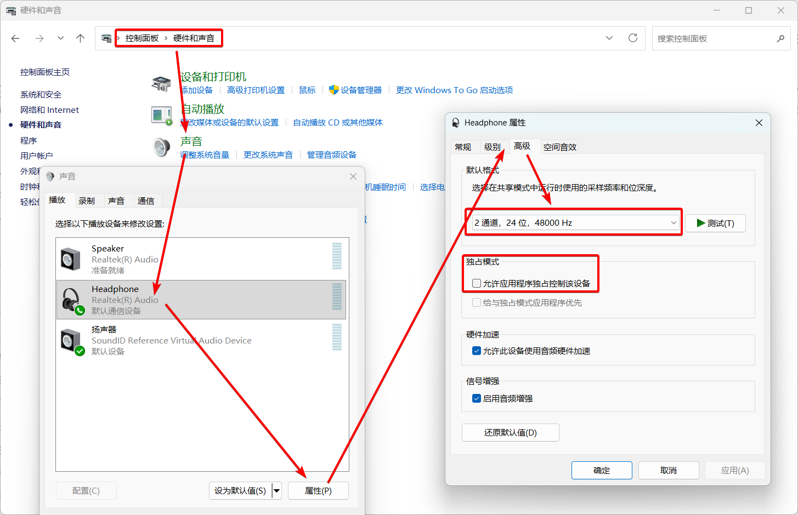

<br>

Q: **A specific project file crashes/errors on opening**?

A: Try **renaming any media file used in the project** so the project can't find it. When reopening, **ignore the "media offline" prompts**. After successfully opening, **rename the file back or replace it**.


<br>

Q: **Opening multiple VEGAS instances causes crashes**?

A: This can happen in all VEGAS versions due to a specific window layout. It's more likely when the Preview window is **undocked (floating)**. A temporary fix: **Before opening a new VEGAS instance, close or dock the Preview window of the old instance** to avoid potential crashes.

<small>
Reference: <a href="https://www.vegascreativesoftware.info/us/forum/posts--148817/">https://www.vegascreativesoftware.info/us/forum/posts--148817/</a><br>
</small>

<br>

Q: **After VEGAS starts, there's a WebView error (`msedgewebview2.exe`, or `WebView2 initialization failed`, etc.)**?

A: The VEGAS Hub feature uses Microsoft Edge WebView. If you **don't need the Hub, simply close its window via the menu `View -> Window`**. You can also try deleting the `WebView2` folder in the [VEGAS cache directory](#vegas-preferences-and-cache-directory): **`%localappdata%\VEGAS Pro\23.0\WebView2`** (where `23.0` is your VEGAS version).

<br>

Q: **[VP19]** After working for a while, VEGAS window suddenly **gets graphical corruption, UI glitches, becomes laggy, unable to continue**, forcing a restart?

A: This is a **VP19-specific issue in older builds (e.g., `19 build 341`)**. **Update to `19 build 651`** to resolve it.

<small>
Reference: <a href="https://www.vegascreativesoftware.info/us/forum/posts--131391/">https://www.vegascreativesoftware.info/us/forum/posts--131391/</a><br>
</small>

<br>

Q: **[VP19, VP20]** VEGAS crashes immediately after the loading screen, **with no error pop-up**?

A: Check your VEGAS build number. Is it `19 build 648` or earlier, or `20 build 402` or earlier?

Versions in this range have a critical bug causing a **direct crash after loading**, and can **only be opened by disconnecting from the internet or changing the system date**.

The fix is to **update VP19 to `19 build 651` or later, and VP20 to `20 build 403` or later**. (Note: VP19 final is `19 build 651`, VP20 final is `20 build 411`.)

<br>

Q: **[`22 build 122` and above]** VEGAS won't run, no loading screen?

A: A Windows update issue. Download and run vc_redist.x86.exe and vc_redist.x64.exe to repair C++ runtimes: https://learn.microsoft.com/cpp/windows/latest-supported-vc-redist

Feedback suggests updating other software (like OBS) might also be needed.

<small>
Reference: <a href="https://www.vegascreativesoftware.info/us/forum/posts--147255/">https://www.vegascreativesoftware.info/us/forum/posts--147255/</a><br>
</small>

<br>

Q: <sup>**French Version**</sup> The French version of VEGAS Pro crashes on startup?

A: This is an issue **specific to the French version**. The only solution is to **uninstall and reinstall the English version**. MAGIX intended to fix it but has no clear solution. Users who can reproduce this issue are encouraged to contact MAGIX support.

<small>
Reference: <a href="https://www.vegascreativesoftware.info/us/forum/posts--147150/#ca926950">https://www.vegascreativesoftware.info/us/forum/posts--147150/#ca926950</a><br>
</small>

<br>

## V. File Import Related

### General Troubleshooting for Files Not Importing/Importing with Glitches/Green Flashes:

#### 1. Enable/Disable Legacy AVC and HEVC Decoding

- VP18 and above: **`Preferences -> File I/O`, enable/disable `Legacy AVC decoding` and `Legacy HEVC decoding`**.

- VP15-17: Access [Internal Preferences](#accessing-vegas-internal-preferences), search for `Reader`, find:
  - `Use So4 Audio Reader for Intermediate/HEVC`
  - `Enable So4 Compound Reader for AVC/M2TS`
  - `Enable Mx Compound Reader for HEVC/ProRes` <sup>VP17 only</sup>

  `TRUE` = `Use new decoder`, `FALSE` = `Use old decoder`. Default is `TRUE`. Try changing these.

- VP14 and below use only the old decoder; cannot switch.

Since `21 build 300`, the meanings of "legacy" and "new" decoders have swapped. The original "legacy AVC/HEVC decoders" are now the default new decoders. The original "new AVC decoder" became the "legacy AVC decoder", and the original "new HEVC decoder" became the "experimental HEVC decoder".

For decoding issues (e.g., media turns **completely green or black**, **no video stream**, or even **audio decoding problems**), try **enabling or disabling these two legacy decoders**.

If that doesn't work, try switching the **`Hardware decoder`** option below (may require disabling legacy decoding).

<br>

#### 2. Disable Resample

`File -> Properties`, under `Resample`, select **`Disable resample`**.

Disabling resample addresses **frame-related issues**. If resample is enabled (e.g., 30fps footage in a 60fps project), **VEGAS generates frame blending between original frames** (visible as a **crossfade between two frames** when scrubbing frame by frame). **This can cause frame generation errors, resulting in flickering (green/black flashes). It's generally recommended to disable it.**

In VP13 and earlier, you **cannot modify the project's resample setting directly in `Project Properties`**. Instead, select an event on the timeline, **`Right-click -> Switches -> Disable resample`**.

<br>

#### 3. Install Corresponding Codecs

For example, QuickTime formats require QuickTime 7.7.9 installed with the QuickTime plugin selected during installation.

The question of installing K-Lite Codec Pack is still debated. Some users on the official forum say it "might conflict with VEGAS's built-in codecs" and advise against it.

<br>

#### 4. Re-encode Media Files

If the above methods don't solve **import failure/decoding issues/severe lag after import**, try re-encoding the file. Recommended settings: Video codec AVC, audio codec AAC, container mp4, constant frame rate. If only audio has issues, you can **extract the audio as a wav file** and import it back, grouping it (G) with the original video.

<br>

#### 5. Reset Preferences

A common scenario: **Imported audio is completely noisy**. In this case, try **[Resetting Preferences](#5-reset-preferences)**.

<br>

### File Import Q&A

Q: Can't **drag and drop files from folders** into VEGAS, only use the `Open` button?

A: If VEGAS is running **with administrator privileges**, drag-and-drop is disabled. The fix is to **run VEGAS without administrator privileges**.

Note: If you're using a **portable version of VEGAS (marked `Portable`)**, it might require administrator privileges to start, preventing drag-and-drop. Some "solutions" involve disabling UAC via registry, which is **not recommended**. **It's better to switch to a regular version, not the portable one.**

**Issues with Portable VEGAS: Requires administrator privileges; cannot run multiple instances; doesn't recognize system environment variables; some plugins (e.g., [Voukoder](#recommended-render-plugin-voukoder)) need manual connector placement. Avoid if possible.**

<br>

Q: Error when trying to import: **`Warning: An error occurred opening one or more files. The files could not be opened. Ensure the files exist and that you have access permissions to the file/folder.`**

A: Check if the VEGAS **installation path** contains **only [half-width English characters (including half-width spaces)]**. If it contains any other characters like Chinese, **uninstall and reinstall VEGAS to a path with only half-width English characters**.

<br>

Q: Want to **import mkv files**, but can't.

A: In VP17 and above, you can **`Preferences -> File I/O`, `Enable MKV reader`**, restart VEGAS, and try again.

This feature has many bugs, so import might still fail. If so, pre-convert with other software.

Note: `21 build 187` and above support mkv import by default; no need to enable manually.

Also: About converting mkv files

A video file has two layers: the inner encoding stream and the outer container. Import failure can be due to either unsupported stream or container.

For a file with **AVC (H.264)** stream and **mkv** container, VEGAS cannot import it due to **unsupported container**, but the **inner AVC stream is supported**. When converting, you can change only the container, not the stream. Using [FFmpeg](https://ffmpeg.org/), the command `ffmpeg -i input.mkv -c:v copy output.mp4` does this. In GUI converters (such as [`HandBrake`](https://handbrake.fr/)), this is often called `Copy` or `Remux`. It's fast and recommended.

For a file with **VP9** stream and **mkv** container, both stream and container are unsupported (VEGAS doesn't support VP9). Even converting container to mp4 won't work. You must **re-encode both stream and container**. For example, mkv files downloaded from YouTube might have VP9 video. Use a tool like [MediaInfo](https://mediaarea.net/en/MediaInfo) to check the codec.

<br>

Q: Video recorded by **OBS** imports into VEGAS with **incorrect, very short length**?

A: This happens when OBS uses fragmented MP4 for recording, which VEGAS can't decode properly. **Change the output format in OBS settings**. For existing footage, use the copy stream method, e.g., `ffmpeg -i input.mp4 -c copy output.mp4`.

<small>
Reference: <a href="https://www.vegascreativesoftware.info/us/forum/posts--144992/">https://www.vegascreativesoftware.info/us/forum/posts--144992/</a><br>
</small>

<br>

Q: **Cannot import some mov files with certain codecs**?

A: First, ensure you have QT Lite or QuickTime installed. **QT Lite 4.1.0** is generally recommended. For VP17 and above, the new decoder supports ProRes mov files, but other QuickTime codecs are no longer supported by default. You need to **`Preferences -> Deprecated Features`, `Enable QuickTime plug-in`** to import other QuickTime mov files.

Note: If installing Apple's `QuickTime 7.7.9`, ensure `QuickTime plug-in` is selected during installation.

**Since VP23, VEGAS has effectively dropped QuickTime compatibility and can no longer import or render QuickTime-encoded mov files.**

<br>

Q: After importing media files originally **with alpha channel (mov or png)**, the **alpha transparency is not displayed correctly** in VEGAS?

A: In VEGAS, **right-click the media file or event -> Properties**, switch to the `Media` tab, find `Alpha channel`, change it to **`Straight (unmatted)`**.  
<small>
(Note: For <code>Alpha channel</code>, <b>as long as you don't select <code>Undefined</code> or <code>None</code></b>, the alpha channel should display.)
</small>

You can also modify this property for multiple files in the **`Project Media`** window.

<br>

Q: Videos downloaded directly from **web platforms like TikTok** using tools like IDM (**audio codec `AAC LC SBR (HE-AAC)`**), when imported into VEGAS, have **random audio glitches, noise**, or are **incorrectly recognized as mono**?

A: This is **entirely a VEGAS software bug**, and as of the latest version (`23 build 302`), it's not fixed. **Testing shows all previous methods fail. The only solution is to extract/re-encode the audio and import it separately.** Videos downloaded via TikTok app are not affected.

<small>
Reference: <a href="https://www.vegascreativesoftware.info/us/forum/posts--140457/#ca884682">https://www.vegascreativesoftware.info/us/forum/posts--140457/#ca884682</a><br>
</small>

<br>

Q: 4:3 videos/images import **stretched horizontally** to 16:9. How to fix?

A: This happens when `4:3` media is imported into a `16:9` project with certain auto-configuration. Fix: **Right-click the media -> Properties -> Media tab**, find `Pixel aspect ratio`, change from `1.3333` to `1`, then click the save button next to the `Stream` section<sup>(`Save settings to video profile for future auto-detection`)</sup>. This ensures future `4:3` imports aren't auto-stretched. This can also be done for multiple files in the **`Project Media`** window.


<p align="center">Note: "Pixel aspect ratio" is a mis-translation; it should be "Pixel width:height ratio".</p>

If you get "**Unknown error occurred while trying to save video profile**":

1. Press **`Win + R`** for `Run`.

2. Enter (where `23.0` is your VEGAS version; include English quotes `""` around the path):
  - **`notepad "C:\ProgramData\VEGAS Pro\23.0\Vegas profiles.ini"`** <sup>VP17+</sup>
  - **`notepad "C:\ProgramData\VEGAS\VEGAS Pro\16.0\Vegas profiles.ini"`** <sup>VP14+</sup>
  - **`notepad "C:\ProgramData\Sony\Vegas Pro\13.0\Vegas profiles.ini"`** <sup>VP13-</sup>

3. Instead of clicking `OK`, press **`Ctrl + Shift + Enter`** to open the file with administrator privileges. Manually edit the default import profile for `4:3`, changing all `1.3333333333` values to `1`, then save.
  - Note: Opening without administrator privileges will cause Notepad to prompt `Save As` instead of writing to the original file.


<small>
Reference: <a href="https://www.vegascreativesoftware.info/us/forum/posts--128760/">https://www.vegascreativesoftware.info/us/forum/posts--128760/</a><br>
</small>

<br>

## VI. Software Operation and Display Q&A

Q: **Video Preview window shows nothing**?


A: Check if you've switched to the **`Trimmer`** window. If so, **switch back to the `Video Preview` window**. If you prefer the separated `Trimmer` and `Preview` window layout from older versions (VP14 and below), go to the menu **`View -> Window Layout`** and select **`Source Window Layout`**.

<br>

Q: Accidentally **closed/dragged out the xxxx window**. How to **get it back/dock it**?

A: Go to the menu **`View -> Window`** and enable the window you need. VEGAS window layout is highly customizable. Docked windows can be dragged out; undocked windows can be docked by dragging while holding **`Ctrl`**. Since VP23, windows can be docked above, below, left, or right of the timeline. Older versions only support docking above the timeline.

<br>

Q: Clicking **Pan/Crop button/FX button/xxxx button** **doesn't open the window**?/**xxxx window disappeared**?

A: Usually, the window was accidentally dragged below the Windows taskbar and can't be pulled up.

Easy fix: **Click the corresponding button, then immediately press `Alt + Space`, choose `Move`**, and drag the window up. Alternatively, hide the Windows taskbar temporarily, then drag. As a last resort, try `View -> Restore Default Layout`.


<br>

Q: Added an FX, but in the Preview window, the **FX is not fully displayed, appearing split left/right**?


A: As shown, check if **`Split Screen View`** is enabled.

<br>

Q: Clicked something, and a single video track **split into A/B tracks**. How to revert?

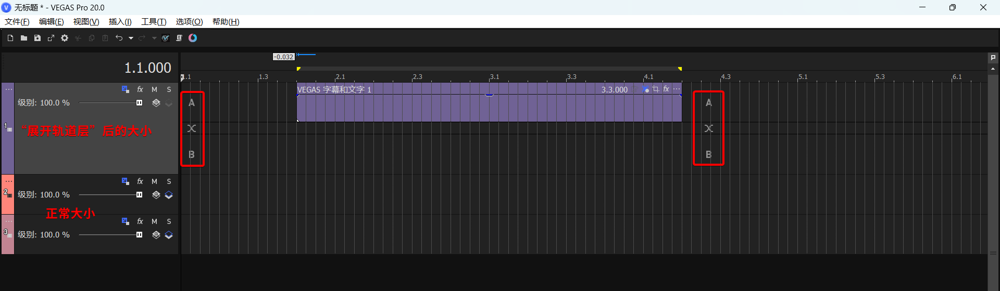

A: Usually, this happens by double-clicking the edge of an event. **Double-click the event edge again** to fix it.

If that doesn't work, in the track header (left side with `Level` and buttons), **Right-click -> Expand Track Layers**, and uncheck this option.

To prevent accidental triggering in VP18+, go to **`Preferences -> General`**, scroll to the bottom, and **disable `Double-click event edge to toggle expanded edit mode`**.

<br>

Q: Pressing **Undo (`Ctrl + Z`)** while the **Media Generator** window is open causes the Media Generator effect to **disappear from the preview**?

A: When focus is on the **Media Generator's edit window**, pressing **Undo (`Ctrl + Z`)** may cause the Media Generator's **`Frame size`** and **`Duration`** parameters to change to abnormal values. Repeatedly pressing `Ctrl + Z` likely won't help in this case.

Both parameters are located in the top-left corner of the Media Generator window. You need to manually **change the Media Generator's `Frame size` and `Duration` back to their original values**. By default, `Frame size` matches the project dimensions (e.g., `1920*1080`), and `Duration` defaults to 5 seconds (or `00:00:05.00` on the `Time & Frames` ruler).

- Another related minor bug: After modifying the `Frame size` and `Duration` of a Media Generator, if you immediately open a second Media Generator's edit window on the timeline, the second generator may inherit the `Frame size` and `Duration` parameters from the first one.

<br>

Q: **Some FX windows** (e.g., (legacy) Text, TV Simulator FX, other DXT plugins) **display incompletely**?

A:

1. Install the **sserife.fon** font.
    - Download link: https://github.com/taveevut/Windows-10-Fonts-Default/blob/master/sserife.fon

2. If installing the font doesn't help, go to **`Control Panel -> Region -> Administrative -> Change system locale`**. Ensure **`Beta: Use Unicode UTF-8 for worldwide language support`** is **NOT** checked, as shown below.


<small>
Reference: <a href="https://www.vegascreativesoftware.info/us/forum/posts--138828/">https://www.vegascreativesoftware.info/us/forum/posts--138828/</a><br>
</small>

<br>

Q: Project Properties / Custom Render Template / Preferences windows are **too large, can't display fully, can't click OK**?


A: VEGAS window size scales with Windows display settings. High DPI scaling can make VEGAS windows very large, causing cut-off displays at extreme scales. To click "OK", you can press the **`Enter` key**. If you need the full window displayed, you must **change the screen DPI scaling to 100%** in Windows Settings before opening the window, then change it back. Alternatively, **set VEGAS's DPI scaling individually to 100%**: Right-click the VEGAS executable or shortcut -> `Properties -> Compatibility -> Change high DPI settings`. **Set `Scaling performed by:` to `Application`**.

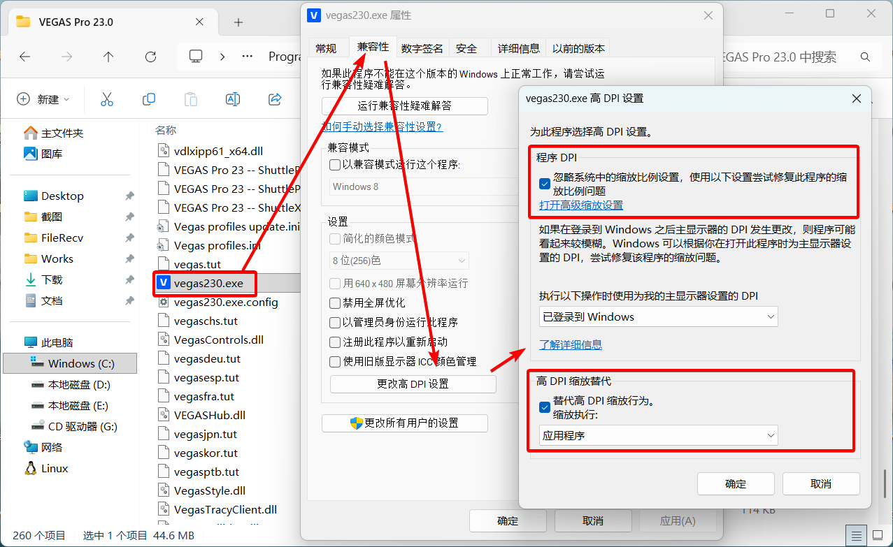

<br>

Q: After **switching back to VEGAS** from another software, it **takes a long time to buffer** before returning to normal?

A: **`Preferences -> General`**, uncheck `Close media files when application is inactive`. Note: When this option is disabled, **VEGAS keeps media files in use, preventing you from modifying/deleting the original files outside VEGAS**. (Doesn't affect replace/delete within VEGAS.)

<br>

Q: Trying to **drag a video from the `Project Media` window** to the timeline, but it **accidentally starts "trimming"**?

A: An old, annoying issue: Dragging on the video image triggers "trimming".

Standard fix: **Press `Ctrl + Z` to undo, then drag by the filename below the video thumbnail, not on the image itself.**

VP21 added a **`Bypass Hover Scrub`** button. Enabling it prevents misoperation, but you lose the ability to preview video by hovering (only see thumbnail).

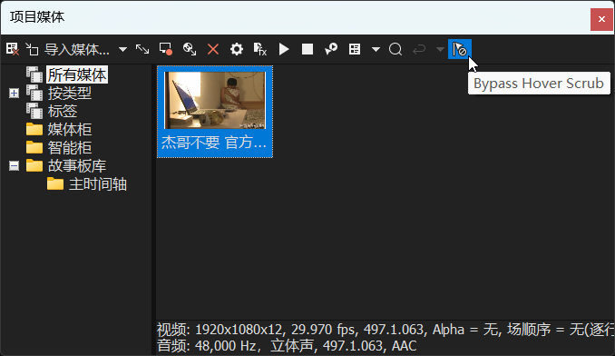

<p align="center">Actually, this button was added in VP20, but in VP20 it had no effect.</p>

<br>

Q: **When playing in VEGAS, pressing the spacebar makes the cursor return to the start. I want space to pause at the current position.**

A: In VEGAS, "Pause" means "stop playback, cursor stays", while "Stop" means "stop playback, cursor returns to start".

In VP22 and below, by default, **`Enter` is "Pause", `Space` is "Stop"**. In `21 build 108` and earlier, you could swap them via **`Preferences -> General -> Use spacebar and F12 for play/pause instead of play/stop`**.

Since `21 build 187`, this option moved to the **transport bar below the Preview window**, alongside play/pause/stop buttons. If not visible, expand the three dots on the right.

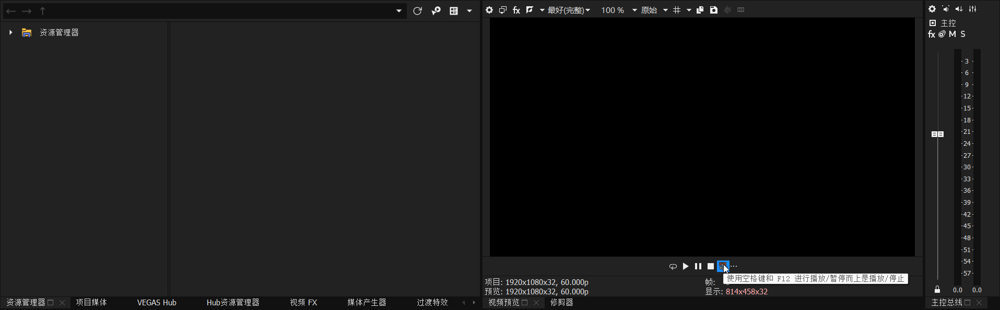

After the VP23 update, the default behavior changed: **`Enter` is "Stop", `Space` is "Pause"**. The option became `Use spacebar and F12 for play/stop instead of play/pause`, available in both `Preferences -> General` and the transport bar.

<br>

Q: **Crash when copying Pan/Crop keyframes**?

A: A Windows 11 update issue. **Upgrading to `22 build 250`** fixes it.

- Temporary fix for older VEGAS: **Right-click VEGAS executable/shortcut -> `Properties -> Compatibility`, under `Compatibility mode` select `Windows 8`**.

<small>
Reference: <a href="https://www.vegascreativesoftware.info/us/forum/posts--148746/">https://www.vegascreativesoftware.info/us/forum/posts--148746/</a><br>
</small>

<br>

Q: <sup>VP22+</sup> **Left-dragging on the timeline now selects events, can't select a time range anymore**?

A: After VP22, left-drag on the timeline selects events, while right-drag selects a time range. If you're used to the old logic, you can **check `Preferences -> Editing -> Use right mouse button to switch to selection edit tool`** to swap left/right button functions, similar to Reaper's default logic.  
<small>
If this happens in older versions, first confirm your edit tool is selected correctly (press <code>D</code> key twice).
</small>

This update also introduced a minor issue: the actual event selection area is slightly smaller than the mouse-drawn area due to a new offset value. Go to [Internal Preferences](#accessing-vegas-internal-preferences), search for **`Default SelectionMode Offset`**, change it to **`0`**.

<br>

## VII. Preview Related

### General Troubleshooting for Preview Flickering Green/Black, Footage Glitching, etc.

1. First try **[Disable GPU Acceleration](#1-disable-gpu-acceleration)**, **[Disable Resample](#2-disable-resample)**, **[Enable/Disable Legacy Decoders](#1-enabledisable-legacy-avc-and-hevc-decoding)**.

2. Switch the preview quality in the top-left of the Preview window (e.g., `Best (Full)`) to see if it normalizes.

3. **Specific plugin bug**: Try removing video FX that might cause the issue.

4. Re-encode all original media files and replace them.

5. Inexplicable preview flickering/glitching is frustrating. If the above methods fail, you might be out of luck.

<br>

### Preview Q&A

Q: After **adding FX / modifying subtitle text / editing FX**, the **Preview window doesn't update**. Changes only appear **after closing the FX window**?

A: This issue appears with **certain Nvidia driver versions**. Here are solutions:

1. **[Disable GPU Acceleration](#1-disable-gpu-acceleration)**. Simple and effective. **(Using integrated GPU acceleration also works.)**

2. To solve **while keeping GPU acceleration enabled**, modify OpenGL settings.

    Go to [Internal Preferences](#accessing-vegas-internal-preferences), search for **`Enable OpenCL/GL Interop`**, set to **`FALSE`**.

    Alternatively, change settings in the **Nvidia Control Panel**:

    Open **NVIDIA Control Panel**, click **`Manage 3D settings`** on the left, switch to the **`Program Settings`** tab on the right. Click `Add`, select the VEGAS executable, and change **`OpenGL GDI compatibility`** from `Use global setting` to **`Prefer compatibility`**. Restart VEGAS. (If you have multiple VEGAS versions, set each separately.)

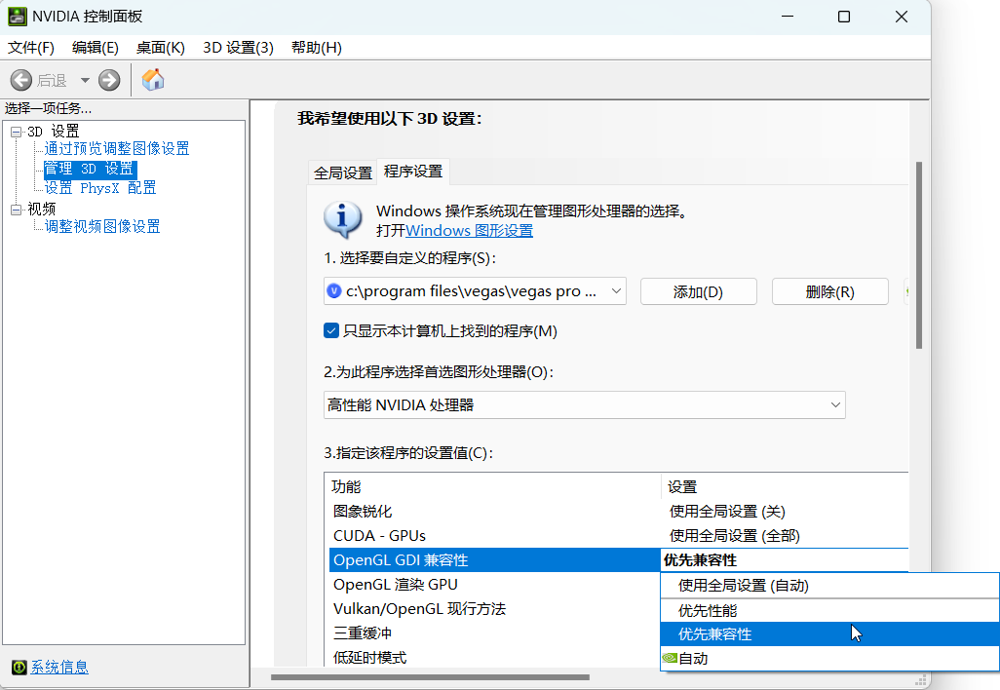

3. Roll back Nvidia driver to `522.30` or earlier, or update to the latest. When reinstalling, **choose "Custom" installation** and check **`Perform a clean installation`**. This resets all driver settings to default, so **not recommended**.

<small>
Reference: <a href="https://www.vegascreativesoftware.info/us/forum/posts--138196/">https://www.vegascreativesoftware.info/us/forum/posts--138196/</a><br>
</small>

<br>

## VIII. Rendering Related

### Recommended Render Plugin: Voukoder

When using VEGAS's built-in render templates, we often **need to constantly adjust resolution, frame rate, bitrate, etc.**, to match the project properties and achieve desired quality. However, there's a render plugin that **automatically matches resolution/frame rate to project properties and supports advanced CRF/CQP parameters for bitrate control**, allowing rendering **with less manual parameter tweaking**. This plugin is **Voukoder**.


Two versions: Voukoder Classic and Voukoder Pro.

- Voukoder Classic is free, supports VP12-VP22, but was removed by the original author Vouk.

  User backups on GitHub:
  - [https://github.com/FORARTfe/voukoderFREE](https://github.com/FORARTfe/voukoderFREE)
  - [https://github.com/FORARTfe/voukoder-connectorsFREE](https://github.com/FORARTfe/voukoder-connectorsFREE)  
  Requires installing both the Voukoder core (e.g., `Voukoder 13.4.1`) and the connector (e.g., `connector-vegas22-1.0.0.msi`).
- Voukoder Pro is currently paid. Official site: [https://www.voukoder.org/](https://www.voukoder.org/).
  - Voukoder Pro 1 was once free, but Voukoder Pro 2 became paid, with each major version requiring a separate purchase.

Other similar plugins include [DebugMode FrameServer](http://www.debugmode.com/frameserver.html) and [MagicYUV](https://www.magicyuv.com/). I don't use them often; they might suit more advanced users.

<br>

### General Troubleshooting for Render Crashes/Freezes/Errors

- Render Crash: VEGAS **suddenly goes white and crashes with an error** during rendering.

- Render Freeze: **Progress bar stops moving**, CPU/GPU usage in Task Manager is low, **clicking "Cancel" doesn't work**, forcing you to kill VEGAS via Task Manager.

- Render Error: Rendered video has **flickering frames/green screens**.

**Before rendering, ensure:**

- Project Properties and Render Template don't have problematic values. E.g., **Field order is progressive**, **width/height divisible by 4** (some encoders use 4x4 blocks), **frame rate is common** (especially strange decimals, aside from standard `23.976`, `29.97`, `59.94`).

- **Render template matches Project Properties exactly**. Mismatch can cause issues like Sapphire plugin position offset.

- When modifying bitrate in built-in templates, ensure **Maximum bitrate is larger than Average**, not equal.

1.  If render crashes with an **error pop-up**, see [Disable VEGAS Error Reporting Pop-up](#2-disable-vegas-error-reporting-pop-up).

2.  **[Disable GPU Acceleration](#1-disable-gpu-acceleration).**

3.  **Change encoder in render template.**


<p align="center">Available encoders depend on your GPU.</p>

4.  Modify the area around the frame where it freezes: delete FX, trim events, etc.

5.  Use a different render format (e.g., wmv).
  - Note: Default wmv template is: **resolution `1440*1080`, Pixel aspect ratio `1.3333`**. Although the final aspect ratio is 16:9, rendering directly with these parameters can cause issues. Manually change to **resolution `1920*1080`, Pixel aspect ratio `1`**.

6.  **<sup>Recommended</sup> Render using [Voukoder](#recommended-render-plugin-voukoder).**

7.  **<sup>Recommended</sup> Nest and Render.**
  - Create a new project, **drag the original .veg file directly into it**. After proxy creation, render directly. Nested rendering is slower; low-spec PCs may struggle.

8.  Segment Rendering.
  - For freezes, **split the project into small segments, render separately**, then create a new project, **combine all segments and render again**.
  - For random render errors (e.g., first render has issue in first half, second render has issue in second half), you can combine the good halves from both renders.

9.  **Render Image Sequence**. Start rendering from where it froze. **This at least preserves rendered files.** Finally, **import the image sequence back into VEGAS and render it as a video**. After each sequence render, **output to a new folder** to avoid overwriting, as VEGAS always starts numbering from `000000`.

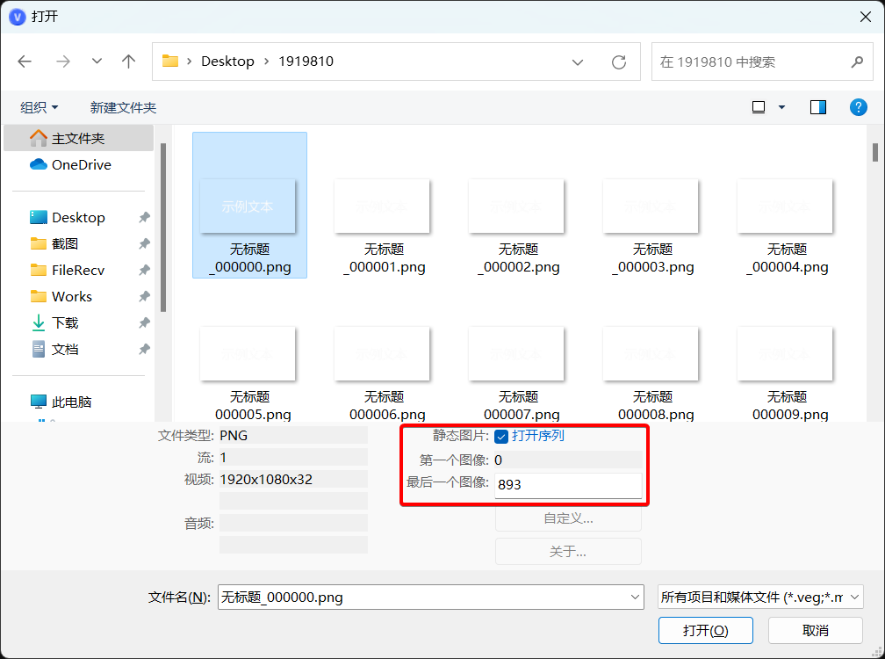

<p align="center">Importing an image sequence. It behaves like a video file; you can set frame rate.</p>

10. **Use [Voukoder](#recommended-render-plugin-voukoder), customize template, set output container to mkv**, and render from where it froze.
  - Unlike other formats, **mkv files remain playable and importable after a render freeze/crash**. **Note: Lower VEGAS versions cannot import mkv directly.**

11. Ask someone else to render.
  - Use `File -> Export -> .veg` to collect project media into a new folder. Compress and send to another trusted VEGAS user.

**Summary:** For render issues, try **methods 1, 2, 3** first. If they fail, prioritize **methods 6 and 7**. Other methods are references. Methods **8, 9, 10, 11** are last resorts.

<br>

#### Repairing Files from Failed Renders

As mentioned, only **image sequences** and **mkv container** preserve rendered progress after a failure. Other formats (mp4, mov, avi, wmv) leave a cache file, but it's not directly playable/importable; playback may show corruption. However, video repair software can sometimes fix these failed cache files using **a reference video sample successfully rendered with the same template**. I've tested [Digital Video Repair](https://risingresearch.com/zh/dvr/) (free) and [Wondershare Repairit](https://repairit.wondershare.com/) (paid, better results). You can try others.

<br>

### Rendering Q&A

Q: Clicking **`Render As`** (called **`Render`** in VP23+) to open the template list causes **error/crash**?

A: If there's an **error pop-up**, first try **[Disabling Error Reporting](#2-disable-vegas-error-reporting-pop-up)**.

If that fails, try temporarily moving all folders from the codec path **`...<VEGAS install path>\FileIO Plug-Ins\`**, restart VEGAS, insert a text event, and see if clicking `Render As` still crashes. If not, gradually move codecs back, restarting VEGAS and testing `Render As` after each to **identify the problematic codec**. Once found, avoid using that codec by not placing its folder back. This may prevent VEGAS from importing/rendering certain formats. (Prioritize checking `mxavcaacplug`.)

<br>

Q: Immediate render error: **`An error occurred creating media file xxx.mp4. Unable to determine the cause of the error.`**

A: In custom render template, **uncheck `Enable progressive download`**. Or try **[Voukoder](#recommended-render-plugin-voukoder)**.

<br>

Q: Immediate render error: **`An error occurred creating media file xxx.mp4. Error 0x80660008 (Message missing)`**

A: If you are using **NVIDIA NVENC encoder** and your **graphics driver version is > `590`**, then **built-in render templates in VP22 and below cannot call NVENC**, **forcing you to choose templates with other encoders**. Current solutions: **downgrade driver to `581.57` or below**, or **upgrade VEGAS to VP23 or above**. You can also use **[Voukoder's](#recommended-render-plugin-voukoder)** NVENC encoder without error.

<small>
Reference: <a href="https://www.vegascreativesoftware.info/us/forum/posts--150382/">https://www.vegascreativesoftware.info/us/forum/posts--150382/</a><br>
</small>

<br>

Q: Error when trying to **render m2ts**: **`The COM object could not be initialized.`**

A: Starting with **Win11 24H2**, Microsoft removed the **AC-3 codec** that VEGAS and other software depend on. On a **fresh install of Win11 24H2 or later**, this codec is missing, causing VEGAS to **fail decoding AC-3 audio in m2ts files** and **fail rendering m2ts**. Refer to [**this English tutorial**](https://www.elevenforum.com/t/ac-3-dolby-digital-codec-no-longer-included-with-windows-11-version-24h2.25597/post-459390) to add the AC-3 codec back, or **upgrade to VP22 final (`22 build 250`) or above**, which includes a new AC-3 codec.

<small>
Reference: <a href="https://www.vegascreativesoftware.info/us/forum/posts--147963/">https://www.vegascreativesoftware.info/us/forum/posts--147963/</a><br>
</small>

<br>

Q: Want to **stop rendering midway** but **keep the partially rendered video file**.

A: The **SeMW extension** render display window has this feature.


SeMW Extension official site: https://www.semw-software.com/en/extensions/

Note: Testing shows this feature **does not solve the "cannot cancel render" issue during a freeze**; you must kill VEGAS via Task Manager in that case.

<br>

Q: How to render **mov files with alpha channel**?

A:

- **QuickTime Plugin <small>(VP22 and below. Good compression for static images, small file size.)</small>**

  1.  Install QT Lite or QuickTime. **`QT Lite 4.1.0`** is recommended. For newer VP, also **`Preferences -> Deprecated Features -> Enable QuickTime plug-in`**.

  2.  In render template list, select `QuickTime` on the left. Choose any template on the right, click `Customize Template`, adjust parameters as shown:

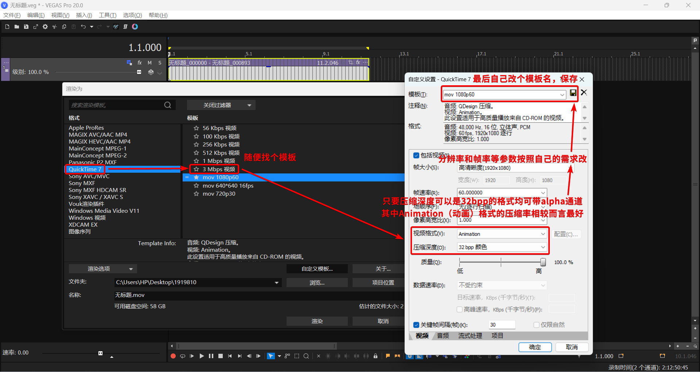

  3.  Save template and render.

  Due to poor compatibility, QuickTime format is listed under `Deprecated Features`. Testing shows importing many QuickTime mov files into VEGAS can cause issues (read failures, lag). Also, alpha channel isn't displayed by default on import; needs manual change. For compatibility, Apple ProRes is recommended.

  **Since VP23, VEGAS has effectively dropped QuickTime compatibility and can no longer import or render QuickTime-encoded mov files.**

- **Apple ProRes Template <small>(VP18+. If template doesn't exist, this method is unavailable.)</small>**

  As shown:


- **[Voukoder](#recommended-render-plugin-voukoder)<small>(VP18+, Voukoder Classic version 12.0+.)</small>**

  In Voukoder templates, find those marked **`4:4:4 10 bit with alpha channel`** and render. Or customize: Output container `QuickTime (.mov)`, Video encoder `ProRes KS` or `QuickTime Animation`.

<br>

Q: Preview or rendered file has **color difference/inconsistency** compared to the original media?

A1: In VP17 and below, **color space** settings in Project Properties and Render Template can cause **color shifts**.

Three solutions:

1.  **Use [Voukoder](#recommended-render-plugin-voukoder), create a template with `Filters` to convert color space.**


2.  Upgrade to VP18+. When opening an old project in new VP, change `Pixel format` in `File->Properties` from `Legacy 8-bit (video levels)` to **`8-bit (full range)`**, and **don't use render templates created in old VP**.

3.  Apply the `Levels` FX preset **`Computer RGB to Studio RGB`** to media files.

<small>
Reference: <a href="https://www.vegascreativesoftware.info/us/forum/posts--142942/">https://www.vegascreativesoftware.info/us/forum/posts--142942/</a><br>
</small>

<br>

A2: If source is **HDR footage**, change the **Project Properties `Color space` <sup>Fig 1</sup>** to match the source <sup>Fig 2</sup>. This switches the entire project to 10-bit color depth, making rendering slower than 8-bit.

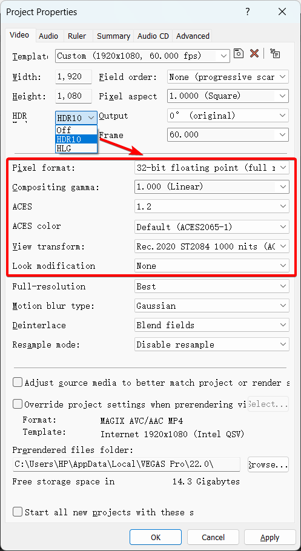

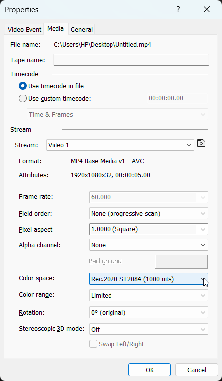

Alternatively, keep project color space unchanged and apply a color space conversion LUT to the source footage. Use the built-in `LUT Filter` FX or the newer `Color Grading` feature. The key is finding a LUT that converts the source color space to `Rec.709` standard. This loses HDR details, so if you don't plan to output HDR, avoid recording HDR footage initially.

<br>

Q: Rendered video has **color shifts (red becomes purple, blue becomes yellow, etc.)**?

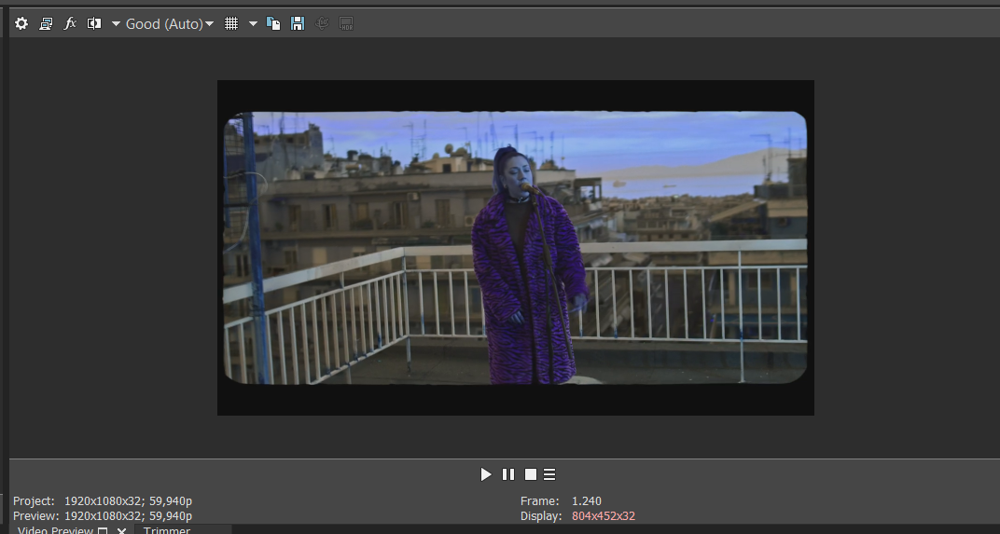

A: AMD GPU driver issue. Try:

- **[Disable GPU Acceleration](#1-disable-gpu-acceleration).**
- Roll back AMD driver to **23.7.2** or earlier, or update to **23.11.1** or later.
- Upgrading to `21 build 187` or later fixes this.
- **Before rendering**, add the built-in **`Channel Blend` FX to the Video Output Bus, select preset `RGBA -> BGRA`**.

<small>
Reference: <a href="https://www.vegascreativesoftware.info/us/forum/posts--142292/">https://www.vegascreativesoftware.info/us/forum/posts--142292/</a><br>
</small>

<br>

Q: **[VP18 and below] Cannot render videos taller than `2304` (e.g., vertical 4K)**?

A: In older versions, trying to set height above `2304` in a native template's custom dialog automatically reverts to `2304`. The easiest solution is to **use [Voukoder](#recommended-render-plugin-voukoder)** after setting your desired project properties.

Here's a "bug exploit" method using native templates:

1.  In Render As, choose a template allowing custom dimensions, like **`MAGIX AVC` or `MAGIX HEVC`**. On the right, pick a close template, click `Customize Template`.

2.  Modify all parameters except height to your desired values, and **change the template name at the top, but DO NOT click the save button yet**.

3.  Now, change the height to your desired value > `2304`. After typing, **DO NOT press `Enter` or `Tab`, or click elsewhere. Keep the cursor blinking in the height field, then click the save button next to the template name**.

4.  **After saving, click `Cancel`**. You'll notice it doesn't jump to your saved template, but the template is added to the list.

5.  Use this new template. If you clicked `OK` after saving, it jumps to a template with a `*`, which is wrong. Use the one without `*` from the list.

- Note: This method cannot exceed the encoder's maximum limit (e.g., `4096*4096` for NVENC).

<small>
Reference: <a href="https://www.vegascreativesoftware.info/us/forum/posts--149413/#ca939692">https://www.vegascreativesoftware.info/us/forum/posts--149413/#ca939692</a><br>
</small>

<br>

Q: After rendering, trying to play the project gives error: **`An error occurred starting playback. No request is enabled for this device.`**

A: VEGAS requests microphone permission after rendering. If a mic is connected but VEGAS lacks permission, it errors. Fix: **Enable microphone permission for VEGAS in Windows Settings**. Alternatively, try switching audio devices in `Preferences -> Audio Device` or clicking `All Defaults`, then render again to see if it permanently fixes. (Switching once is temporary.) As a last resort, reinstall sound card drivers.

<br>

Q: Videos rendered with **[Voukoder](#recommended-render-plugin-voukoder)** (or built-in templates) look fine locally but show **horizontal stripes** when uploaded to YouTube/other sites at full resolution?

A: Voukoder auto-matches project properties. In VP17 and below, the default project template has `Field order` set to `Upper field first` (interlaced). Local players support deinterlacing, so it looks fine. Sites like YouTube may not, showing interlacing stripes. For Voukoder, **change `Field order` in `Project Properties` to `Progressive (no fields)`** before rendering. For built-in templates, **avoid templates with `i` in the name; choose those with `p`**.

<br>

Q: **Built-in render templates lack image sequence options**?

A: This bug was fixed in VP19. For older versions, try these (not guaranteed):

1.  Install/Reinstall HEIF Image Extensions: [https://apps.microsoft.com/detail/9pmmsr1cgpwg](https://apps.microsoft.com/detail/9pmmsr1cgpwg).

2.  Use the image sequence render script.
  - Download link: https://www.vegascreativesoftware.info/us/forum/posts--133068/?page=3#ca863786

3.  Render to another format (`.mov`), then convert using [FFmpeg](https://ffmpeg.org/).

<small>
Reference: <a href="https://www.vegascreativesoftware.info/us/forum/posts--133068/">https://www.vegascreativesoftware.info/us/forum/posts--133068/</a><br>
</small>

<br>

Q: In render templates, **wav and avi template output formats changed to .wdp**?

A: The only known effective fix is **reinstalling Windows via the Windows Update Tool**.

- Update Tool: https://www.microsoft.com/software-download

It updates your system to the latest version, taking hours. This method keeps most installed software, files, and settings.

The exact repair principle is unclear.

<small>
Reference: <a href="https://www.vegascreativesoftware.info/us/forum/posts--83436/">https://www.vegascreativesoftware.info/us/forum/posts--83436/</a><br>
</small>

<br>

Q: **[Win7 VP18+]** **Clicking `Render As` immediately errors**: **`An error occurred creating media file. Error 0x80131501 (Message missing)`**


A: Normally, Win7 only supports **up to VP17**. VP18+ on Win7 throws this error.

There's a workaround: replace the rendering component DLL in the newer VP install directory with one from an older VP18 build.

This may affect stability, so upgrading to Win10 is advised.

<small>
Reference: <a href="https://www.vegascreativesoftware.info/us/forum/posts--128221/">https://www.vegascreativesoftware.info/us/forum/posts--128221/</a><br>
</small>

Download link for `18 build 284` `RenderAsDialog.dll`: [RenderAsDialog.dll](/downloads/fixes/RenderAsDialog.dll)

<br>

## IX. Subtitles Q&A

Q: Subtitle file won't import / imports as **garbled text**?

A: Open the subtitle file in Notepad, **Save As with UTF-8 encoding**, then import.

<br>

Q: Using "**Titles & Text**" to edit text. Selected the correct font, but **font in Preview window doesn't change, cannot switch fonts**?

A: This is a "Titles & Text" issue; its font compatibility is poor.

Solutions:
- **Set the font style in a Word document first, then copy-paste into VEGAS Titles & Text.**
  - You can use any rich-text editor.

- Or use **(legacy) Text** or **ProType Titler**; they are less prone to this.
  - In newer VP, enable them in `Preferences -> Deprecated Features`.

- In some cases, Windows Unicode settings might be the cause. Go to **`Control Panel -> Region -> Administrative -> Change system locale`**, ensure **`Beta: Use Unicode UTF-8 for worldwide language support`** is **NOT** checked.


In VP20, the "Titles & Text" feature "**Transfer Subtitle Attributes**" is also affected, making some fonts unusable with this function.

<br>

Q: Clicking menu **`Insert -> Subtitle from File`** **doesn't open the insert window**, no response?

A: A relatively rare bug, seemingly unfixed. It might work one day and stop the next. Currently, the only known fix is **[resetting preferences](#5-reset-preferences)**.

<small>
Reference: <a href="https://www.vegascreativesoftware.info/us/forum/posts--137861/">https://www.vegascreativesoftware.info/us/forum/posts--137861/</a><br>
</small>

<br>

Q: Using "**Credit Roll**", editing text causes **VEGAS freeze/crash**?

A: Microsoft Input Method issue. In **Microsoft Pinyin Input Method settings, find `Compatibility`, enable `Use previous version of Microsoft Pinyin Input Method`**.

<br>

Q: Importing a text file into "**Credit Roll**" displays **garbled text**?

A: Open the text file in Notepad, **Save As with ANSI encoding**, then import.

<br>

Q: On high-resolution screens, using "**ProType Titler**" causes **UI glitches/tiny unreadable text**?


A: DPI scaling issue when system scaling >= 150%. Right-click VEGAS executable/shortcut -> `Properties -> Compatibility -> Change high DPI settings`. **Set `Scaling performed by:` to `System (Enhanced)`**.


<br>

Q: **[VP20, VP21]** **"Transfer Subtitle Attributes" function in Titles & Text errors (as shown)**?

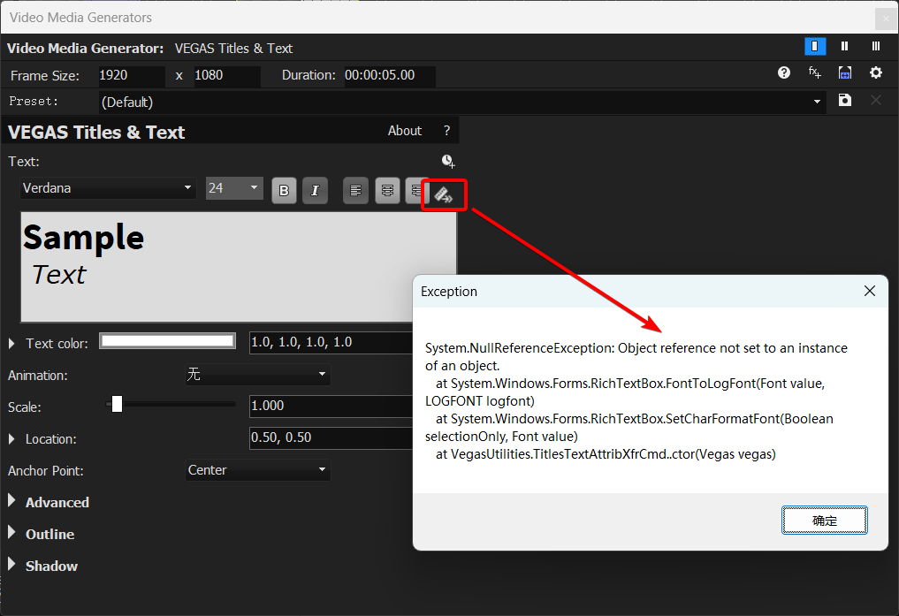

A: The issue occurs when the text box contains **mixed formatting (different fonts, sizes, etc.)** that cannot be transferred. Try **unifying the text format** first before using the function. **VP21 final build 315 fixed this.** Older versions (including pre-VP20) can use a script I wrote with similar functionality, no error, but also doesn't support mixed formatting transfer. Script installation path see [Scripts](#xii-scripts-extensions-related).

- [Transfer Subtitle Attributes] Script download: https://github.com/zzzzzz9125/VegasScripts/blob/main/Transfer%20Subtitle%20Attributes.cs

  - Usage: Select a single "Titles & Text" event on a track, run the script to match other subtitle events on the same track to its attributes.

<small>
Reference: <a href="https://www.vegascreativesoftware.info/us/forum/posts--145461/">https://www.vegascreativesoftware.info/us/forum/posts--145461/</a><br>
</small>

<br>

**Additional Note:** (VP18+) How to change the default tool for `Insert Text Media`:

VEGAS has three main text tools: Titles & Text, (legacy) Text, ProType Titler. `Right-click track -> Insert Text Media` defaults to "Titles & Text". To use the other two, you must drag them from "Media Generators", which can be cumbersome. Here's how to change the default:

Access [Internal Preferences](#accessing-vegas-internal-preferences), search for `Text Media Generator GUID`. Change its value to the GUID of your preferred tool (default is Titles & Text).

GUIDs:

- Titles & Text: `{Svfx:com.vegascreativesoftware:titlesandtext}`

- (legacy) Text: `{0FE8789D-0C47-442A-AFB0-0DAF97669317}`

- ProType Titler: `{53FC0B44-BD58-4716-A90F-3EB43168DE81}`

Knowing the GUID, you can set it to any Media Generator FX's GUID, making "Insert Text Media" create that generator directly.

<br>

## X. Video Plugin Related

VEGAS video plugins fall into two categories: DirectX Transform (DXT) plugins, developed specifically for VEGAS, and OpenFX (OFX) plugins, a universal standard. Older plugins might be DXT (e.g., NewBlue 2012, Neat Video 3.1.1). Newer plugins are usually OFX. Some legacy VEGAS FX, like Soft Contrast FX, ProType Titler, are also DXT plugins.

The VEGAS Pro Video FX List summarizes all available **`Video FX`** in VEGAS Pro, including their **`Names`**, **`Groups`**, **`UIDs`**, and other information, making it easy to search and browse online. **[Enter here.](./videofxlist)**

<br>

### VEGAS Plugin Cache Files

- Scan Cache: `%localappdata%\VEGAS Pro\23.0\svfx_plugin_cache.bin`

- Name Cache: `%localappdata%\VEGAS Pro\23.0\plugin_manager_cache.bin`

- Thumbnail Cache: `%localappdata%\VEGAS Pro\23.0\FX Thumbnails\fx_thumbnail_cache.bin`

Where `23.0` is your VEGAS version. Plugin cache stores scanned plugin/FX info. VEGAS stuck at "Creating video plugin factory..." is **regenerating plugin cache**, scanning for new plugins.

<br>

### OFX Related Paths

- **Common OFX Path**: `C:\Program Files\Common Files\OFX\Plugins\`

- **VEGAS-specific OFX Path**: `...<VEGAS install path>\OFX Video Plug-Ins\`

Note: An OFX plugin may consist of the plugin core and the OFX interface files. The OFX path is for the interface files. Without them, VEGAS **won't scan** the plugin. Common OFX path plugins are also scanned by other OFX-supporting software (Premiere Pro, DaVinci Resolve). The VEGAS-specific path is scanned only by that VEGAS version.

OFX interface file structure:

```
<OFX Path>/
├── xxx.ofx.bundle/
│ └── Contents/
│ ├── Presets/
│ │ ├── PresetPackage.xml
│ │ ├── PresetPackage.zh-CN.xml
│ │ └── ...
│ ├── Resources/
│ │ ├── xxx.xml
│ │ ├── xxx.zh-CN.xml
│ │ └── ...
│ └── Win64/
│ └── xxx.ofx
└── yyy.ofx.bundle/
 └── ...
```

`Win64\xxx.ofx` is the OFX interface file. `Presets\PresetPackage.xml` contains built-in presets. `Resources\xxx.xml` is the language translation file.

Note: Editing OFX paths often requires administrator privileges. For `xml` files, I recommend `Visual Studio Code`, which prompts for administrator privileges on save.

After modifying language files, delete the **plugin name cache** mentioned earlier and restart VEGAS to see changes.

User-saved OFX plugin FX presets: `%userprofile%\Documents\OFX Presets\`

<br>

### DXT Related Info

- **Built-in DXT Path**: `...<VEGAS install path>\Video Plug-Ins\`

Strictly, DXT plugins don't have a mandated folder like OFX. They are DLL files requiring registration via `regsvr32 xxx.dll`. This allows placing external DXT plugins anywhere and registering them for VEGAS to recognize. Useful for manual registration plugins like [Route Animation](https://www.vegascreativesoftware.info/us/forum/posts--105615/) (`RouteAnimationX64.dll`).

<br>

### Video Plugin Q&A

Q: Changed VEGAS to other language via registry, but **built-in plugin names are still English**. How to fix?

A: **Delete the plugin name cache** mentioned above, restart VEGAS. Or simply **[reset preferences](#5-reset-preferences)**.

<br>

Q: **Already uninstalled a plugin**, but it **still appears in VEGAS FX list**, and clicking it crashes?

A: Check if **corresponding files in OFX paths** are cleaned up. If cleaned and still appears, try **deleting the VEGAS plugin cache files**.

<br>

Q: **Browsing to a specific FX in Video FX/Transition FX/Media Generator FX windows causes immediate crash**?

A: This is usually a **thumbnail loading crash**. No direct fix; you can only avoid it. If you don't need that plugin series, find its OFX files (external in common path, VEGAS-built-in in specific path) and remove them. If you still want the plugin series but not that FX, **try editing the `xml` translation file** to move it to the end, avoiding accidental selection.  
<small>Alternatively, use the <b>FX Search extension [VPConsole](https://www.ratinfx.com/vpconsole/)</b> as a replacement.</small>

<br>

Q: **Using the plugin search box causes white screen/freeze**, making it unusable?

A: With many plugins installed, older VEGAS versions often freeze when using search, taking a long time to recover. **VP18 fixed this**, so upgrading to VP18+ is recommended for smooth searching.  
<small>Alternatively, use the <b>FX Search extension [VPConsole](https://www.ratinfx.com/vpconsole/)</b> as a replacement.</small>

<iframe width="560" height="315" src="https://www.youtube.com/embed/4ZZBfTb2Ubg?si=vkKTf8trYe8t6RR5" title="YouTube video player" frameborder="0" allow="accelerometer; autoplay; clipboard-write; encrypted-media; gyroscope; picture-in-picture; web-share" referrerpolicy="strict-origin-when-cross-origin" allowfullscreen></iframe>

<br>

Q: **Using built-in AI FX prompts to install VEGAS Deep Learning Models component**?  
`This plug-in requires additional data. Please log into your Service Center account and download the Deep Learning Models component from the My Products section.`

A: For newer built-in AI FX, **you must install the corresponding version of Deep Learning Models** separately.

<small>
Official AI Deep Learning Models download: <a href="https://www.vegascreativesoftware.info/us/forum/posts--104782/">https://www.vegascreativesoftware.info/us/forum/posts--104782/<br></a>
</small>

<br>

Q: Built-in **`LUT Filter` FX cannot recognize selected `.cube` files**?

A: Check if the **full path to the `.cube` file contains only [half-width English characters]**. If it contains any other characters like Chinese, **move the file to a path with only half-width English characters**, then reselect it.

<br>

Q: **Some Sapphire plugin FX ignore alpha channel, covering the background underneath**?

A: As shown, enter the FX's `Help` and disable its `GPU` acceleration individually.


If that doesn't work, **disable VEGAS's own `GPU Acceleration`**.

<br>

Q: Standalone Mocha works, but **OFX plugin version Mocha called via VEGAS crashes**?

A: Try **rolling back/updating your graphics driver**.

<br>

Q: **[VP21]** Adding **`3D LUT Creator` plugin** causes **crash/freeze**?

A: You can save this FX as a plugin chain in an older VEGAS version, then apply the chain in VP21. This bug is fixed in VP22.

<small>
Reference: <a href="https://www.vegascreativesoftware.info/us/forum/posts--144354/">https://www.vegascreativesoftware.info/us/forum/posts--144354/</a><br>
</small>

<br>

## XI. Audio Plugin Related

VEGAS audio plugins fall into two categories: DirectX plugins (older) and VST plugins (current standard). Apart from VEGAS's built-in "no prefix" and `ExpressFX` series audio FX (which are DirectX), all other audio plugins are VST. The `eFX` series built into VP16+ are also VST. Older VEGAS supports VST2; VP20+ also supports VST3. No VEGAS version supports VSTi.

<br>

### VST Related Paths

- **Common VST Path**: `C:\Program Files\VSTPlugins\`

<small>
If other software changed the common VST path, VEGAS follows that. You can check the registry key <code>HKEY_LOCAL_MACHINE\SOFTWARE\VST</code>, value <code>VSTPluginsPath</code>.
</small>

- **VEGAS-specific VST Path (VP16+)**: `...<VEGAS install path>\MAGIX Plugins\`

<br>

You can also manually set VST paths in `Preferences -> VST Effects`. Older VEGAS limits to 3 paths; VP20+ has no limit.

<br>

User-saved VST plugin FX presets:
- `%userprofile%\Documents\VST2 Presets\`
- `%userprofile%\Documents\VST3 Presets\`

<br>

Q: How to edit VST paths externally, not through VEGAS preferences?

A: Go to registry key:
- `HKEY_CURRENT_USER\Software\VEGAS Creative Software\VEGAS Pro\23\Metrics\x64\VstCache\SearchPaths` <sup>VP20+</sup>
- `HKEY_CURRENT_USER\Software\Sony Creative Software\VEGAS Pro\19.0\Metrics\VstCache\SearchPaths` <sup>VP19-</sup>
- Where `23`/`19.0` is your VEGAS version.

There are `Path 1`, `Path 2`, etc., corresponding to VST paths in preferences.


`CheckSum` is for VEGAS to check if rescan is needed; you can ignore it. Focus on `Path` (absolute path string) and `Flags` (`3` = scan, `0` = don't scan). Modify as needed.

If VST scanning has issues and rescanning via preferences doesn't help, you can delete the `Mappings` subkey under `VstCache`, then restart VEGAS to rescan.

<br>

### Audio Plugin Q&A

Q: Newer versions can't scan **32-bit VST plugins**?

A: **`Preferences -> Audio -> Enable support for 32-bit VST plug-ins (experimental)`**.

<br>

Q: In newer versions, some **VST plugin GUIs display incompletely**?

A: Seems VST2-specific. If the plugin has a VST3 version, **use the VST3 version**.

<br>

Q: **DirectX plugins not showing in Audio FX list**/**showing but invalid when added**/**plugin becomes Demo version, adding causes beeping**?

A: **Uninstall VEGAS**, then delete all files in **`C:\Program Files (x86)\VEGAS\Shared Plug-Ins\Audio_x64\`** (for VP13-: `C:\Program Files (x86)\Sony\Shared Plug-Ins\Audio_x64\`), then **reinstall VEGAS**. (If multiple VEGAS versions, uninstalling one is enough; the uninstall is just to allow reinstallation later.)

<small>
Reference: <a href="https://www.vegascreativesoftware.info/us/forum/posts--143986/">https://www.vegascreativesoftware.info/us/forum/posts--143986/</a><br>
</small>

<br>

Q: After adding a **Limiter FX (built-in `eFX_Limiter` or other VST limiter)** to the Master bus, **adding pan envelopes and envelope points** to any audio track causes **crackling/zipper noise**?

A: A weird bug occurring when **pan envelope point type is `Smooth` or `Sharp`**. Fix: **Change the envelope point type to another**.

<br>

## XII. Scripts/Extensions Related

VEGAS supports custom scripts in `C#` (or `JScript`, `Visual Basic`) to optimize workflows.

- **Script**: Must be run manually by the user; relatively simple functionality.

- **Extension**: Can run automatically when VEGAS starts. Enables more complex features, like creating dockable windows within VEGAS.

<small>
This section only covers installation issues. For tutorials, see: <a href="https://www.vegascreativesoftware.info/us/forum/posts--104563/">https://www.vegascreativesoftware.info/us/forum/posts--104563/</a><br>
</small>

<br>

**Valid Script Installation Paths:**

```text{1}
C:\ProgramData\VEGAS Pro\Script Menu\
C:\ProgramData\VEGAS Pro\23.0\Script Menu\
%userprofile%\Documents\Vegas Script Menu\
%appdata%\VEGAS Pro\Script Menu\
%appdata%\VEGAS Pro\23.0\Script Menu\
%localappdata%\VEGAS Pro\Script Menu\
%localappdata%\VEGAS Pro\23.0\Script Menu\
...<VEGAS install path>\Script Menu\
```

<br>

**Valid Extension Installation Paths:**

```text{1}
C:\ProgramData\VEGAS Pro\Application Extensions\
C:\ProgramData\VEGAS Pro\23.0\Application Extensions\
%userprofile%\Documents\Vegas Application Extensions\
%appdata%\VEGAS Pro\Application Extensions\
%appdata%\VEGAS Pro\23.0\Application Extensions\
%localappdata%\VEGAS Pro\Application Extensions\
%localappdata%\VEGAS Pro\23.0\Application Extensions\
```

<br>

Where `23.0` is your VEGAS version. The first path (`C:\ProgramData\...`) is my top recommendation. Note: `ProgramData` is a hidden folder by default. For Sony-era (VP13-) paths, add a **`Sony`** folder above `VEGAS Pro`, e.g., `C:\ProgramData\Sony\VEGAS Pro\Script Menu\`.

<br>

Due to API changes in history, scripts/extensions for SonicFoundry-era, Sony-era (VP13-) and MAGIX-era (VP14+) VEGAS are not directly compatible. Very ancient SonicFoundry-era uses `SonicFoundry.Vegas` namespace; relatively ancient Sony-era uses `Sony.Vegas`; morden MAGIX-era uses `ScriptPortal.Vegas`. For source code files (`.cs`, `.js`, `.vb`), you can edit the namespace manually in a text editor. For pre-compiled `.dll` files, you must modify the source project and recompile.

<br>

### General Steps to Install a Script or Extension

Using extensions as an example; similar for scripts. For other paths, see the [lists above](#xii-scripts-extensions-related).

1.  Copy `C:\ProgramData\VEGAS Pro\` and paste into File Explorer's address bar to navigate.

2.  Check if the `Application Extensions` folder exists. If not, create it with the exact name. Enter the folder.

3.  Copy all required `.dll` files for the extension and paste them directly here. E.g., `C:\ProgramData\VEGAS Pro\Application Extensions\UltraPaste.dll`.
    *   Some scripts/extensions may include `16*16` `.png` icon files. You can optionally place these. Icons appear in VEGAS menus/toolbars for identification.

4. If some scripts/extensions require additional installers, please follow the installation steps they provide.

<br>

## XIII. Project File Backup and Recovery

**Most important advice upfront:**

<p align="center"><big><b>Develop a good habit of pressing <code>Ctrl + S</code> frequently!</b></big></p>

This section helps with situations like **saved project file disappearing/corrupt**, **software crash before saving**, etc.

<br>

### 1. The `.veg.bak` File Beside Your Project

This is a **backup from the second-to-last save**. To recover, **rename the `.veg.bak` file to `.veg`** and open in VEGAS. If you rarely save manually, this backup could be very old.

<br>

### 2. VEGAS's Default 5-Minute Auto-Save

VEGAS auto-saves every 5 minutes for crash recovery.

Standard recovery method: After a crash, **don't open the original project directly**. **Run VEGAS, start a new empty project**. VEGAS should prompt "**Project recovery available**". Recover from there.

This method is somewhat cumbersome. If you open the original project directly, the prompt won't appear. If you then modify the original project, it **might overwrite the auto-save file**, making recovery via this method impossible. Therefore, I recommend **manually locating the auto-save files**.

Simple method: Go to the **[VEGAS Cache Directory](#vegas-preferences-and-cache-directory)** (**`%localappdata%\VEGAS Pro\`**) <small>(or simply **search `autosave` on `C:`**)</small>, sort by date, find `.veg` or `.veg.bak` files, copy them out, **rename** to `.veg` as in [1](#_1-the-veg-bak-file-beside-your-project), open, verify, then save elsewhere.

The default auto-save interval is 5 minutes. To change, go to [Internal Preferences](#accessing-vegas-internal-preferences), search for `msAutoSaveInterval`. Default is `300000` milliseconds. Change as desired.

<br>

### 3. Advanced Save (VP16+)

**My current top recommendation** for project recovery, but requires prior setup.

Advantages:

- Backup files are saved in the **same directory as the project**, no need to search the cache directory.

- Easy adjustment of backup intervals.


<p align="center">Menu: <b><code>Tools -> Advanced Save</code></b>.</p>

Two functions: Live Save and Advanced Backup.

- **`Live Save`**: **Saves after every single operation**, ensuring the project file is **always up-to-date**.
  - Because it saves after every action, it **can cause significant lag on large projects, so it's NOT recommended**.

- **`Advanced Backup`**: Creates additional `.veg` backup files.

  Several tiers: **Minute/Hour/Daily/Live**.

  - `Minute backups`: Saves 1 `.veg` backup **every `x` minutes**, **keeping only backups from the last hour**. Older backups auto-delete.

  - `Hour backups`: Saves 1 `.veg` backup **every `x` hours**, **keeping only backups from the last 10 hours**. Older auto-delete.

  - `Daily backups`: Saves 1 `.veg` backup **when opening/closing VEGAS each day**. Keeps a maximum of `x` backups; oldest deleted when exceeded.

  - `Live backups`: **Saves a backup after every operation** as a separate `.veg` file. Keeps a maximum of `x` backups; oldest deleted when exceeded. Like "Live Save", **can cause lag on large projects, NOT recommended**.

Note: These backup tiers are **independent**.

- `Minute backups` go to `MinorBackups` folder in the specified directory.

- `Hour backups` go to `MajorBackups`.

- `Daily backups` go to `CriticalBackups`.

- `Live backups` go to `RealtimeBackups`. Enabling `Live backups` disables other tiers.

**Enabling `Advanced Backup` disables the default [5-minute auto-save](#_2-vegas-default-5-minute-auto-save) feature.**

For other questions, click the **question mark in the top-right of the Advanced Save window for help documentation**.

<br>

### 4. Use Incremental Save (VP18+)

Incremental Save, available since VP18, shortcut **`Ctrl + Alt + S`**. Similar to "Save As" but more convenient; **automatically saves as a new file with an incremental number**, not overwriting the original. You can remap the shortcut via `Options -> Customize Keyboard`.

<br>

### ~~5. Manually backup project files periodically~~

<br>

## XIV. Downgrading Project Versions

Normally, newer VEGAS can open older project files with good compatibility. Older VEGAS cannot open newer project files. This section provides methods to downgrade project versions.

<br>

### 1. VEGAS Project File Version Downgrade Tool


Original project link: https://sr.ht/~mrpapersonic/msvpvf/

This tool modifies the version identifier inside the project file to downgrade it. However, it doesn't adjust the project's structure. Therefore, even if the version identifier is lowered, the file will often show as corrupted and fail to open. The author introduces the concept of "generations", suggesting downgrade compatibility only exists within the same generation: VEGAS projects cannot be downgraded across generations, only within the same generation. Based on the author's concept and my testing, generation boundaries are roughly: `8 - 11 | 12 - 14 | 15 - 16 | 17 | 18 | 19 - 21 build 208 | 21 build 300 - 22 | 23`. <small>(Differences between minor build numbers can create further splits, so this is approximate.)</small> The middle range is quite fragmented, making this tool of limited practical use, though it works for specific version pairs.

My localized/compiled **VEGAS Project File Version Downgrade Tool** download: https://github.com/zzzzzz9125/msvpvf/releases/

The following methods aren't true version downgrades but transfer project content.

<br>

### 2. Cross-Version Copy-Paste Method

VEGAS supports multiple instances. You can copy-paste events between projects in different instances. This can be used to copy-paste content across VEGAS versions by running multiple versions.

This method works across a wider range than the tool above but only copies **events**, not entire tracks with their properties.

<br>

### 3. Cross-Version Plugin Chain Method

See [Using, Importing, and Exporting VEGAS Plugin Chain Presets](#using-importing-and-exporting-vegas-plugin-chain-presets) in Chapter II. By saving plugin chains, you can transfer audio/video FX chains from one project/version to another. Plugin chains support FX on various positions but cannot be batch-applied; must be saved/loaded individually per chain. Often used with Method 2: Method 2 transfers events, Method 3 transfers track FX.

Version downgrading inevitably causes compatibility issues, mainly in two areas:

- **New features.** For example, VP21's "Adjustment Events" become empty events in older versions; VP20's updated VST engine makes its VST FX unrecognizable in older versions, etc.

- **Internal API or GUID changes.** For example, VP13 (Sony) and VP14 (MAGIX) are a dividing line; they can't cross-copy-paste. VP17 changed the GUID prefix for all built-in OFX from `sonycreativesoftware` to `vegascreativesoftware`, making those FX unrecognizable in older versions.

Version upgrades generally don't have these issues.

<br>

## XV. Other Q&A

Q: VEGAS generates a **`.sfk` file** next to imported media. Any way to **hide it**?

A:

- **Old versions**: No. `.sfk` is the audio peak file. VEGAS has **no setting** to store `.sfk` files elsewhere; they must be beside the media file. Deleting manually causes regeneration when reopening the project.  
  <small><s>Even Sound Forge can directly hide peak files, but Vegas can't. Isn't this a bit...</s></small>

- **New versions (`21 build 300`+)**: `Preferences -> General`, two new options: **`Do not create .sfk files to store peak data`** and `Hide new .sfk files`. Checking only the second hides new `.sfk` files (visible if "Show hidden files" is enabled). Checking the first **prevents `.sfk` generation entirely** (peak data recreated on project open, usually fine), **recommended**.

<br>

Q: After importing audio/video, **audio waveform is not visible, shows "Peaks unavailable"**, but audio plays?

A: If **media files are in a folder requiring administrator permissions**, VEGAS cannot generate `.sfk` files, causing **`Peaks unavailable`**. Solution: **Move media files to a folder not requiring administrator privileges**.

<small>
Also, for info on <code>.sfk</code>, <code>.sfl</code>, <code>.sfap0</code>, <code>.sfvp0</code> files, see: <a href="https://vegasaur.com/sweeper">https://vegasaur.com/sweeper</a><br>
</small>

<br>

## XVI. Software Purchase Channels

1.  VEGAS Official Website: https://www.vegascreativesoftware.com/us/

  - Sells only the latest version. Two main editions: Standard (no suffix, formerly `Edit`) and `Suite` (includes extra software/plugins). Available as Perpetual License (buy-once) or Subscription (365 days). Also supports upgrade discounts if you own an older license. One license activates two devices; you can deactivate devices in your MAGIX account (with a cooldown).

  - Official Installer Links: https://www.vegascreativesoftware.info/us/forum/posts--104782/


2.  Some Regional Agents, e.g., Japan: https://www.sourcenext.com/product/vegas/video/vegas-edit/
  - Cheaper than official site, but might force you to use Japanese.

3. Steam Edition: https://store.steampowered.com/app/4006040/
  - VP23 priced at $199 in USA. However, Steam edition **does not allow multiple instances**, doesn't support manual registry changes for language, and lacks cloud services like Text-to-Speech/Speech-to-Text and VEGAS Hub.

4.  Occasional deep-discount bundles on sites like [Humble Bundle](https://www.humblebundle.com/), [Fanatical](https://www.fanatical.com/).

  - Priced around $20-30. Typically includes VEGAS Pro version **two versions behind the current latest**, plus bundled content. Also qualifies for official upgrade discounts. For example, when latest is 21, they sell 19. Sales are infrequent and brief, with varying bundle content.

All channels have random discounts. For current deals, follow this thread: https://www.vegascreativesoftware.info/us/forum/posts--109642/

<br>

## XVII. VEGAS Communities/Forums


VEGAS Pro Official Forum: [https://www.vegascreativesoftware.info/us/vegas-pro-forum/](https://www.vegascreativesoftware.info/us/vegas-pro-forum/)

VEGAS Pro Reddit: [https://www.reddit.com/r/VegasPro/](https://www.reddit.com/r/VegasPro/)
