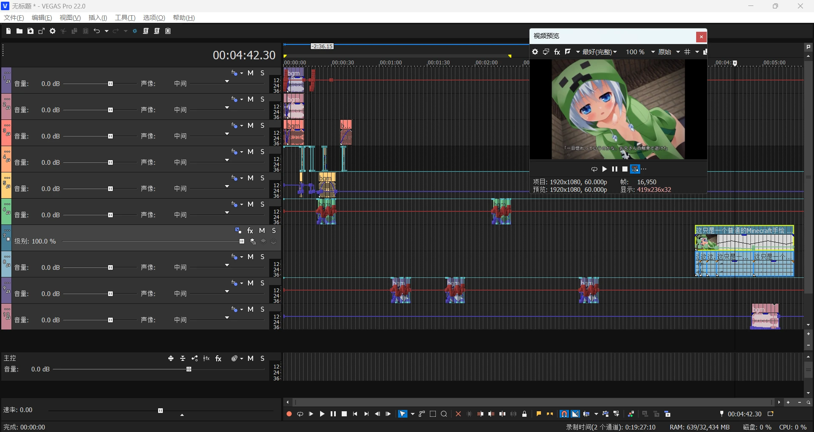

# UltraPaste! Extension

## Overview

This extension introduces a **<u>novel</u>** file import method for VEGAS Pro. With just one hotkey, you can import almost any type of file: regular media files, images from the clipboard, SRT subtitle files, and even REAPER clipboard data. You simply need to `Ctrl + C`, then `Ctrl + Shift + V` to quickly import these files into the VEGAS timeline.

## Installation

Current Extension Version: v1.03 beta

Supported Versions: Sony Vegas Pro 13 - Magix Vegas Pro 22

1.  Go to [Releases](https://github.com/zzzzzz9125/UltraPaste/releases) to download the latest .zip file and extract it. Select `UltraPaste.dll` <small>(or `UltraPaste_13.dll` for `Sony VEGAS Pro 13`)</small> and `UltraPaste.png`, copy them, and paste into the extension folder:
    *   `C:\ProgramData\Vegas Pro\Application Extensions\`
    *   or for Sony versions: `C:\ProgramData\Sony\Vegas Pro\Application Extensions\`

2.  After installation, you can find the dockable extension window via `Tools -> UltraPaste!`.

## Usage

First is the topmost `UltraPaste!`. This is the extension's primary function; almost all operations can be completed using it. You can assign it a keyboard shortcut in `Options -> Customize Keyboard`:

`Ctrl + Shift + V` is my personal recommendation. You can bind another convenient shortcut as well. It's not recommended to bind `Ctrl + V`, as it would override VEGAS's native paste key.

This binds the shortcut for our UltraPaste key. All one-click operation functions that appear in the menu can also have shortcuts added this way.

The file import logic is simple: for example, select any media file on your desktop, `Ctrl + C` it, run the `UltraPaste` shortcut in VEGAS, and it will be imported onto the currently selected VEGAS track. Furthermore, if you have defined a loop region in VEGAS, the file can be imported according to the length of that loop region.

Beyond basic file import, the extension can also read these clipboard data types:
*   Clipboard images
*   Plain text and subtitle files
*   REAPER clipboard data

All this data can be correctly recognized and processed.

Example of media file import method:

Interaction of the `Clipboard Image` function with your screenshot tool:

Interaction of the `Clipboard Image` function with PPT:

 

`UltraPaste! - Window` is the extension's settings window, where you can adjust the behavior logic of `UltraPaste`.

### General

Exclude File Types: This option makes the extension exclude files matching specific name patterns. It uses basic DOS expressions. For example, the `*.sfvp0` and `*.sfap0` in the image are VEGAS Pro's video proxy files and audio proxy files, respectively. These proxy files can actually be imported directly into VEGAS, but they are excluded by default to prevent user error. If you don't need to import certain specific files, you can adjust this setting yourself.

 

### Clipboard Image

`Start Position`: The starting position for file import. Divided into three categories: `Cursor`, `Playback Cursor`, `Project Start`. The difference between `Cursor` and `Playback Cursor` is that when you play the timeline, the `Cursor` is just the starting point of playback, while the `Playback Cursor` is the real-time playback position of the timeline.

`Move Cursor to End`: Mimics paste behavior, automatically moving the cursor to the very end of the new Event(s) after pasting.

`Save Path`: VEGAS cannot embed files out of thin air; all media files must be saved to an actual location. We must set the path for clipboard images.

*   Default value: `Clipboard\<yyyyMMdd_HHmmss>.png`. This is equivalent to `%PROJECTFOLDER%\Clipboard\<yyyyMMdd_HHmmss>.png`, where `%PROJECTFOLDER%` refers to the folder path of the current project file. <small>(If the project hasn't been saved, it defaults to the desktop path.)</small>
*   `<yyyyMMdd_HHmmss>` refers to the timestamp format for saving files. Here we rigidly specify that parts of the path requiring conversion to timestamps must be enclosed in `<>`, otherwise the extension will not convert them.
    *   For other timestamp formatting syntax, please refer to: https://learn.microsoft.com/dotnet/api/system.datetime.tostring

 

### REAPER Data

This is one of the key features of this extension: complete implementation of REAPER clipboard data import and export. You can select various items or tracks in REAPER, `Ctrl + C`, then directly `Ctrl + Shift + V` paste them into the VEGAS timeline.

The extension adapts various parameters between the two software:
*   `REAPER Item Properties` → `VEGAS Event Properties`
*   `REAPER Item/Track Envelopes` → `VEGAS Track Envelopes`
*   `REAPER Item Stretch Markers` → `VEGAS Audio Event Stretch / Video Event Speed Envelopes`
*   `REAPER Track Properties` → `VEGAS Track Properties`
*   ...

In short, everything adaptable has been adapted. You can also select a REAPER project file, `Ctrl + C`, and import it as multiple tracks.

You can also export VEGAS events or tracks as REAPER clipboard data, then `Ctrl + V` in REAPER, achieving full interoperability between the software.

Note: Due to scripting API limitations, when the VEGAS version is older than the final version of 15, `VP15B416`, all parameters related to audio event pitch cannot be transferred into VEGAS, nor can they be output to REAPER clipboard data.

`Close Start Gap`: REAPER clipboard data includes the absolute position of the original items within the REAPER project. When "Close Start Gap" is off, paste start position = REAPER project start position. When "Close Start Gap" is on, paste start position = first item's start position.

`Add Video Stream`: Adds a video stream to imported REAPER items.

 

### PSD Images

`Expand All Layers`: When importing a multi-layer PSD image, automatically expand it into separate VEGAS tracks.

`Add Other Layers`: For a selected single PSD layer, supplement with all other layers above and below it.

 

### Subtitles

Subtitles are another key feature of this extension. You can copy any `Plain Text` / `TXT` file / `SRT` subtitle file / `LRC` subtitle file and paste it into the VEGAS timeline.

`Generator Type`: The type of subtitle generator.

`Preset Name`: The preset name of the subtitle generator you want to use. You need to adjust and save the preset within the corresponding FX in advance.

For the DXT-type plugins `ProType Titler` and `(Legacy) Text`, only user-saved presets are recognized; VEGAS's built-in presets are not supported. <small>(If you want to use them, just rename and resave them.)</small>

`Region`: Import subtitles as VEGAS regions.

`Max Characters`: Automatically wrap to a new line when the number of characters in one line exceeds the specified amount. 0 means no character limit.

`Ignore Word`: When unchecked, the extension optimizes for word separation by spaces, meaning it won't forcefully split a whole word and will try to wrap at spaces. Of course, for languages like Chinese that don't typically use spaces, you can check this box directly, and it will split strictly according to character count.

`Max Lines`: When the number of lines in a subtitle block exceeds a certain amount, automatically split it into new subtitle blocks. The split length is averaged from the original block.

`Multi-Track`: Split multiple lines within a single subtitle block into multiple tracks. Note: the extension does not apply any positional adjustments to these multiple tracks, so such subtitles will overlap in the preview window and require manual adjustment.

`Default Length`: The default length (in seconds) when importing clipboard plain text or TXT files without timestamps.

Tip: It's more convenient to define a region on the timeline first, then press the shortcut key.

`Apply Preset to Selected Events`: Apply the current preset to selected Events. Only supports OFX effects, i.e., does not support `ProType Titler` and `(Legacy) Text`.

`T&T to ProType Titler`: Convert selected "Titles & Text" events into `ProType Titler` events with one click.

 

### Media

`Add Method`: Divided into three types: `Across Time`, `Across Tracks`, `As Takes`. Completely consistent with the three file import methods in VEGAS's native right-click drag import menu.

`Stream Type`: Divided into `All`, `Video Only`, `Audio Only`.

`Event Length`: Divided into `Media Length`, `Loop`, `Loop Average`. `Loop Average` is only effective when the Add Method is `Across Time`.

`Auto-Import Image Sequences`: When the extension detects the user is importing an image sequence (e.g., all selected image files follow a naming logic like `000000.png - 114514.png`, and the image dimensions are identical), automatically import them as an image sequence.

`Add Missing Stream`: Add missing streams to selected events.

 

Media Custom Import:

Set import rules for specific media file names

Customization allows you to set special import rules for specific media file names. After modifying, click `√` to save to settings. For settings you no longer need, press `×` to delete.

<small>The UI logic here is a bit rigid; the file rule string is used as the key name. Therefore, to modify a file name, you must first delete it, then re-enter and modify, otherwise the original one won't be removed.</small>

For example, my `1_*(*).wav;1_*(*).flac` here refers to the naming convention of stem files output by [UVR5](https://github.com/Anjok07/ultimatevocalremovergui). We require them to be imported as audio only, using the Across Tracks method. Then, in the folder, multi-select the stem files, `Ctrl + C`, and press the `UltraPaste!` shortcut key to directly import the [UVR5](https://github.com/Anjok07/ultimatevocalremovergui) stems.

 

### VEGAS Data

`VEG Import Type`: Divided into three categories: `Open Project File`, `As Nested Project`, `Import Media from Project`.

`Paste Event Attributes`: When clipboard data contains VEGAS Events, execute `Selective Paste Event Attributes`.

(Due to version limitations, VEGAS Pro 14 and below cannot use `Selective Paste Event Attributes` and can only perform `Paste Event Attributes`.)

`Run Script`: When copied files contain `.cs` / `.js` / `.vb` / `.dll` files, attempt to run them as scripts. Running failures will directly report errors, so when enabling this option, try not to randomly copy and paste `.dll` files, etc.

`Generate Mixed VEGAS Clipboard Data`: Not very useful for general users. However, when using both the Sony version (Sony VEGAS Pro 13 and below) and higher versions, this one-click operation converts the VEGAS Events in the clipboard data into a version that can be pasted in both Sony and Magix versions. An experimental feature, not completely reliable.
