---
layout: doc
---

<style scoped>
:deep(div[class*="language-"]) pre,
:deep(div[class*="language-"]) code {
  word-break: break-all !important;
  white-space: pre-wrap !important;
}

:deep(p) code,
:deep(li) code,
:deep(td) code {
  word-break: break-all;
  white-space: pre-wrap;
}

:deep(.vp-doc) {
  word-break: normal;
  overflow-wrap: break-word;
}
</style>

# VEGAS Pro Troubleshooting Guide: Common Issues and Solutions
<p align="right"><strong>Version: 2026.01&ensp;&ensp;Author: <a href="https://space.bilibili.com/12355745/">zzzzzz9125</a></strong></p>

::: warning
This English page is AI-translated from the Chinese original and has not been fully human-reviewed yet. If anything seems ambiguous, please refer to the Chinese source: [VEGAS 疑难杂症](/zh/vegas-troubleshooting).
:::

## 0. Preface

- This document is not a beginner's tutorial but a guide for troubleshooting various issues in VEGAS Pro. Therefore, it will not cover basic software operations in detail. This guide supports the use of licensed software. For purchasing channels, see [Software Purchase Channels](#xvi-software-purchase-channels) at the end.

- This guide contains over 20,000 words, covering common problems and solutions for VEGAS Pro. It was first published as a Bilibili article [cv27004832](https://www.bilibili.com/read/cv27004832/) and later compiled into this document for online viewing. Please point out any omissions in the comments section of that article.

- When consulting this guide, it is recommended to use the chapter index on the left for categorized searching and to utilize the **`Ctrl + F`** search function to find keywords or error codes for quick problem-solving. Paths in this guide are generally represented using environment variables, such as **`%localappdata%\VEGAS Pro\`**. **You can copy and paste the path text into the Windows File Explorer address bar and press `Enter` to navigate quickly.** Specific build numbers are sometimes mentioned, e.g., `23 build 302`, where `302` is the build number. The build number can be seen on the VEGAS startup splash screen. Underlined <u>content</u> indicates clickable hyperlinks.

- Standard reposting and referencing of this document are permitted. **Please include a link to the original source when reposting.**

<br>

## I. About VEGAS Preferences Optimization

**So-called "optimization guides" are not listed here because they cannot guarantee positive effects on VEGAS Pro, and some information may be outdated and misleading.**

**According to MAGIX, it's best to keep the default settings, as they are considered optimal for most users.**

**There is no one-size-fits-all preference configuration, so even if you find "optimization guides" elsewhere, adjust them according to your specific situation.**

**Also, it is not recommended to directly use registry files or preference files from others that claim to be "optimized."**

<br>

## II. About VEGAS Preferences, Cache Directory, Presets, etc.

### VEGAS Preferences and Cache Directory

Note: The following paths use **environment variable notation `% %`**. Copy and paste the path text into the Windows File Explorer address bar and press `Enter` to navigate quickly. Actual paths are also provided for reference.

- Main VEGAS cache directory: **`%localappdata%\VEGAS Pro\`**
  - i.e., `C:\Users\<Username>\AppData\Local\VEGAS Pro\`
  - Different versions are stored in separate folders for independence, e.g., **`%localappdata%\VEGAS Pro\23.0\`**.

<br>

For VEGAS preferences:
- Older versions (18 and earlier) are stored in the registry at **`HKEY_CURRENT_USER\Software\Sony Creative Software\VEGAS Pro\18.0\Metrics\Application\`**, which is difficult to edit manually. To back up, use the `regedit` tool to export all contents under that registry path.
- Newer versions (19 and later) are stored in the cache directory file **`%localappdata%\VEGAS Pro\<Version>\persist.prefs`**. The file is in `XML` format and easy to edit manually. Copy this file to back up.

<br>

Other VEGAS-related settings and preset directories for manual backup:

- Saved FX presets, plugin chain presets, FX favorites, render templates, etc.: `%appdata%\VEGAS\`
  - i.e., `C:\Users\<Username>\AppData\Roaming\VEGAS\`
- VEGAS window layouts, keyboard shortcuts, etc.: `%appdata%\VEGAS Pro\`
  - i.e., `C:\Users\<Username>\AppData\Roaming\VEGAS Pro\`
- Saved OFX plugin FX presets: `%userprofile%\Documents\OFX Presets\`
  - i.e., `C:\Users\<Username>\Documents\OFX Presets\`
  - Or OneDrive path: `C:\Users\<Username>\OneDrive\Documents\OFX Presets\`

VP13 and earlier versions have cache directories under a Sony folder, e.g., **`%localappdata%\Sony\VEGAS Pro\`**.

**For other important locations, refer to: [https://www.vegascreativesoftware.info/us/tutorials/posts--139290/](https://www.vegascreativesoftware.info/us/tutorials/posts--139290/)**

<br>

### Using, Importing, and Exporting VEGAS Plugin Chain Presets

1. Install the "Sony Preset Manager." (Required for importing/exporting plugin chains as `.sfpreset` files)
   - Download link: https://web.archive.org/web/20160826164938/http://dspcdn.sonycreativesoftware.com/current/extras/presetmngr20k.exe

2. As shown in the diagram:


<p align="center">VP Plugin Preset Manager Usage Diagram v0.2</p>

<br>

### Accessing VEGAS Internal Preferences

VP18 and above: Hold `Shift` and go to Options (menu bar) -> Internal.
VP18 and below: Hold `Shift` and go to Options -> Preferences, switch to the "Internal" tab.

<br>

## III. Solutions for Crashes, Freezes, and Error Pop-ups Caused by Bugs

(The solutions in this section are general troubleshooting steps. They can be tried when encountering problems but are not guaranteed to work.)

### 1. Disable GPU Acceleration

**`Options -> Video`**, under **`GPU acceleration of video processing`**, select **`Off`**. This option mainly controls whether video effects use GPU acceleration. While GPU acceleration can make effect preview and rendering smoother, **older VP versions have more bugs related to it, often causing crashes**. When troubleshooting, first try **disabling GPU acceleration**. For newer VP versions (e.g., `22 build 250`), with a capable graphics card and no other issues, enabling it is still recommended.

<br>

### 2. Disable VEGAS Error Reporting Pop-up

A common scenario: VEGAS crashes / an error pop-up appears **when clicking `File -> Render As`**.


**Always check `Show Problem Details` at the bottom to get error details.**

Sometimes the error reporting feature itself may cause issues. Disabling it completely can help.

Two ways to disable the error pop-up:
- **In the VEGAS installation directory, find `ErrorReportClient.exe` and rename it.**
- In the VEGAS installation directory, run **`PRSConfig.exe`** and select **`Disabled`**.

Choose either method to disable VEGAS error reporting. If the problem persists, re-enable it and focus on analyzing the error details. **Error details sometimes contain useful clues. See [Troubleshooting Specific Errors](#7-troubleshooting-specific-errors).**

<br>

### 3. Reinstall VEGAS

Reinstalling VEGAS only addresses issues like incomplete installation or corrupted program files, so it's rarely needed. Reinstalling alone does not reset preferences.

<br>

### 4. Reinstall Hardware Drivers

Software issues can be caused by hardware drivers. For audio problems, try reinstalling the sound card driver; for video problems, try reinstalling the graphics driver.

<br>

### 5. Reset Preferences

For strange issues, like **imported audio being complete noise**, try **resetting preferences**.

**This will clear: [All preferences and cache for the current VP version].**

Standard method: Hold `Ctrl + Shift` while double-clicking to run VEGAS. A "Reset?" prompt will appear. Check `Delete all cached application data` and click `Yes`.

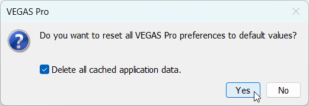

<p align="center">Reset? (Y/N)</p>

This method does not create a backup of preferences; original settings will be completely cleared, which is risky. It's recommended to back up preferences first, as described in [VEGAS Preferences and Cache Directory](#vegas-preferences-and-cache-directory).

<br>

### 6. Install Microsoft Visual C++ and .NET Framework Runtimes

Microsoft Visual C++ Runtimes: https://learn.microsoft.com/cpp/windows/latest-supported-vc-redist

.NET Framework Repair Tool: https://support.microsoft.com/topic/942a01e3-5b8b-7abb-c166-c34a2f4b612a

### 7. Switch Versions

**Whether a VP version suits your PC is somewhat random.**

VP13 is widely considered the most stable. For a balance of stability and features, **VP18** is recommended. Newer versions aren't guaranteed to be stable. Since the video engine update in `21 build 300`, VP's slow video decoding/rendering issues are being gradually resolved, with improvements continuing through VP22 final. **Currently, VP22 final (`22 build 250`) is highly recommended for its significant improvements.** The latest VP23 still isn't very stable.

VEGAS Version Update History: https://www.vegascreativesoftware.info/us/forum/posts--104998/

<br>

### 7. Troubleshooting Specific Errors

If you've tried almost all methods in this guide (especially those in [VEGAS Software Operation Q&A](#iv-vegas-software-operation-q&a)) and the error persists, try this section. Some errors, like `0xC0000005`, have no fixed cause. Encountering such errors is normal even after applying most solutions here. Searching online for the error code yields many solutions, but finding an effective one is like finding a needle in a haystack. This section provides a general troubleshooting approach:

1. **Get the error details.** If error reporting is [enabled](#2-disable-vegas-error-reporting-pop-up), check `Show Problem Details` in the pop-up. Even if disabled, error details might appear elsewhere. Both sources may provide different, potentially additional information, so check both.

2. **Analyze the error details.** Look for two key points: the **error source** and the **error code**. The source can be found in the `Fault Module` line.
   - If the source points to a component of another software, try uninstalling that software.
   - If it points to a VEGAS component, try reinstalling VEGAS or switching versions.
   - If it points to a system component, it's less certain.
   The error code is the 8-digit hexadecimal number starting with `0x`. For example:
   - `0xC06D007F`: Possibly a video plugin issue. Move OFX plugins out of the OFX folder.
   - `0xE0434352`: Possibly a .NET component issue. Try repairing .NET Framework, or an extension loading issue. Move extensions out of the extensions folder.
   Other clues: If the error mentions a specific plugin or `OFX`, consider it a video plugin issue.
   If the above fails, you can only search online for the error code. Some issues might even require a system reinstall to resolve.

<br>

## IV. VEGAS Software Operation Q&A

**Q: How to localize (Chinese) the VEGAS software interface?**

**A:** VEGAS internally includes 9 languages: English, German, French, Portuguese, Spanish, Polish, Chinese, Japanese, Korean. However, the installer from the official website is the International version, containing only the first 5 languages, **not Chinese**. There are three localization methods:

1. **Use a Chinese installer.** Check the language support list before [purchasing](#xvi-software-purchase-channels). The official website version lacks Chinese, but versions from the Chinese distributor Sijie Ma Ke Ding and the Steam version include Chinese. Otherwise, try methods 2 or 3.

2. **Use a localization pack created by other users.**

3. **Modify the registry.** This activates the built-in Chinese language within VEGAS, but compared to the first two methods, this built-in Chinese might be incomplete or inaccurate.

**Manual Registry Modification Steps:**

*Ensure VEGAS is installed.* Press `Win + R`, type `regedit` to open Registry Editor. VEGAS language is stored in the `ULangID` value of these keys:

- VP20 and above:
  - **`HKEY_LOCAL_MACHINE\SOFTWARE\VEGAS Creative Software\VEGAS Pro\23.0\Lang`**
  - `HKEY_LOCAL_MACHINE\SOFTWARE\VEGAS Creative Software\VEGAS Creative Software Video Plug-In Pack\1.0\Lang`
  - `HKEY_LOCAL_MACHINE\SOFTWARE\VEGAS Creative Software\VEGAS Creative Software OFX GPU Video Plug-in Pack\1.0\Lang`
  - `HKEY_LOCAL_MACHINE\SOFTWARE\VEGAS Creative Software\Error Reporting Client\1.0\Lang`
- VP19 and below:
  - **`HKEY_LOCAL_MACHINE\SOFTWARE\Sony Creative Software\VEGAS Pro\19.0\Lang`**
  - `HKEY_LOCAL_MACHINE\SOFTWARE\Sony Creative Software\Sony Vegas Video Plug-In Pack\1.0\Lang`
  - `HKEY_LOCAL_MACHINE\SOFTWARE\Sony Creative Software\Sony Vegas OFX GPU Video Plug-in Pack\1.0\Lang`
  - `HKEY_LOCAL_MACHINE\SOFTWARE\Sony Creative Software\Error Reporting Client\1.0\Lang`

`23.0` and `19.0` represent the current VP version. The first line is the main interface language setting, but changing all four is recommended.


If you installed the English version, the default `ULangID` value is `409`. Change it to **`804`** for Chinese.

<small>
Other language IDs: <a href="https://learn.microsoft.com/openspecs/windows_protocols/ms-lcid">https://learn.microsoft.com/openspecs/windows_protocols/ms-lcid<br></a>
</small>

**If VEGAS shows `Error code: -1` and fails to start after changing the registry**, go to the `language` folder in the VEGAS installation directory (default: `C:\Program Files\VEGAS\VEGAS Pro 23.0\language\`, where `23.0` is the version). Rename any `local_xx_XX.cfg` file (e.g., `local_en_US.cfg` for US English) **to `local_zh_CN.cfg`**.

After successful startup, if built-in video plugin effect names are still in English, try [clearing the plugin cache](#x-video-plugin-related). The same applies to other MAGIX software like ACID Pro.

<br>

**Q: Error during installation: PC needs to restart to continue?**  
`Setup has detected that the system is currently waiting for a reboot to complete a previous installation or update. To avoid problems, please reboot your system before installing.`


**A:** Try restarting the PC first. If it doesn't work, modify the registry. Open Registry Editor, navigate to **`HKEY_LOCAL_MACHINE\System\CurrentControlSet\Control\Session Manager`**, **delete the `PendingFileRenameOperations` value**, then restart the PC.

<small>
See: <a href="https://tieba.baidu.com/p/4339996851">https://tieba.baidu.com/p/4339996851</a><br>
</small>

<br>

**Q: Error: `-2147163964 occurred during installation. Could not register module xxxxx.dll`.**


**A: Restart the PC and try installing again.** If it persists, **try installing a different version**.

<br>

**Q: VEGAS won't start at all, not even showing the loading window?**

**A:** This is an old issue: **VEGAS processes are stuck in the background. Open Task Manager, end all VEGAS processes, then try running VEGAS again.**

<br>

**Q: VEGAS crashes/crashes during startup at "Initializing GPU-accelerated video processing..."?**

**A:** First, try reinstalling the graphics driver. If that doesn't work, try this registry fix. Open Registry Editor, find the **`IntelOpenCL64.dll`** value under **`HKEY_LOCAL_MACHINE\SOFTWARE\Khronos\OpenCL\Vendors`** and the **`IntelOpenCL32.dll`** value under **`HKEY_LOCAL_MACHINE\SOFTWARE\Wow6432Node\Khronos\OpenCL\Vendors`**. Change both values' data **from `0` to `1`**, then restart VEGAS.

<small>
See: <a href="https://www.bilibili.com/video/BV11z411i74a/">https://www.bilibili.com/video/BV11z411i74a/<br></a>
</small>

<br>

**Q: VEGAS crashes/crashes during startup at "Video plug-in factory..." (Error code `0xC06D007F`)?**

**A:** This step loads video plugins, often an OFX plugin scanning issue. Go to the OFX path: **`C:\Program Files\Common Files\OFX\Plugins\`**, **move potentially problematic plugins out of this folder, then try starting VEGAS**. After successful startup, you can move files back or reinstall the plugin. If there are specific error details, look for keywords related to the plugin name.  
**<small>(Priority check: `Red Giant Universe` plugin, as it causes startup crashes for many users.)</small>**

<br>

**Q: VEGAS gets stuck/crashes/crashes during startup at "Scanning VST plug-ins..."?**

**A:** Try **disabling VST scanning on startup**. Right-click the VEGAS **shortcut -> Properties**. In the **`Target`** field, add **` /NOVSTGROVEL`** at the end (**with a leading space**), then run this shortcut. After successful startup, you can move problematic plugins out of the [VST paths](#vst-related-paths) or handle them separately.


<br>

**Q: VEGAS gets stuck/crashes/crashes during startup at "Initializing DirectX plug-ins..."?**

**A:** Similarly, try **disabling DirectX plugin scanning on startup** with the command **` /NODXGROVEL`**.

<br>

**Q: VEGAS crashes/crashes during startup at "Initializing UI..." (Error code `0xE0434352`), or crashes immediately after the main window appears?**

**A:** Possibly an extension issue. Try **deleting files in `C:\ProgramData\VEGAS Pro\Application Extensions\`** and other [extension folders](#xii-scriptsextensions-related). Delete all or identify the problematic one.

<br>

**Q: VEGAS startup error: `Cannot initialize scripting host` / other .NET Framework errors (e.g., `0xE0434352`)?**

**A:** VEGAS scripts rely on .NET Framework. Try the .NET Framework Repair Tool: https://support.microsoft.com/topic/942a01e3-5b8b-7abb-c166-c34a2f4b612a

<br>

**Q: VEGAS crashes/crashes during startup at "Creating windows..." (Error code `0xC0000005`, fault module `C:\WINDOWS\SYSTEM32\ntdll.dll`)?**

**A:** Check **`Control Panel -> Programs -> Programs and Features`** to see if **MSVC 1450 runtime libraries** are installed, i.e., **`Microsoft Visual C++ 2015-2022 Redistributable` x86 and x64 version 14.50**. Microsoft distributed a **MSVC 1450 runtime** that causes VEGAS to crash. This version is automatically installed with **Visual Studio 2026** and might be installed for other reasons. This is a Microsoft issue requiring an update for a full fix. Testing by affected users shows that simply uninstalling may not work. A temporary workaround (**if you don't want to find the dll, skip to the last step and use the provided `x64` `vcomp140.dll`**):

1. Go to Visual Studio downloads: [https://visualstudio.microsoft.com/downloads/](https://visualstudio.microsoft.com/downloads/), find and download the Visual Studio 2022 Build Tools (`vs_BuildTools.exe`).
2. During installation, when prompted for additional components, go to `Individual components`, search for `MSVC`, check `MSVC v143 - VS 2022 C++ x64/x86 build tools (latest)`, then continue.

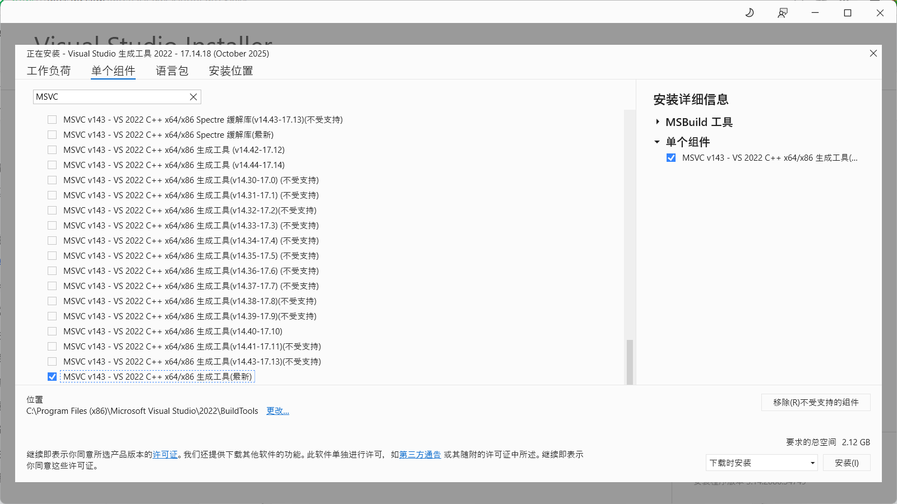

3. After installation, go to the MSVC path: `C:\Program Files\Microsoft Visual Studio\2022\Community\VC\Redist\MSVC\`. There will be folders like `v143` and `14.44.35112` (depending on version). The one like `14.44.35112` is the target.
4. Go to `14.44.35112\onecore\x64\Microsoft.VC143.OpenMP`, find **`vcomp140.dll`**, copy it, and paste it into your VEGAS installation directory. Restart VEGAS.

<small>
If using <code>ARM</code> Windows, use the <code>ARM</code> folder, not <code>x64</code>.
</small>

`x64` `vcomp140.dll` download link: [vcomp140.dll](/downloads/fixes/RenderAsDialog.dll)

<small>
See: <a href="https://www.vegascreativesoftware.info/us/forum/posts--149890/#ca943290">https://www.vegascreativesoftware.info/us/forum/posts--149890/#ca943290<br></a>
</small>

<br>

**Q: Noise/no sound/... after opening VEGAS?**

**A:** **Go to `Control Panel -> Hardware and Sound -> Sound`, open `Properties` of the current playback device. On the `Advanced` tab, under `Exclusive Mode`, uncheck `Allow applications to take exclusive control of this device`, or change `Default Format` to `2 channel, 24 bit, 44100 Hz`.** If that doesn't work, try **reinstalling the sound card driver**.


<br>

**Q: A specific project file crashes/gives errors on open?**

**A:** Try **renaming any media file used in the project** so the project can't find it. When reopening, **ignore the missing media prompt. After successful open, rename the file back/replace it**.

<small>
See: <a href="https://tieba.baidu.com/p/7511708251">https://tieba.baidu.com/p/7511708251<br></a>
</small>

<br>

**Q: Opening multiple VEGAS processes causes crashes?**

**A:** This affects all VP versions and is related to a specific window layout. It's more likely to happen when the Preview window is **undocked (floating)**. A temporary fix: **Before opening a new VEGAS process, close or dock the Preview window of the old process** to avoid potential crashes.

<br>

**Q: VEGAS startup error related to WebView (`msedgewebview2.exe`, or `WebView2 initialization failed`, etc.)?**

**A:** The VEGAS Hub feature in licensed versions uses Microsoft Edge WebView. **If you don't need Hub, simply close the VEGAS Hub window via `View -> Windows`.** You can also try deleting the `WebView2` folder in the [VEGAS cache directory](#vegas-preferences-and-cache-directory): **`%localappdata%\VEGAS Pro\23.0\WebView2`** (where `23.0` is the VP version).

<br>

**Q: [VP19] After working for a while, the VEGAS window gets random graphical glitches, UI corruption, software becomes sluggish, forcing a restart?**

**A:** This is a specific glitch in **older VP19 versions (e.g., `19 build 341`). Update to `19 build 651`** to fix.

<small>
See: <a href="https://www.vegascreativesoftware.info/us/forum/posts--131391/">https://www.vegascreativesoftware.info/us/forum/posts--131391/<br></a>
</small>

<br>

**Q: [VP19, VP20] VEGAS crashes immediately after the loading screen, [no error pop-up]?**

**A:** Check the VP build number: `19 build 648` and earlier, or `20 build 402` and earlier.
Versions in this range have a critical bug causing **[crash after loading screen]**, **[only opens after disconnecting internet or changing system date]**.
Solution: **Update VP19 to `19 build 651` or later, VP20 to `20 build 403` or later**. (Note: VP19 final is `19 build 651`, VP20 final is `20 build 411`.)

<br>

**Q: [VP22 `build 122` and above] VEGAS won't run, no loading screen?**

**A:** A Windows update issue. Download and run vc_redist.x86.exe and vc_redist.x64.exe to repair C++ runtimes: https://learn.microsoft.com/cpp/windows/latest-supported-vc-redist
Feedback suggests updating other software (like OBS) may also be needed.

<small>
See: <a href="https://www.vegascreativesoftware.info/us/forum/posts--147255/">https://www.vegascreativesoftware.info/us/forum/posts--147255/<br></a>
</small>

<br>

## V. File Import Related

<br>

### General Troubleshooting for Failed Import/Corrupted Import/Green Flashes:

#### 1. Enable/Disable Legacy AVC and HEVC Decoding

- VP18 and above: **`Options -> File I/O`, enable/disable `Legacy AVC decoding` and `Legacy HEVC decoding`.**
- VP15-17: Access [Internal Preferences](#accessing-vegas-internal-preferences). Search for `Reader`, find:
  - `Use So4 Audio Reader for Intermaediate/HEVC`
  - `Enable So4 Compound Reader for AVC/M2TS`
  - `Enable Mx Compound Reader for HEVC/ProRes` <sup>VP17 only</sup>
  `TRUE` = `Use new decoder`, `FALSE` = `Use old decoder`. Default is `TRUE`. Try changing.
- VP14 and below use the old decoder exclusively; cannot switch.

Since `21 build 300`, the meanings of "legacy" and "new" decoders swapped. The old "legacy AVC/HEVC decoder" became the new default. The old "new AVC decoder" became "legacy AVC decoder", and the old "new HEVC decoder" became "experimental HEVC decoder".

For decoding issues (e.g., footage turns green/black, no video stream, or even audio decoding problems), try **enabling or disabling these legacy decoders**.

If that doesn't work, try switching the **`Hardware decoder`** option below (may require disabling legacy decoding).

<br>

#### 2. Disable Resample

`File -> Properties`, under `Resample`, select **`Disable resample`**.

Disabling resample addresses **frame-related issues**. If resample is enabled (e.g., 30fps footage in a 60fps project), **VEGAS generates frame blends between original frames** (visually, a crossfade effect when scrubbing frame by frame). **This can cause frame generation errors, leading to flash frames (green/black). Usually recommended to disable.**

In VP13 and earlier, the **project properties don't have a global resample setting**. You must select the clip on the timeline, `Right-click -> Switches -> Disable resample`.

<br>

#### 3. Install Corresponding Codecs

E.g., QuickTime formats require QuickTime 7.7.9 with QuickTime plugin checked during install.
Whether to install K-Lite Codec Pack is debatable. Some users on the official forum warn of potential conflicts with VEGAS's built-in codecs and advise against it.

<br>

#### 4. Re-encode Source Footage

If the above methods don't solve **import failure/decoding issues/severe lag after import**, try re-encoding the footage. Suggested settings: Video codec AVC, audio codec AAC, container mp4, constant frame rate. If only audio has issues, **extract audio as wav** and import it, grouping (G) it with the original video.

<br>

#### 5. Reset Preferences

Common scenario: **Imported audio is complete noise**. Try **[resetting preferences](#5-reset-preferences)**.

<br>

### File Import Q&A

**Q: Can't drag and drop files from Windows Explorer into VEGAS, only via `Open` button?**

**A:** If VEGAS is running with administrator privileges, drag-and-drop is blocked. **Run VEGAS without administrator privileges.**

Note: **Portable versions of VEGAS (marked `Portable`)** often require admin rights to run, preventing drag-and-drop. Some "solutions" involve disabling UAC via registry, but this is not recommended. **Switch to a regular installer version, avoid portable VEGAS.**

**Portable VEGAS issues: Requires admin rights; cannot run multiple instances; doesn't recognize system environment variables; some plugins (e.g., Voukoder) need manual connector placement. Avoid if possible.**

<br>

**Q: Error when importing: "Warning: An error occurred opening one or more files. The file(s) could not be opened. Please ensure that the file(s) exist and that you have access privileges to the file/folder."**

**A:** Check if the VEGAS **installation path** contains **only [ASCII characters]**. If it contains Chinese or other characters, **uninstall and reinstall VEGAS to a path with only ASCII characters**.

<br>

**Q: Want to import mkv footage, but can't.**

**A:** VP17 and above: In **`Options -> File I/O`, check `Enable MKV reader`**, restart VEGAS, then try importing.
This feature is buggy and may still fail. If it fails, re-encode with other software.

Note: VP21 `build 187` and above support mkv import by default; no need to enable.

Re-encoding mkv files:
A video file has two layers: the inner encoding stream and the outer container.
Import failure can be due to unsupported codec or unsupported container.
Example 1: AVC (H.264) stream in mkv container. VEGAS supports AVC but not mkv container. This is **container unsupported**. Convert only the container, not the stream. In FFmpeg: `ffmpeg -i input.mkv -c:v copy output.mp4`. In GUI converters, this is often called "Copy stream" or "Remux". It's fast and recommended.
Example 2: VP9 stream in mkv container. VEGAS doesn't support VP9 codec. This is **both codec and container unsupported**. You must **convert both codec and container**. For example, YouTube downloads in mkv may use VP9. Use a tool like [MediaInfo](https://mediaarea.net/en/MediaInfo) to check the codec.

<br>

**Q: Footage recorded by OBS imports into VEGAS with incorrect, very short duration?**

**A:** OBS uses fragmented MP4 for recording, which VEGAS can't decode properly. **Change OBS settings to another output format.** For existing footage, use the copy stream method, e.g., `ffmpeg -i input.mp4 -c copy output.mp4`, then import.

<small>
See: <a href="https://www.vegascreativesoftware.info/us/forum/posts--144992/">https://www.vegascreativesoftware.info/us/forum/posts--144992/<br></a>
</small>

<br>

**Q: Can't import certain mov files with specific codecs?**

**A:** First, ensure QT Lite or QuickTime is installed. **QT Lite 4.1.0** is recommended. For VP17 and above, the new decoder supports ProRes mov, but other QuickTime codecs are no longer supported by default. Enable them in **`Options -> Deprecated Features`**, check **`Enable QuickTime plug-in`**.

If installing Apple's `QuickTime 7.7.9`, check `QuickTime plugin` during installation.

**Since VP23, VEGAS has essentially dropped QuickTime compatibility. QuickTime-encoded mov files can no longer be imported or rendered.**

<br>

**Q: After importing footage with alpha channel (mov or png), the alpha transparency doesn't display correctly in VEGAS?**

**A:** **Right-click the clip -> Properties, switch to `Media` tab, find `Alpha channel`, change to `Direct (unmatted)`.** (Note: Any setting other than `Undefined` or `None` should work.)
You can also modify media properties for multiple clips in the **`Project Media`** window.

<br>

**Q: Videos downloaded from web platforms like Douyin (TikTok) using IDM (audio codec `AAC LC SBR (HE-AAC)`), when imported, have random audio corruption, noise, or are incorrectly recognized as mono?**

**A:** This is **entirely a VEGAS bug**, still unfixed as of the latest version (`23 build 302`). **Testing shows all above methods fail. The only solution is to extract/transcode the audio and import it separately.** Videos downloaded via the official Douyin app are not affected.

<small>
See: <a href="https://www.vegascreativesoftware.info/us/forum/posts--140457/#ca884682">https://www.vegascreativesoftware.info/us/forum/posts--140457/#ca884682<br></a>
</small>

<br>

**Q: 4:3 video/image footage imports stretched to 16:9. How to fix?**

**A:** This happens when 4:3 footage is imported into a 16:9 project due to certain configuration parameters. Fix: **Right-click clip -> Properties, `Media` tab, find `Pixel aspect ratio`, change from `1.3333` to `1`. Then click the save button next to the `Stream` section (`Save settings to video profile for future auto-detection`)**. This ensures future 4:3 imports won't auto-stretch. This can also be done for multiple clips in the **`Project Media`** window.


<p align="center">"Pixel aspect ratio" translation is incorrect; it should be "Pixel width:height ratio".</p>

If you see "**Unknown error occurred while trying to save video profile**":
1. Press **`Win + R`**.
2. Enter ( `23.0` is VP version; enclose path in quotes `""` ):
   - **`notepad "C:\ProgramData\VEGAS Pro\23.0\Vegas profiles.ini"`** <sup>VP17+</sup>
   - **`notepad "C:\ProgramData\VEGAS\VEGAS Pro\16.0\Vegas profiles.ini"`** <sup>VP14+</sup>
   - **`notepad "C:\ProgramData\Sony\Vegas Pro\13.0\Vegas profiles.ini"`** <sup>VP13-</sup>
3. Instead of clicking `OK`, press **`Ctrl + Shift + Enter`** to open with admin rights. Manually edit the 4:3 default import profile, change all `1.3333333333` values to `1`, save.
   - Without admin rights, Notepad can't save and will prompt "Save As".

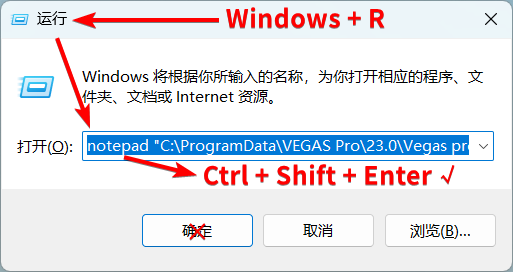

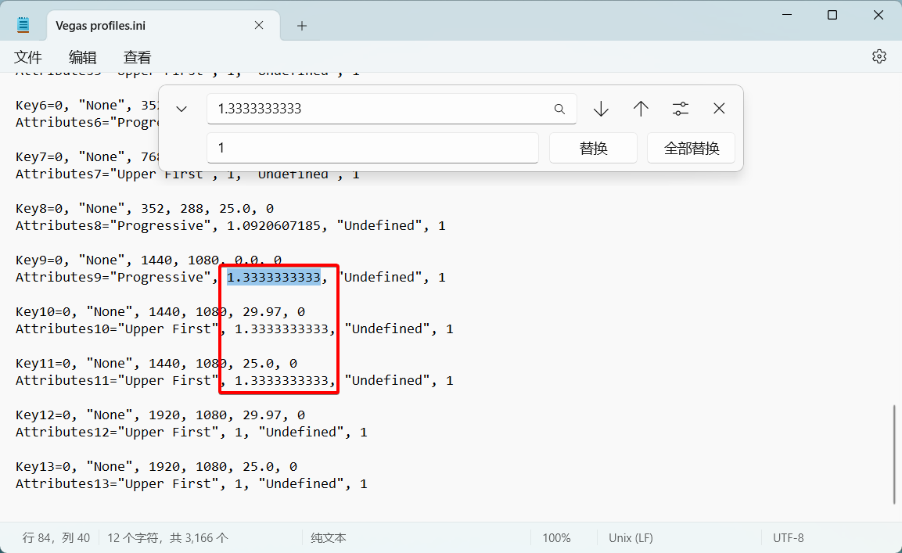

<small>
See: <a href="https://www.vegascreativesoftware.info/us/forum/posts--128760/">https://www.vegascreativesoftware.info/us/forum/posts--128760/<br></a>
</small>

<br>

## VI. Software Operation and Display Q&A

**Q: The Video Preview window shows nothing?**

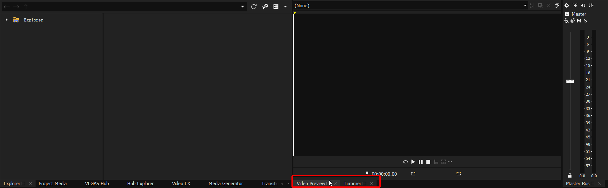

**A:** Check if you've switched to the **`Trimmer`** window. If so, **switch back to the `Video Preview` window**. For a layout similar to older versions (VP14-) with separate Trimmer and Preview windows, go to **`View -> Window Layouts`** and select **`Source Window Layout`**.

<br>

**Q: Accidentally closed/docked a window. How to get it back/dock it?**

**A:** Go to **`View -> Windows`** to enable the needed window. VEGAS window layout is highly customizable. Docked windows can be dragged out; undocked windows can be docked by dragging while holding **`Ctrl`**. Since VP23, windows can be docked above, below, left, or right of the timeline. Older versions only supported docking above the timeline.

<br>

**Q: Clicking Pan/Crop button / FX button / other buttons doesn't open the window? / Can't find a window?**

**A:** Usually, the window was dragged below the Windows taskbar and can't be dragged back up.
Easy fix: **Click the corresponding button, then immediately press `Alt + Space`, choose `Move`**, then drag the window up. Or hide the Windows taskbar temporarily. If all else fails, try `View -> Restore Default Layout`.

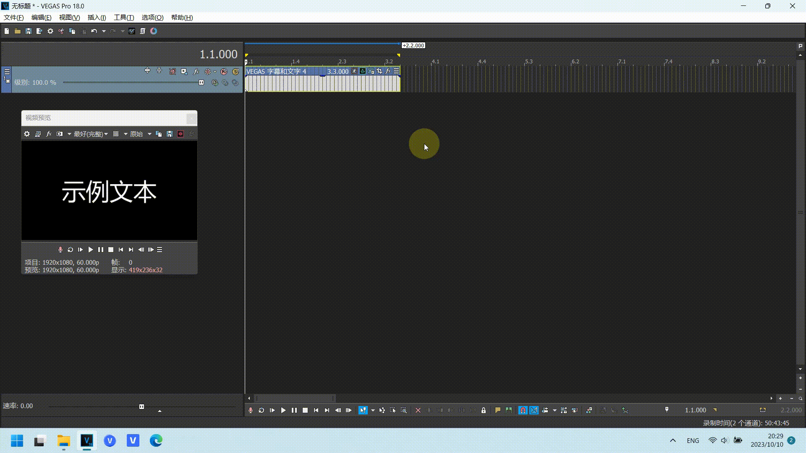

<br>

**Q: Added an FX, but in the Preview window, the FX effect is incomplete, split left/right?**


**A:** As shown, check if **`Split Screen View`** is enabled.

<br>

**Q: A single video track is split into A/B tracks. How to restore?**


**A:** Usually, you double-clicked the edge of a clip. **Double-click the clip edge again** to fix.
If that doesn't work, in the track header (left side with "Level" and buttons), **Right-click -> Expand Track Layers**, uncheck this option.
To prevent accidental activation in VP18+, go to **`Options -> General`**, scroll down, uncheck **`Double-click event edge toggles expanded edit mode`**.

<br>

**Q: Some FX effect windows (e.g., (legacy) Text, TV Simulator FX, other DXT plugins) display incompletely?**

**A:**
1. Install the **sserife.fon** font.
   - Download: https://github.com/taveevut/Windows-10-Fonts-Default/blob/master/sserife.fon
2. If that doesn't work, go to **`Control Panel -> Region -> Administrative -> Change system locale`**. Ensure **`Beta: Use Unicode UTF-8 for worldwide language support`** is **unchecked**.


<small>
See: <a href="https://www.vegascreativesoftware.info/us/forum/posts--138828/">https://www.vegascreativesoftware.info/us/forum/posts--138828/<br></a>
</small>

<br>

**Q: Project Properties / Custom Render Template / Preferences windows are too large, cut off, can't click OK?**

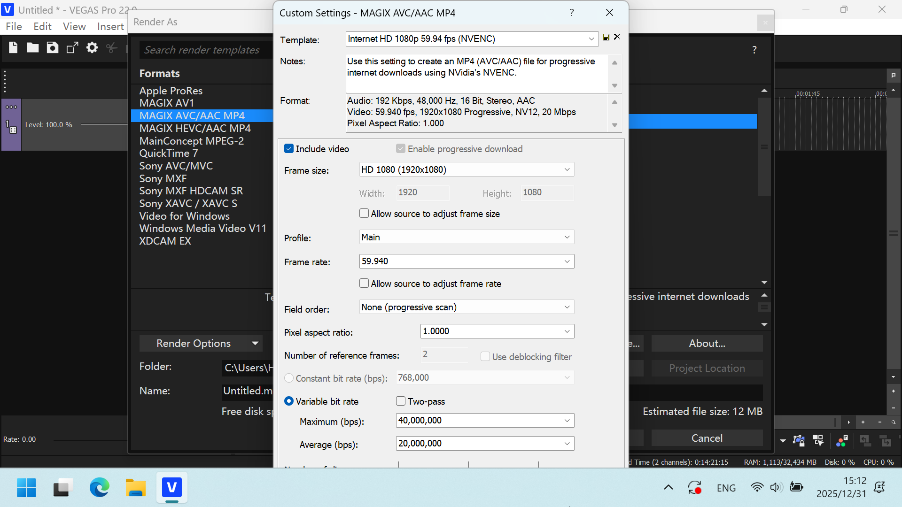

**A:** VEGAS windows scale with Windows DPI settings. High DPI scaling can make windows too large. To click "OK", you can press **`Enter`** on the keyboard. To see the full window, you must adjust Windows DPI scaling: **In Windows Settings, set screen scaling to 100%**, change settings in VEGAS, then set it back. Alternatively, **set VEGAS-specific DPI scaling to 100%**: Right-click VEGAS executable or shortcut -> `Properties -> Compatibility -> Change high DPI settings`, then:


<br>

**Q: After switching back to VEGAS from another program, it takes a long time to buffer/resume?**

**A:** **`Options -> General`**, uncheck **`Close media files when application is not active`**. Note: When disabled, **VEGAS keeps media files open, preventing modification/deletion of the original files outside VEGAS**. (Doesn't affect replace/delete within VEGAS.)

<br>

**Q: Dragging video from `Project Media` window to timeline accidentally triggers "Trim" mode?**

**A:** An old, annoying issue: Dragging on the video image triggers "Trim".
Standard fix: **`Ctrl + Z` to undo, then drag using the filename below the video thumbnail, not the image itself.**
VP21 added a **`Bypass Hover Scrub`** button. Enabling it prevents misoperation but also disables video preview on mouse hover (only shows thumbnail).


<p align="center">Actually added in VP20, but the button had no effect in VP20.</p>

<br>

**Q: Pressing Spacebar during playback makes the cursor jump to the start. I want Spacebar to pause at the current position.**

**A:** In VEGAS, "Pause" means "stop playback, cursor stays", "Stop" means "stop playback, cursor returns to start".
In VP22 and below, by default, **`Enter` is "Pause", `Spacebar` is "Stop"**. In `21 build 108` and earlier, you could toggle **`Options -> General -> Use spacebar and F12 for play/pause instead of play/stop`** to swap them.
Since `21 build 187`, this option moved to the **transport controls below the Preview window**, with Play/Pause/Stop buttons. If not visible, expand the three dots.


Since VP23, the default behavior changed: **`Enter` is "Stop", `Spacebar` is "Pause"**. The option became `Use spacebar and F12 for play/stop instead of play/pause`, available in both `Options -> General` and the transport controls.

<br>

**Q: Copying Pan/Crop keyframes causes a crash?**

**A:** A Windows 11 update issue. **Upgrade to `22 build 250`** fixes it.
- Temporary fix for older versions: **Right-click VEGAS executable/shortcut -> `Properties -> Compatibility`, under `Compatibility mode` select `Windows 8`**.

<small>
See: <a href="https://www.vegascreativesoftware.info/us/forum/posts--148746/">https://www.vegascreativesoftware.info/us/forum/posts--148746/<br></a>
</small>

<br>

**Q: <sup>VP22+</sup> Left-dragging on the timeline selects events instead of creating a time selection?**

**A:** Since VP22, left-drag on the timeline selects events; right-drag creates a time selection. If accustomed to the old logic, you can **check `Options -> Editing -> Use right mouse button to switch to selection editing tool`** to swap left/right button functions, similar to Reaper's default.
If this happens in older versions, first check your editing tool (press D twice).

This update introduced a minor issue: the actual event selection area is slightly smaller than the mouse drag area due to a new selection offset. Go to [Internal Preferences](#accessing-vegas-internal-preferences), search for **`Default SelectionMode Offset`**, change it to **`0`**.

<br>

## VII. Preview Related

### General Troubleshooting for Preview Green/Black Flashes, Footage Drifting, etc.

1. Try **[Disable GPU Acceleration](#1-disable-gpu-acceleration)**, **[Disable Resample](#2-disable-resample)**, **[Enable/Disable Legacy Decoders](#1-enabledisable-legacy-avc-and-hevc-decoding)** first.
2. Switch the preview quality in the top-left of the Preview window (e.g., `Best (Full)`).
3. **Specific plugin bug.** Try removing potentially problematic video effects.
4. Re-encode all source footage and replace.
5. Random preview flashes/drifting are frustrating. If the above methods fail, options are limited.

<br>

### Preview Q&A

**Q: After adding FX / modifying subtitle text / editing FX, the Preview window doesn't update until the FX window is closed?**

**A:** This often occurs with **certain Nvidia driver versions**. Solutions:

1. **[Disable GPU Acceleration](#1-disable-gpu-acceleration)**. Simple and effective. **(Using iGPU GPU acceleration can also work.)**
2. To fix while keeping GPU acceleration enabled, modify OpenGL settings.
   Access [Internal Preferences](#accessing-vegas-internal-preferences), search for **`Enable OpenCL/GL Interop`**, set to **`FALSE`**.
   Or, change settings in **Nvidia Control Panel**:
   Open **NVIDIA Control Panel**, left-click **`Manage 3D settings`**, switch to the **`Program Settings`** tab. Under "Select a program to customize", click "Add", find and select the VEGAS executable. Find **`OpenGL GDI compatibility`** and change from `Use global setting` to **`Prefer compatibility`**. Restart VEGAS. (If multiple VP versions, set for each.)


3. Rollback Nvidia driver to `522.30` or earlier, or update to the latest. When reinstalling, **choose `Custom` installation and check `Perform a clean installation`**. This resets all driver settings to defaults, **not recommended**.

<small>
See: <a href="https://www.vegascreativesoftware.info/us/forum/posts--138196/">https://www.vegascreativesoftware.info/us/forum/posts--138196/<br></a>
</small>

<br>

## VIII. Rendering Related

### Recommended Render Plugin: Voukoder

With VEGAS's built-in render templates, we often need to manually adjust resolution, frame rate, bitrate, etc., to match project properties and achieve desired quality. However, the **Voukoder** render plugin can **automatically match project properties** and supports **advanced bitrate controls like CRF, CQP**, simplifying the rendering process.

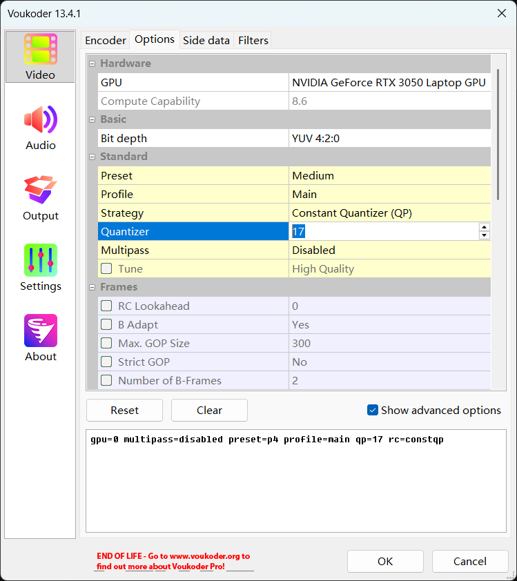

Two versions: Voukoder Classic (free) and Voukoder Pro (paid).
- Voukoder Classic is free, supports VP12-22, but the original repo was deleted.
  User-backed GitHub repos:
  [https://github.com/FORARTfe/voukoderFREE](https://github.com/FORARTfe/voukoderFREE)
  [https://github.com/FORARTfe/voukoder-connectorsFREE](https://github.com/FORARTfe/voukoder-connectorsFREE)
  Install both the main program (e.g., `Voukoder 13.4.1`) and the connector (e.g., `connector-vegas22-1.0.0.msi`).
- Voukoder Pro is currently paid: [https://www.voukoder.org/](https://www.voukoder.org/).

Other similar plugins: [DebugMode FrameServer](http://www.debugmode.com/frameserver.html) and [MagicYUV](https://www.magicyuv.com/), possibly for more advanced users.

<br>

### General Troubleshooting for Render Crash/Freeze/Render Errors

- **Render Crash:** Software turns white, error, crashes.
- **Render Freeze:** Progress bar stops, low CPU/GPU usage in Task Manager, **clicking "Cancel" doesn't work, must force-close VEGAS via Task Manager**.
- **Render Errors:** Output has flash frames, green screens, etc.

Before rendering:
- Ensure project properties and render template don't have problematic values. E.g., **Field order should be Progressive**, **width/height divisible by 4** (some encoders use 4x4 blocks), **frame rate should be common** (except standard `23.976`, `29.97`, `59.94`).
- **Ensure render template matches project properties exactly**. Mismatch can cause issues like Sapphire plugin position offset.
- When modifying bitrate in built-in templates, ensure **Maximum bitrate is higher than Average**, not equal.

1. If there's an **error pop-up**, see [Disable VEGAS Error Reporting Pop-up](#2-disable-vegas-error-reporting-pop-up).
2. **[Disable GPU Acceleration](#1-disable-gpu-acceleration).**
3. **Change the encoder in the render template.**
   
   <p align="center">Available encoders depend on your graphics card.</p>
4. Modify the area around the stuck frame: remove FX, trim events, etc.
5. Render to a different format (e.g., wmv).
   - Note: wmv default template: **Resolution `1440*1080`, Pixel aspect ratio `1.3333`**. Although output is 16:9, these parameters can cause issues. Manually change to **`1920*1080`, `1`**.
6. **<sup>Recommended</sup> Use the [Voukoder render plugin](#recommended-render-plugin-voukoder).**
7. **<sup>Recommended</sup> Nested Rendering.**
   - Create a new project, **drag the original .veg file into it, let proxies generate, then render**. Nested rendering is slower.
8. **Segment Rendering.**
   - For freezes, **split the project into small segments, render separately**, then create a new project to concatenate and re-render.
   - For random errors, if two renders have errors in different segments, combine the good parts.
9. **Render Image Sequence.** Start from where it gets stuck. **This preserves rendered frames.** Then **import the image sequence into VEGAS and re-render**. Render each sequence to a new folder to avoid overwriting (VEGAS starts numbering from `000000`).
   
   <p align="center">Importing an image sequence. Treat as a video file; set frame rate.</p>
10. **Use [Voukoder](#recommended-render-plugin-voukoder), customize template, set output container to mkv**, start from the stuck point.
    - Unlike other formats, **mkv files remain playable and importable after a crash/freeze**. **Note: Older VP versions cannot import mkv directly.**
11. **Ask someone else to render.**
    - Use `File -> Export -> .veg` to collect media into a new folder. Compress and send to a trusted VEGAS user.

Summary: Try **methods 1, 2, 3** first. If they fail, prioritize **methods 6 and 7**. Other methods are alternatives. Methods **8, 9, 10, 11** are last resorts.

<br>

#### Repairing Failed Render Files

As mentioned, only image sequences and mkv format retain partial progress after a failure. Other formats (mp4, mov, avi, wmv) leave a cache file that is not directly playable/importable. However, video repair software can fix these using **a successfully rendered sample video with the same template**. Tested software: [Digital Video Repair](https://risingresearch.com/zh/dvr/) (free), [Wondershare Repairit](https://repairit.wondershare.com/) (paid, better). Try others.

<br>

### Rendering Q&A

**Q: Clicking `Render As` (`Render` in VP23+) opens the template list, then crashes/errors?**

**A:** If there's an **error pop-up**, try [disabling it](#2-disable-vegas-error-reporting-pop-up) first.
If still fails, temporarily **move all folders from the codec path `...<Vegas Install Path>\FileIO Plug-Ins\`**. Restart VEGAS, insert a text event, check if clicking `Render As` crashes. If not, move folders back one by one, restarting and testing each time to **identify the problematic codec**. Then avoid using that codec (don't place its folder). This may prevent importing/rendering certain formats. (Check `mxavcaacplug` first.)

<br>

**Q: Render fails immediately: "An error occurred creating the media file xxx.mp4. The cause of the error could not be determined."**

**A:** In the custom render template, **uncheck `Enable progressive download`**. Or try **[Voukoder](#recommended-render-plugin-voukoder)**.

<br>

**Q: Render fails immediately: "An error occurred creating the media file xxx.mp4. Error 0x80660008 (Message missing)"**

**A:** If using **Nvidia NVENC encoder** and your **driver version is > `590`**, then **VP22 and below** built-in templates **cannot call NVENC**. **You must choose a template using another encoder**. Solutions: **downgrade driver to `581.57` or below**, **upgrade VEGAS to VP23+**, or use **[Voukoder's](#recommended-render-plugin-voukoder)** NVENC encoder (won't error).

<small>
See: <a href="https://www.vegascreativesoftware.info/us/forum/posts--150382/">https://www.vegascreativesoftware.info/us/forum/posts--150382/<br></a>
</small>

<br>

**Q: Trying to render m2ts video fails: "The COM object could not be initialized."?**

**A:** Starting with **Win11 24H2**, Microsoft removed the **AC-3 codec** that VEGAS and other software rely on. **Fresh installs of Win11 24H2+ lack this codec**, causing VEGAS to **fail decoding AC-3 audio in m2ts files** and **fail rendering m2ts**. Follow [this English guide](https://www.elevenforum.com/t/ac-3-dolby-digital-codec-no-longer-included-with-windows-11-version-24h2.25597/post-459390) to add AC-3 codec, or **upgrade to VP22 final (`22 build 250`)+**, which includes a new AC-3 codec.

<small>
See: <a href="https://www.vegascreativesoftware.info/us/forum/posts--147963/">https://www.vegascreativesoftware.info/us/forum/posts--147963/<br></a>
</small>

<br>

**Q: Want to stop rendering mid-way but keep the partially rendered file.**

**A:** The **SeMW Extension** render window has this feature.


SeMW Extension website: https://www.semw-software.com/en/extensions/

Note: Tested, **this does not solve the "Cancel" freeze issue**. For that, you must force-close VEGAS via Task Manager.

<br>

**Q: How to render mov with alpha channel?**

**A:**
- **QuickTime Plugin <small>(VP22 and below. Good compression for static images, smaller files.)</small>**
  1. Install QT Lite or QuickTime. **`QT Lite 4.1.0`** is recommended. In newer VP, also enable **`Enable QuickTime plug-in`** in `Options -> Deprecated Features`.
  2. In render template list, select `QuickTime`, choose any template, customize. Set as shown:

  
  3. Save template and render.

  QuickTime compatibility is poor and listed under `Deprecated Features`. Testing shows importing over 100 QuickTime mov files can cause issues (unreadable files, UI lag). Also, alpha channel isn't auto-detected; must be set manually. For compatibility, use Apple ProRes.

  **Since VP23, VEGAS has essentially dropped QuickTime compatibility. QuickTime-encoded mov files can no longer be imported or rendered.**

- **Apple ProRes Template <small>(VP18+. If template not present, this method is unavailable.)</small>**
  As shown:

  

- **Voukoder Render Plugin <small>(VP18+, Voukoder Classic 12.0+.)</small>**
  Find a template labeled **`4:4:4 10 bit with alpha channel`** and render. Or customize: Container `QuickTime (.mov)`, Video encoder `ProRes KS` or `QuickTime Animation`.

<br>

**Q: Preview or rendered video has different colors (color shift) compared to source footage?**

**A1:** In VP17 and below, **color space** settings in project properties and render templates can cause **color shifts**.

Solutions:
1. **Use Voukoder's "De-color shift" template.**
2. Upgrade to VP18+. When opening old projects in new VP, change `Pixel format` in `File -> Properties` from `Legacy 8-bit (video levels)` to **`8-bit (full range)`**, and **don't use render templates created in old VP**.
3. Apply the **Levels FX** preset **`Computer RGB to Studio RGB`** to the source footage.

<small>
See: <a href="https://www.vegascreativesoftware.info/us/forum/posts--142942/">https://www.vegascreativesoftware.info/us/forum/posts--142942/<br></a>
</small>

<br>

**A2:** If source is **HDR footage**, change the **project's `Color space` <sup>Fig 1</sup>** to match the source <sup>Fig 2</sup>. This switches the project to 10-bit, making rendering slower than 8-bit.

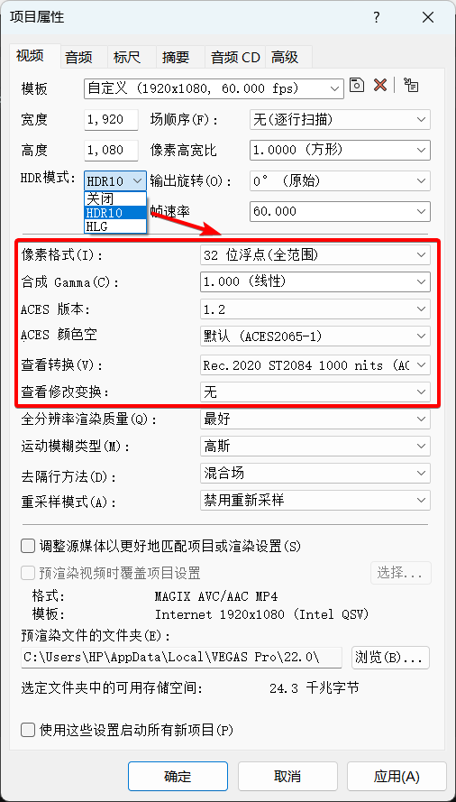

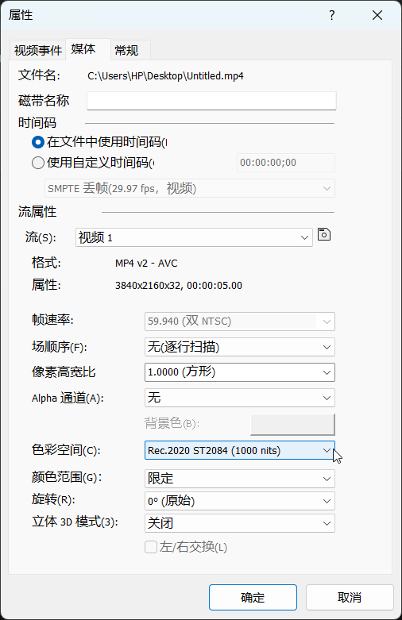

Alternatively, keep project color space and add a color space conversion LUT to the source footage using `LUT Filter` FX or newer `Color Grading`. You need a LUT that converts the source color space to `Rec.709`. This loses HDR detail. If you don't intend HDR output, avoid recording HDR footage.

<br>

**Q: Rendered video colors are wrong (red becomes purple, blue becomes yellow, etc.)?**


**A:** AMD driver issue. Solutions:
- **[Disable GPU Acceleration](#1-disable-gpu-acceleration).**
- Rollback AMD driver to **23.7.2** or earlier, or update to **23.11.1** or later.
- **VP21 `build 187`+** has fixed this issue. Upgrade VP.
- **Before rendering**, add the built-in **`Channel Blend` FX to the Video Output Bus, preset `RGBA -> BGRA`**.

<small>
See: <a href="https://www.vegascreativesoftware.info/us/forum/posts--142292/">https://www.vegascreativesoftware.info/us/forum/posts--142292/<br></a>
</small>

<br>

**Q: [VP18 and below] Cannot render videos with height > `2304` (e.g., vertical 4K)?**

**A:** In old VP, trying to set height above `2304` in a custom native template resets to `2304`. The easiest fix is to **change project properties as desired and use [Voukoder](#recommended-render-plugin-voukoder)**, not native templates.
A "bug exploit" using native templates:
1. In render window, select a template allowing custom dimensions (e.g., **`MAGIX AVC` or `MAGIX HEVC`**). Choose a close template, click `Customize Template`.
2. Change all parameters except height to desired values. **Change the template name at the top, but don't click Save.**
3. Now change height to the desired value > `2304`. After typing, **do not press `Enter` or `Tab`, don't click elsewhere. Keep the cursor blinking in the height field, then click the Save button next to the template name.**
4. **After saving, click `Cancel`**. The new template will be in the list but not selected.
5. Use this new template. If you clicked `OK` after saving, it selects a template with `*` – this is wrong. Use the one without `*`.
- Note: This cannot exceed encoder limits (e.g., NVENC max is `4096*4096`).

<small>
See: <a href="https://www.vegascreativesoftware.info/us/forum/posts--149413/#ca939692">https://www.vegascreativesoftware.info/us/forum/posts--149413/#ca939692<br></a>
</small>

<br>

**Q: After rendering, trying to play the project errors: "An error occurred starting playback. No enablement for the requested device."**

**A:** VEGAS requests microphone permission after rendering. If a mic is connected but VEGAS lacks permission, it errors. **Enable microphone permission in Windows Settings**. Alternatively, switch audio devices in `Options -> Audio Device`, or click `All Default`. Then render again; this may temporarily fix. For a permanent fix, reinstall the sound card driver.

<br>

**Q: Videos rendered with Voukoder (or built-in templates) look fine locally but show horizontal interlacing lines when uploaded to sites like Bilibili at full resolution?**

**A:** Voukoder auto-matches project properties. In VP17 and below, the default project template has `Field order` set to `Upper field first` (interlaced). Local players support deinterlacing, but sites like Bilibili don't, showing interlacing lines. **Change `Field order` in `Project Properties` to `Progressive`** before rendering with Voukoder. For built-in templates, **choose templates with `p`, not `i`**.

<br>

**Q: Built-in render templates lack image sequence options?**

**A:** This bug was fixed in VP19. Workarounds for older versions (not guaranteed):
1. Install/reinstall HEIF Image Extensions: [https://apps.microsoft.com/detail/9pmmsr1cgpwg](https://apps.microsoft.com/detail/9pmmsr1cgpwg).
2. Use an image sequence render script.
   - Download: https://www.vegascreativesoftware.info/us/forum/vegas-pro-19-missing-image-sequence-as-a-render-option--133068/?page=3#ca863786
3. Render to another format (`.mov`), then convert with [FFmpeg](https://ffmpeg.org/).

<small>
See: <a href="https://www.vegascreativesoftware.info/us/forum/posts--133068/">https://www.vegascreativesoftware.info/us/forum/posts--133068/<br></a>
</small>

<br>

**Q: In render templates, wav and avi template output formats changed to .wdp?**

**A:** Currently, the only known effective fix is **reinstalling Windows using the Windows Update Tool**.
- Update Tool: https://www.microsoft.com/software-download
Updates the system to the latest version. Takes hours. This method preserves most installed software, files, and settings.
The exact repair mechanism is unclear.

<small>
See: <a href="https://www.vegascreativesoftware.info/us/forum/posts--83436/">https://www.vegascreativesoftware.info/us/forum/posts--83436/<br></a>
</small>

<br>

**Q: [Win7 VP18+] Clicking `Render As` errors: "An error occurred creating the media file. Error 0x80131501 (Message missing)"**

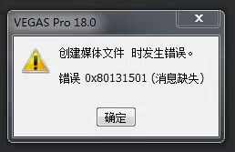

**A:** Normally, Win7 supports **only up to VP17**. VP18+ on Win7 gives this error.
A workaround: **replace the rendering component dll from an older VP18 build into the newer VP installation directory**. This may allow rendering.
This compromises stability. **Upgrading to Win10 is recommended.**

<small>
See: <a href="https://www.vegascreativesoftware.info/us/forum/posts--128221/">https://www.vegascreativesoftware.info/us/forum/posts--128221/<br></a>
</small>

`18 build 284` `RenderAsDialog.dll` download link: [RenderAsDialog.dll](/downloads/fixes/RenderAsDialog.dll)

<br>

## IX. Subtitles Q&A

**Q: Subtitle file won't import / imports as gibberish?**

**A:** Open the subtitle file in Notepad, **Save As with UTF-8 encoding**, then import.

<br>

**Q: Editing text in "Titles & Text", font doesn't change in Preview despite selection?**

**A:** "Titles & Text" has poor font compatibility; switching fonts sometimes fails.
Solutions:
- **Style text in Word (or other rich-text editor), then copy-paste into VEGAS Titles & Text.**
- Use **(legacy) Text** or **ProType Titler**, which work better.
  - In newer VP, enable these in `Options -> Deprecated Features`.
- In some cases, Windows Unicode settings cause it. Go to **`Control Panel -> Region -> Administrative -> Change system locale`**, ensure **`Beta: Use Unicode UTF-8 for worldwide language support`** is **unchecked**.


VP20's "Titles & Text" has a new "**Transfer Subtitle Attributes**" feature, also affected by this bug for some fonts.

<br>

**Q: Clicking `Insert -> Subtitles from File` does nothing, no window pops up?**

**A:** A rare bug, seemingly unfixed. Might stop working suddenly. Currently, **resetting preferences** is the only known fix.

<small>
See: <a href="https://www.vegascreativesoftware.info/us/forum/posts--137861/">https://www.vegascreativesoftware.info/us/forum/posts--137861/<br></a>
</small>

<br>

**Q: Using "Credit Roll", editing text causes VEGAS to freeze/crash?**

**A:** Microsoft Input Method issue. **In Microsoft Pinyin settings, find `Compatibility`, enable `Use previous version of Microsoft Pinyin Input Method`**.

<br>

**Q: Importing text file into "Credit Roll" shows gibberish?**

**A:** Open the text file in Notepad, **Save As with ANSI encoding**, then import.

<br>

**Q: On high-resolution screens, "ProType Titler" UI is scrambled/font too small?**


**A:** DPI scaling issue when system scaling >= 150%. Right-click VEGAS executable/shortcut -> `Properties -> Compatibility -> Change high DPI settings`. **Under `High DPI scaling override`, check `Override high DPI scaling behavior`, select `System (Enhanced)`**.

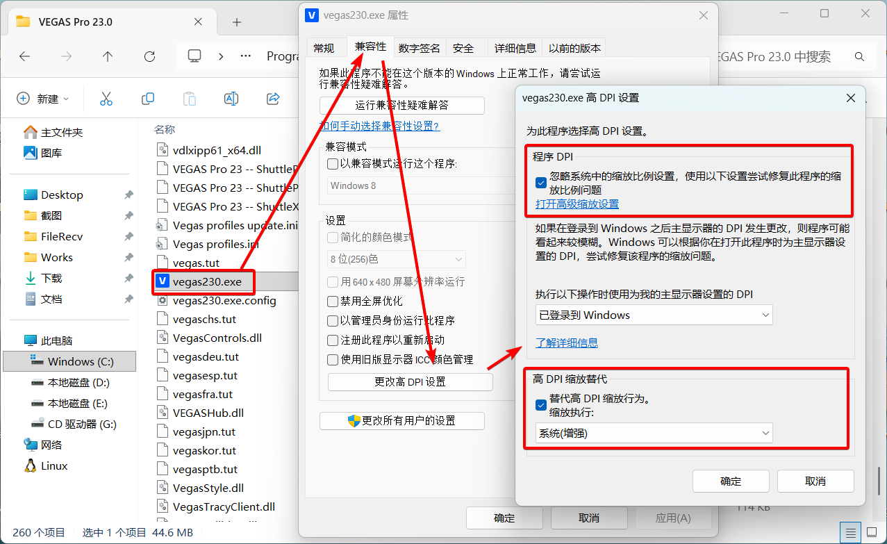

<br>

**Q: [VP20, 21] "Titles & Text" "Transfer Subtitle Attributes" function errors (see image)?**


**A:** The issue is **rich text containing multiple formats (different fonts, sizes, etc.)** in the text box, which cannot be transferred. **Try unifying the text format** first. **Fixed in VP21 final build 315**. Older versions (or VP20- without this feature) can use my script (doesn't support mixed formats). Installation path in [Scripts/Extensions](#xii-scriptsextensions-related).
- **Transfer Subtitle Attributes (Single Track)** script download: https://github.com/zzzzzz9125/VegasScripts/blob/main/Transfer%20Subtitle%20Attributes.cs
  - Usage: Select a single "Titles & Text" event on a track, run script to match other subtitle events on the same track to its attributes.

<small>
See: <a href="https://www.vegascreativesoftware.info/us/forum/posts--145461/">https://www.vegascreativesoftware.info/us/forum/posts--145461/<br></a>
</small>

<br>

**Changing the default "Insert Text Media" tool (VP18+):**
As mentioned, VEGAS has three main text tools: Titles & Text, (legacy) Text, ProType Titler. `Right-click track -> Insert Text Media` defaults to "Titles & Text". To use others, you must drag from Media Generators, which is cumbersome. To change the default:
Access [Internal Preferences](#accessing-vegas-internal-preferences), search for `Text Media Generator GUID`. Change its value to the GUID of your preferred tool. (Default is Titles & Text GUID.)
GUIDs:
- Titles & Text: `{Svfx:com.vegascreativesoftware:titlesandtext}`
- (legacy) Text: `{0FE8789D-0C47-442A-AFB0-0DAF97669317}`
- ProType Titler: `{53FC0B44-BD58-4716-A90F-3EB43168DE81}`
You can also enter the GUID of any Media Generator FX to make "Insert Text Media" generate that effect.

<br>

## X. Video Plugin Related

Two types: DirectX Transform (DXT) plugins (VEGAS-specific) and OFX plugins (universal). Old plugins (e.g., NewBlue 2012, Neat Video 3.1.1) might be DXT. Newer ones are usually OFX. Some built-in effects (Soft Contrast FX, ProType Titler) are also DXT.

VEGAS Pro Effect Name Quick Reference: https://docs.qq.com/sheet/DUFRQUUFxVENpaVZM

<br>

### VEGAS Plugin Cache Files

- Scan cache: `%localappdata%\VEGAS Pro\23.0\svfx_plugin_cache.bin`
- Name cache: `%localappdata%\VEGAS Pro\23.0\plugin_manager_cache.bin`
- Thumbnail cache: `%localappdata%\VEGAS Pro\23.0\FX Thumbnails\fx_thumbnail_cache.bin`

`23.0` is the VP version. Cache stores scanned plugin info. Stuck at "Video plug-in factory..." means **regenerating plugin cache**, scanning for new plugins.

<br>

### OFX Related Paths

**Common OFX Path**: `C:\Program Files\Common Files\OFX\Plugins\`
**VEGAS-specific OFX Path**: `...<VEGAS Install Path>\OFX Video Plug-Ins\`

OFX plugins may consist of the plugin itself and the OFX interface files. The OFX path stores the interface files. Without them, VEGAS **won't scan** the plugin. Common OFX path is scanned by other OFX-supporting software (Premiere Pro, DaVinci Resolve). VEGAS-specific path is scanned only by that VP version.

OFX interface structure:
```
<OFX Path>/
├── xxx.ofx.bundle/
│   └── Contents/
│       ├── Presets/
│       │   ├── PresetPackage.xml
│       │   ├── PresetPackage.zh-CN.xml
│       │   └── ...
│       ├── Resources/
│       │   ├── xxx.xml
│       │   ├── xxx.zh-CN.xml
│       │   └── ...
│       └── Win64/
│           └── xxx.ofx
└── yyy.ofx.bundle/
    └── ...
```
`Win64\xxx.ofx` is the interface file. `Presets\PresetPackage.xml` holds built-in presets. `Resources\xxx.xml` is the language file (usually English). `.zh-CN.xml` files are prioritized by Chinese VEGAS.

OFX paths require admin rights to edit. Use an editor like Visual Studio Code that can prompt for admin on save.

After modifying language files, delete the **plugin name cache** and restart VEGAS to see changes.

User-saved OFX FX presets: `%userprofile%\Documents\OFX Presets\`

<br>

### DXT Related Info

**Built-in DXT Path**: `...<VEGAS Install Path>\Video Plug-Ins\`
DXT plugins aren't confined to a specific folder. They are dll files requiring registration (`regsvr32 xxx.dll`). This allows placing external DXT plugins anywhere and registering them (e.g., [Route Animation](https://www.vegascreativesoftware.info/us/forum/posts--105615/) `RouteAnimationX64.dll`).

<br>

### Video Plugin Q&A

**Q: Changed VEGAS interface to Chinese via registry, but built-in plugin names remain English?**

**A: Delete the plugin name cache** mentioned above, restart VEGAS. Or simply **reset preferences**.

<br>

**Q: Uninstalled a plugin, but it still appears in VEGAS FX list, clicking it crashes?**

**A:** Check if **corresponding files in OFX paths** are cleaned up. If they are, try **deleting the plugin cache files**.

<br>

**Q: Browsing to a specific plugin effect in Video FX / Transition FX / Media Generator FX windows causes a crash?**

**A:** Usually a **thumbnail loading crash**. No direct fix; avoid the crash. If you don't need the plugin series, remove its OFX files. If you want the series but not that specific effect, **try editing the `xml` language file** to move it to the end of the list, avoiding it during browsing.  
<small>Alternatively, use **effect search plugin [VPConsole](https://www.ratinfx.com/vpconsole/)**.</small>

<br>

**Q: Using the plugin search box causes white screen/freeze?**

**A:** With many plugins, older VP versions often freeze when using search. **VP18 fixed this.** Upgrade to VP18+ for smooth search.  
<small>Use **effect search plugin [VPConsole](https://www.ratinfx.com/vpconsole/)** as an alternative.</small>

<p align="center"><iframe src="//player.bilibili.com/player.html?bvid=BV1U4XhYgEG5&autoplay=false" scrolling="no" border="0" frameborder="no" framespacing="0" allowfullscreen="true"></iframe></p>

<br>

**Q: Using built-in AI effects prompts to install VEGAS Deep Learning Models component?**  
`This plug-in requires additional data. Please log into your Service Center account and download the Deep Learning Models component from the My Products section.`

**A:** High-version built-in AI effects require **installing the corresponding version's Deep Learning Models**.

<small>
Official AI Deep Learning Models download: https://www.vegascreativesoftware.info/us/forum/posts--104782/
</small>

<br>

**Q: Built-in `LUT Filter` FX doesn't recognize selected `.cube` file?**

**A:** Check if the **full path to the `.cube` file contains only [ASCII characters]**. If it contains Chinese or other characters, **move it to an ASCII-only path**, then reselect.

<br>

**Q: Some Sapphire effects ignore alpha channel, covering the background?**

**A:** As shown, enter the effect's `Help` menu, uncheck `GPU` for that specific effect.

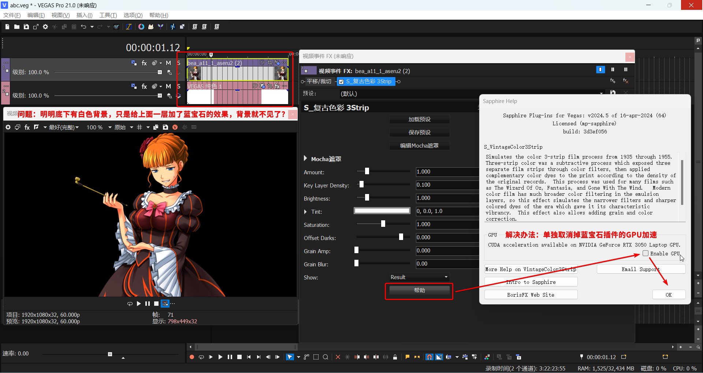

If that doesn't work, **disable VEGAS's own `GPU acceleration`**.

<br>

**Q: Standalone Mocha works, but OFX plugin version Mocha crashes when called from VEGAS?**

**A:** Try **rolling back or updating graphics drivers**.

<br>

**Q: [VP21] Adding `3D LUT Creator` plugin causes crash?**

**A:** Save the FX as a plugin chain in an older version, then apply the chain. Fixed in VP22.

<small>
See: <a href="https://www.vegascreativesoftware.info/us/forum/posts--144354/">https://www.vegascreativesoftware.info/us/forum/posts--144354/<br></a>
</small>

<br>

## XI. Audio Plugin Related

Two types: DirectX plugins (older) and VST plugins (current standard). Built-in "no prefix" and "ExpressFX" series are DirectX. Others are VST. VP16+ built-in eFX series are also VST. Older VP supports VST2; VP20+ supports VST3. All VP versions do not support VSTi.

<br>

### VST Related Paths

- **Common VST Path**: `C:\Program Files\VSTPlugins\`
<small>Other software can change this path. Check registry `HKEY_LOCAL_MACHINE\SOFTWARE\VST` value `VSTPluginsPath`.</small>
- **VEGAS-specific VST Path (VP16+)**: `...<VEGAS Install Path>\MAGIX Plugins\`

You can also set VST paths in `Options -> VST Effects`. Older VP limits to 3 paths; VP20+ has no limit.

User-saved VST FX presets:
- `%userprofile%\Documents\VST2 Presets\`
- `%userprofile%\Documents\VST3 Presets\`

<br>

**Q: How to edit VST paths externally (not via VEGAS preferences)?**

**A:** Go to registry:
- `HKEY_CURRENT_USER\Software\VEGAS Creative Software\VEGAS Pro\23\Metrics\x64\VstCache\SearchPaths` <sup>VP20+</sup>
- `HKEY_CURRENT_USER\Software\Sony Creative Software\VEGAS Pro\19.0\Metrics\VstCache\SearchPaths`<sup>VP19-</sup>
`23`/`19.0` is VP version.

`Path 1`, `Path 2`, etc., correspond to VST paths in preferences.


`CheckSum` is for scanning detection; ignore. Focus on `Path` (absolute path string) and `Flags` (`3`=scan, `0`=don't scan). Modify as needed.

If VST scanning has issues and rescan in preferences doesn't help, delete the `Mappings` subkey under `VstCache`, restart VEGAS to rescan.

<br>

### Audio Plugin Q&A

**Q: Newer VP can't scan 32-bit VST plugins?**

**A:** **`Options -> Audio -> Enable support for 32-bit VST plug-ins (experimental)`**.

<br>

**Q: Some VST plugin GUIs display incompletely in newer VP?**

**A:** Seems VST2-specific. If the plugin has a VST3 version, **use VST3**.

<br>

**Q: DirectX plugins not showing in Audio FX list / shown but invalid when added / plugin becomes Demo version (beeping)?**

**A: Uninstall VEGAS**, then delete all files in **`C:\Program Files (x86)\VEGAS\Shared Plug-Ins\Audio_x64\`** (VP13-: `C:\Program Files (x86)\Sony\Shared Plug-Ins\Audio_x64\`). **Reinstall VEGAS**. (If multiple VP versions, uninstall one; uninstalling is just to allow reinstallation.)

<small>
See: <a href="https://www.vegascreativesoftware.info/us/forum/posts--143986/">https://www.vegascreativesoftware.info/us/forum/posts--143986/<br></a>
</small>

<br>

**Q: After adding a Limiter FX (built-in `eFX_Limiter` or other VST limiter) to Master, adding Pan Envelope and points to any audio track causes buzzing?**

**A:** A bizarre bug when **Pan envelope point type is "Smooth Fade" or "Fast". Change point type to others**.

<br>

## XII. Scripts/Extensions Related

VEGAS supports custom scripts in C# (or JScript, VB) to optimize workflow. **Scripts** are user-initiated, simpler. **Extensions** run at VEGAS startup, enabling complex features like dockable windows.

This section covers installation issues. For basics: [https://www.vegascreativesoftware.info/us/forum/posts--104563/](https://www.vegascreativesoftware.info/us/forum/posts--104563/).

Script installation paths:
- **`C:\ProgramData\VEGAS Pro\Script Menu\`**
- `C:\ProgramData\VEGAS Pro\23.0\Script Menu\`
- `%userprofile%\Documents\Vegas Script Menu\`
- `%appdata%\VEGAS Pro\Script Menu\`
- `%appdata%\VEGAS Pro\23.0\Script Menu\`
- `%localappdata%\VEGAS Pro\Script Menu\`
- `%localappdata%\VEGAS Pro\23.0\Script Menu\`
- ...`<VEGAS Install Path>\Script Menu\`

Extension installation paths:
- **`C:\ProgramData\VEGAS Pro\Application Extensions\`**
- `C:\ProgramData\VEGAS Pro\23.0\Application Extensions\`
- `%userprofile%\Documents\Vegas Application Extensions\`
- `%appdata%\VEGAS Pro\Application Extensions\`
- `%appdata%\VEGAS Pro\23.0\Application Extensions\`
- `%localappdata%\VEGAS Pro\Application Extensions\`
- `%localappdata%\VEGAS Pro\23.0\Application Extensions\`

`23.0` is VP version. **Bolded paths are recommended**. `ProgramData` is hidden. For Sony era (VP13-), add **`Sony`** folder, e.g., `C:\ProgramData\Sony\VEGAS Pro\Script Menu\`. Create folders if missing.

Due to API changes in VP14, Sony-era and MAGIX-era scripts/extensions are not directly compatible. Sony uses `Sony.Vegas` namespace; MAGIX uses `ScriptPortal.Vegas`. For source files (`.cs`, `.js`, `.vb`), edit namespace. For compiled `.dll` files, you must modify and recompile the original project.

<br>

## XIII. Project File Backup and Recovery

Most important:

<p align="center"><big><b>Cultivate the habit of pressing <code>Ctrl + S</code> frequently!</b></big></p>

This section helps with **lost/corrupted project files** or **crashes without save**.

<br>

### 1. The `.veg.bak` File Next to Your Project

This is the **second-to-last** saved version, a minor backup. To recover, **rename `.veg.bak` to `.veg`** and open. If you rarely save, this backup might be old.

<br>

### 2. VEGAS Default 5-Minute Auto-save

VEGAS auto-saves every 5 minutes for crash recovery.

Standard recovery: After a crash, **don't open the original project directly. Start VEGAS, create a new empty project.** VEGAS should prompt "**A project can be recovered**". Recover it.

This is cumbersome. If you open the original project first, the prompt won't appear, and further edits might **overwrite the auto-save**. Better to **find it manually**.

Go to the **[VEGAS cache directory](#vegas-preferences-and-cache-directory)** (**`%localappdata%\VEGAS Pro\`**) <small>(or search `autosave` on C:)</small>, sort by date, find `.veg` or `.veg.bak` files, copy them out, **rename** to `.veg` per [1](#_1-the-veg-bak-file-next-to-your-project), open, verify, then save elsewhere.

Default auto-save interval is 5 minutes. To change, go to [Internal Preferences](#accessing-vegas-internal-preferences), search for `msAutoSaveInterval`. Default `300000` milliseconds; change as desired.

<br>

### 3. Advanced Save (VP16+)

**Currently recommended** for recovery, but requires setup.

Advantages:
- Backup files can be set to the **same directory as the project**, easy to find.
- Easy to adjust backup intervals.


<p align="center"><b><code>Tools -> Advanced Save</code></b> from the menu bar.</p>

Two features: Real-time Save and Advanced Backup.
- **`Real-time Save`**: **Saves after every action**, keeping the project **always current**. Can cause **lag in large projects; not recommended**.
- **`Advanced Backup`**: Creates extra `.veg` backups.
  Several modes: **Minute/Hourly/Daily/Real-time**.
  - `Minute backup`: Saves a backup **every `x` minutes**, **keeps only backups from the last hour**.
  - `Hourly backup`: Saves a backup **every `x` hours**, **keeps only backups from the last 10 hours**.
  - `Daily backup`: Saves a backup **when opening/closing VEGAS daily**, keeps max `x` backups, deletes oldest.
  - `Real-time backup`: **Saves a backup after every action**, keeps max `x` backups, deletes oldest. Like Real-time Save, can cause **lag; not recommended**.

Backup modes are independent.
- `Minute backup` stores in `MinorBackups` subfolder.
- `Hourly backup` stores in `MajorBackups`.
- `Daily backup` stores in `CriticalBackups`.
- `Real-time backup` stores in `RealtimeBackups`. Enabling this disables other modes.

**Enabling `Advanced Backup` disables the default [5-minute auto-save](#_2-vegas-default-5-minute-auto-save).**

For more, click the **question mark in the Advanced Save window for help**.

<br>

### 4. Use Incremental Save (VP18+)

Incremental Save (`Ctrl + Alt + S`) saves a new file with an auto-incremented number without overwriting the original. You can remap the shortcut in `Options -> Customize Keyboard`. Default conflicts with QQ screen recording.

<br>

### ~~5. Manual periodic backups~~

<br>

## XIV. Project Version Downgrade

Normally, newer VP can open older project files with good compatibility, but not vice versa. This section provides downgrade methods.

<br>

### 1. VEGAS Project File Version Downgrade Tool


Original project: https://sr.ht/~mrpapersonic/msvpvf/

This tool modifies the version identifier inside the project file. However, it doesn't adjust the file structure, so downgraded files often appear corrupt. The author introduces "generations", suggesting downgrade compatibility only exists within the same generation: Vegas project files cannot be downgraded across generations, only within the same generation. Based on this and testing, generations are roughly: `8 - 11 | 12 - 14 | 15 - 16 | 17 | 18 | 19 - 21 build 208 | 21 build 300 - 22 | 23`. <small>(Different build numbers within versions vary, so accuracy isn't guaranteed.)</small> The middle generations are fragmented, limiting utility, but it works for specific cases.

My localized/compiled [VEGAS Project File Version Downgrade Tool] download: https://github.com/zzzzzz9125/msvpvf/releases/

The following methods aren't true version downgrades but content transfer.

<br>

### 2. Cross-Version Copy-Paste

VEGAS supports multiple instances. You can copy events between projects across different VP versions running simultaneously. This transfers events but not track settings.

<br>

### 3. Cross-Version Plugin Chains

See [Using, Importing, and Exporting Plugin Chain Presets](#using-importing-and-exporting-vegas-plugin-chain-presets). Save FX as plugin chains to migrate audio/video FX. This doesn't batch process; apply chain per event/ track. Can combine with method 2.

Downgrading inevitably brings compatibility issues:
- **New features.** E.g., VP21's Adjustable Events become empty in older versions; VP20's updated VST engine means VST effects won't be recognized in older VP, etc.
- **Internal API/GUID changes.** E.g., VP13 (Sony) and VP14 (MAGIX) are incompatible for copy-paste. VP17 changed built-in OFX effect GUIDs from `sonycreativesoftware` to `vegascreativesoftware`, making them unrecognizable in older VP.

Upgrading rarely has such issues.

<br>

## XV. Other Q&A

**Q: VEGAS generates `.sfk` files next to imported media. Any way to hide them?**

**A:**
- **Older VP:** No. `.sfk` files are audio peak files. **No setting in VEGAS** can hide or relocate them; they stay next to media. Deleting them manually causes regeneration on project reopen.
- **Newer VP (`21 build 300`+):** `Options -> General`, new options **`Do not create .sfk files to store peak data`** and `Hide new .sfk files`. Checking the second hides new `.sfk` files (attribute Hidden). Checking the first **stops generating `.sfk` files** (peak data recalculated on project open, minimal impact). **Recommended to check the first option.**

<br>

**Q: After importing audio/video, audio waveform shows "Peaks not available", but audio plays?**

**A:** If **media files are in a folder requiring administrator privileges**, VEGAS can't generate `.sfk` files, causing **`Peaks not available`**. **Move media to a non-admin folder**.

<small>
More on `.sfk`, `.sfl`, `.sfap0`, `.sfvp0`: <a href="https://vegasaur.com/sweeper">https://vegasaur.com/sweeper<br></a>.
</small>

<br>

## XVI. Software Purchase Channels

1. **VEGAS Official Website:** https://www.vegascreativesoftware.com/us/
   Sells latest version only. No direct Chinese payment. Two main bundles: Standard (no suffix, formerly `Edit`) and `Suite` (extra software/plugins). Options: Perpetual (buyout) or 365 Subscription. Supports upgrade discounts with old serials. Installer lacks Chinese interface but can be modified via registry. One serial activates two devices; can deactivate with cooldown.

   Official installers: https://www.vegascreativesoftware.info/us/forum/posts--104782/

2. **Chinese Distributor:** https://vegaschina.cn/
   Note: Distributor Sijie Ma Ke Ding has mixed reputation. **Distributor serials only activate their installer. Activation yields an official serial that can bind to MAGIX account, activate official installer, and qualify for upgrade discounts.**

3. **Other Regional Distributors**, e.g., Japan: https://www.sourcenext.com/product/vegas/video/vegas-edit/
   No Chinese payment. Cheaper than official but may not support Chinese via registry.

4. **Steam Version:** https://store.steampowered.com/app/4006040/
   VP23 China price ~￥678, includes official Chinese. **Limitations:** No multiple instances, cannot modify registry, lacks cloud features like Text-to-Speech/Speech-to-Text, Vegas Hub.

5. **Discount Sites** like [Humble Bundle](https://www.humblebundle.com/), [Fanatical](https://www.fanatical.com/) for occasional deep-discount bundles.
   Price $20-30, supports Alipay. Bundles include VP version ~2 behind current latest plus other content. Qualifies for official upgrade discounts. Promotions are brief and sporadic; bundle contents vary.

All channels have random sales. Monitor: https://www.vegascreativesoftware.info/us/forum/posts--109642/

<br>

## XVII. VEGAS Communities

VEGAS Pro Official Forum: [https://www.vegascreativesoftware.info/us/vegas-pro-forum/](https://www.vegascreativesoftware.info/us/vegas-pro-forum/)

VEGAS Pro Reddit: [https://www.reddit.com/r/VegasPro/](https://www.reddit.com/r/VegasPro/)
