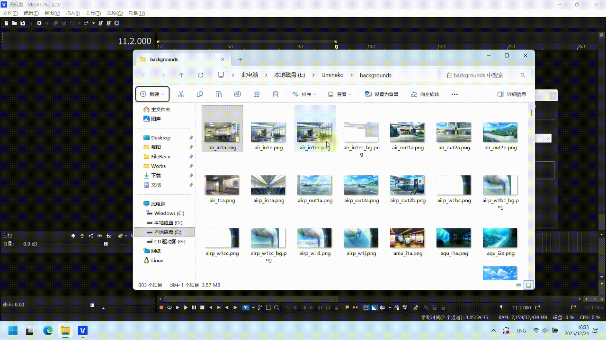
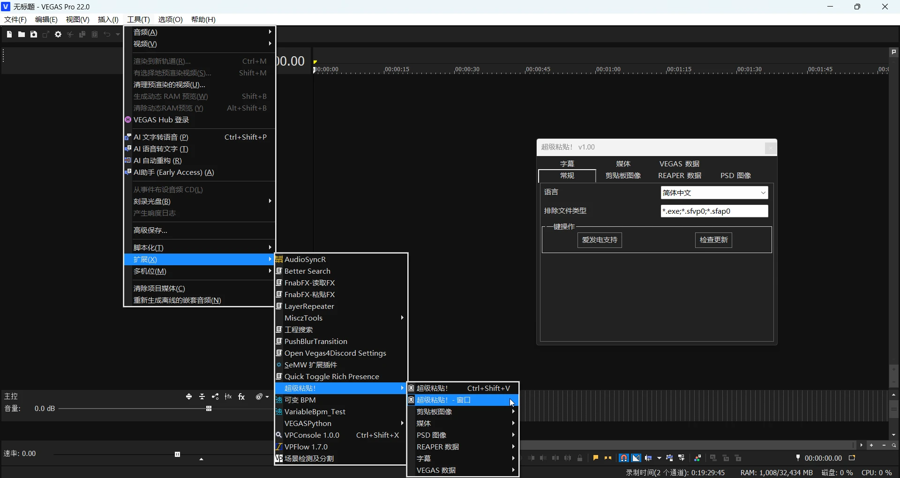
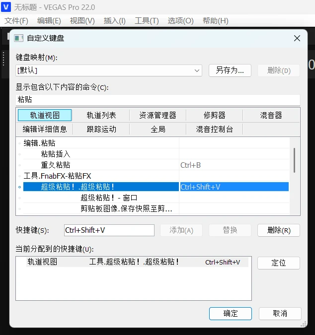
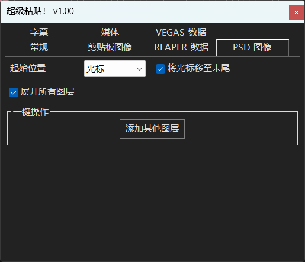
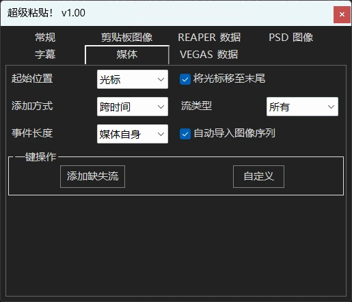
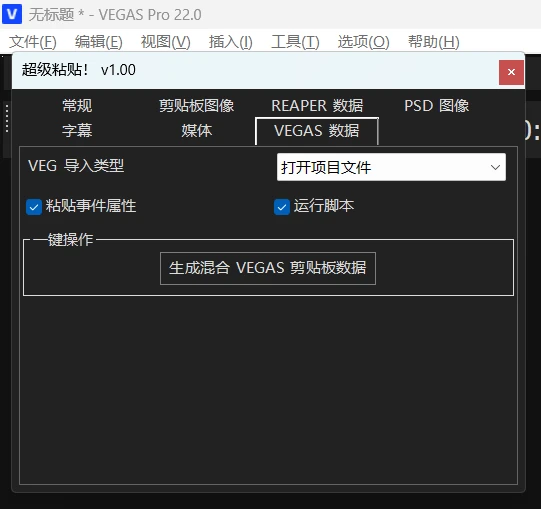

# 超级粘贴 UltraPaste! 扩展

## 简述

本扩展为 VEGAS Pro 设计了一种 	**<u>很新</u>** 的文件导入方式。仅仅通过一个快捷键，你可以导入几乎所有类型的文件：普通媒体文件、剪贴板里的图像文件、SRT 字幕文件，甚至是 REAPER 的剪贴板数据。你只需要 `Ctrl + C`，然后 `Ctrl + Shift + V`，即可快速导入这些文件到 VEGAS 时间轴中。

媒体文件导入方式示例：

`剪贴板图像` 功能与你的截图工具的交互：

`剪贴板图像` 功能与 PPT 的交互：

## 安装

当前扩展版本号：v1.03 beta

支持版本：Sony Vegas Pro 13 - Magix Vegas Pro 22

1. 前往 [Releases](https://github.com/zzzzzz9125/UltraPaste/releases) 下载最新的压缩包并解压。选择 `UltraPaste.dll`<small>（如果是 `Sony VEGAS Pro 13` 的话就是 `UltraPaste_13.dll`）</small> 和 `UltraPaste.png` 并复制，粘贴到扩展文件夹：
  - `C:\ProgramData\Vegas Pro\Application Extensions\`  
  - 或者 Sony 版的 `C:\ProgramData\Sony\Vegas Pro\Application Extensions\` 
  - 如果你不知道如何安装扩展的话，点击[这里](/index#general-steps-to-install-a-script-or-extension)

2. 安装完毕后，可通过 `工具 -> 超级粘贴!` 中找到可停靠的扩展窗口。

## 使用

首先是最顶上的 `超级粘贴!`。这个是扩展最主要的功能，几乎所有操作都可以依赖它来完成。可以为它绑定一个键盘快捷键，到上边的 `选项 -> 自定义键盘`：

`Ctrl + Shift +V` 是我个人推荐的快捷键，绑个其他顺手的也可以。不建议绑 `Ctrl + V`，会覆盖掉 VEGAS 原生的粘贴键。

这样就为我们的超级粘贴键绑好了快捷键。所有出现在选单里的一键操作功能，也可以这样子添加快捷键。

文件的导入逻辑很简单：比如选中你桌面上的任意媒体文件，对它 `Ctrl + C`，在 VEGAS 里运行 `超级粘贴` 的快捷键，即可将其导入到当前所选择的 VEGAS 轨道上。在此基础上，如果你在 VEGAS 里划定了一个循环区域，那么也可以按照该循环区域的长度导入文件。

除了基本的文件导入以外，扩展还可以读取这些剪贴板数据：
- 剪贴板图像
- 纯文本和字幕文件
- REAPER 剪贴板数据

这些数据都可以被正确地识别和处理。

 

`超级粘贴! - 窗口` 是扩展的设置窗口，你可以在这里调整 `超级粘贴` 的行为逻辑。

### 常规

排除文件类型：这个选项会使扩展排除特定名称规则的文件。使用的是基本的 DOS 表达式。比如图上的 `*.sfvp0` 和 `*.sfap0`，分别是 VEGAS Pro 的视频代理文件和音频代理文件。这些代理文件实际上是可以直接导入进 VEGAS 的，但是为了避免用户误操作，默认是排除掉的。如果你不需要导入某些特定的文件的话，可以自行调整这个设置。

 

### 剪贴板图像

`起始位置`：文件导入的起始位置。一共分为三类：`光标`、`播放光标`、`项目起始处`。`光标` 和 `播放光标` 的区别是，当你播放时间轴时， `光标` 只是播放的起始处，而 `播放光标` 是时间轴的实时播放位置。

`将光标移至末尾`：模仿粘贴行为，粘贴完毕后自动将光标调整至新事件的最末尾处。

`保存路径`：VEGAS 不可能凭空嵌入文件，所有的媒体文件都必须保存到实际的位置，我们必须设置剪贴板图像的路径。

- 默认值是：`Clipboard\<yyyyMMdd_HHmmss>.png`。也就相当于是 `%PROJECTFOLDER%\Clipboard\<yyyyMMdd_HHmmss>.png`，这里的 `%PROJECTFOLDER%` 指的是该项目文件的文件夹路径。<small>（如果项目未被保存过，则为桌面路径。）</small>
- `<yyyyMMdd_HHmmss>` 指的是保存文件的时间码格式。这里我们硬性规定，需要将对应字符转换为时间码的路径部分，必须用 `<>` 括起来，否则扩展将不会转换。
  - 其他时间码写法详见：https://learn.microsoft.com/dotnet/api/system.datetime.tostring

 

### REAPER 数据

这个是本扩展的重点功能之一：完全实现了 REAPER 剪贴板数据的导入和导出。你可以在 REAPER 中选择各种物件或者轨道，`Ctrl + C` 以后，直接 `Ctrl + Shift + V` 粘贴到 VEGAS 时间轴里。

扩展对两个软件的各种参数都进行了适配：
- `REAPER 物件属性 -> VEGAS 事件属性`
- `REAPER 物件/轨道包络 -> VEGAS 轨道包络`
- `REAPER 物件拉伸标记 -> VEGAS 音频事件拉伸/视频事件速度包络`
- `REAPER 轨道属性 -> VEGAS 轨道属性`
- ...

总之，能适配的基本都适配了个遍。你也可以选择一个 REAPER 工程文件后 `Ctrl + C`，作为多条轨道导入进来。

你还可以将 VEGAS 事件或轨道导出为 REAPER 剪贴板数据，然后在 REAPER 里 `Ctrl + V`，实现软件间的完全互通。

注意，由于脚本 API 限制，当 VEGAS 版本低于 15 的最终版 `VP15B416` 时，与音频事件的音高有关的所有参数无法被转移进入 VEGAS 里，也无法输出到 REAPER 剪贴板数据。

`关闭开头间隙`：REAPER 剪贴板数据会带上原始物件在 REAPER 工程里的绝对位置。未关闭开头间隙时，粘贴起始位置 = REAPER 工程开头位置。关闭开头间隙后，粘贴起始位置 = 第一个物件的开头位置。

`添加视频流`：为导入的 REAPER 物件添加视频流。

 

### PSD 图像

`展开所有图层`：当导入的 PSD 图像含有多个图层时，自动在 VEGAS 轨道中展开。

`添加其他图层`：为选中的单个 PSD 图层的上方和下方补充其他所有图层。

 

### 字幕

字幕也是本扩展的重点功能之一。你可以复制任意 `纯文本` / `TXT` 文件 / `SRT` 字幕文件 / `LRC` 字幕文件，粘贴到 VEGAS 时间轴里。

`生成器类型`：字幕的生成器类型。

`预设名称`：你要使用的字幕生成器的预设名称，需要自己提前在对应 FX 内调整并保存预设。

对于 `PTT 字幕` 和 `(自带) 文字` 这两个 DXT 类插件，只能识别到用户自己保存的预设，不支持 VEGAS 自带的那些预设。<small>（想用的话，自己改个名重新保存一遍就行。）</small>

`区域`：将字幕作为 VEGAS 区域导入。

`最大字符数`：当一行内超过指定的字符数量时，自动换行。0 表示不对字符数进行限制。

`忽略单词`：取消勾选时，扩展会对单词的空格分隔做优化，也就是不会强行拆分一整个单词，会尝试在空格处换行。当然，对于中文这种基本不使用空格的语言文字，可以直接勾选上，会严格按照字符数量来分割。

`最大行数`：当一个字幕块中的行数超过一定数量时，自动拆分为新的字幕块。拆分长度按照原始字幕块均分。

`多轨道`：将单个字幕块中的多行拆成多个轨道。注意，扩展并不会对这些多个轨道进行任何的位移更改，所以这样的字幕在预览窗口中会重叠到一起，需要手动调整。

`默认长度`：当导入剪贴板纯文本或者 TXT 文件这种不带时轴的字幕时的默认长度，单位为秒 (s)。

小技巧：在时间轴上提前划好区域后直接按下快捷键，更方便。

`预设应用到选中事件`：将当前预设应用到选中事件。只支持 OFX 效果，也就是不支持 `PTT字幕` 和 `(自带) 文字`。

`T&T 到 PTT 字幕`：将选中的“字幕和文字”事件一键转换为 `PTT 字幕` 事件。

 

### 媒体

`添加方式`：一共分为 `跨时间`、`跨轨道`、`作为片段` 三种。与 VEGAS 自带的右键拖动导入选单中的三种文件导入方式完全一致。

`流类型`：分为 `所有`、`仅视频`、`仅音频` 三种。

`事件长度`：分为 `媒体自身`、`循环`、`循环取平均` 三种。其中 `循环取平均` 只有添加方式为 `跨时间` 时才有效。

`自动导入图像序列`：当扩展识别到用户正在导入图像序列时（比如选中的所有图像文件的命名逻辑为 `000000.png - 114514.png`，且图像宽高均相同），自动将其作为图像序列导入。

`添加缺失流`：为选中的事件添加缺失流。

 

媒体自定义导入：

为特定的媒体文件名称设置导入规则

自定义可以使你为特定的媒体文件名称设置特殊的导入规则。修改完以后点击 `√`，就会保存到设置里。不需要的设置，可以按 `×` 删除。

<small>我这里的 UI 逻辑写得有些呆，将文件规则字符串作为了键名，所以要修改文件名称时，必须先删除，再重新输入重新改，否则原先的那个不会被删除。</small>

比如我这里的 `1_*(*).wav;1_*(*).flac`，指的是 [UVR5](https://github.com/Anjok07/ultimatevocalremovergui) 输出的分轨文件的命名规则。我们这里要求它们以跨轨道的方式，仅导入音频。之后，在文件夹中对着分轨文件多选，`Ctrl + C`，再按下 `超级粘贴!` 快捷键，即可将 [UVR5](https://github.com/Anjok07/ultimatevocalremovergui) 分轨直接导入进来。

 

### VEGAS 数据

`VEG 导入类型`：一共分为 `打开项目文件`、`作为嵌套项目导入`、`导入项目中的媒体` 三类。

`粘贴事件属性`：当剪贴板数据中含有 VEGAS 事件时，执行 `选择性粘贴事件属性` 操作。

（由于版本限制，VEGAS Pro 14 及以下无法使用 `选择性粘贴事件属性`，而只能执行 `粘贴事件属性`。）

`运行脚本`：当复制的文件中含有 `.cs` / `.js` / `.vb` / `.dll` 文件时，尝试将其作为脚本运行。运行失败会直接报错，所以启用该选项时，尽量不要随便复制粘贴 `.dll` 啥的进来。

`生成混合 VEGAS 剪贴板数据`：对一般用户没有什么作用，不过当你同时使用 Sony 版（Sony VEGAS Pro 13 及以下）和高版本时，这个一键操作会将剪贴板数据中的 VEGAS 事件转换为 Sony 版和 Magix 版都能够粘贴的版本。属于实验性功能，并不完全可靠。
