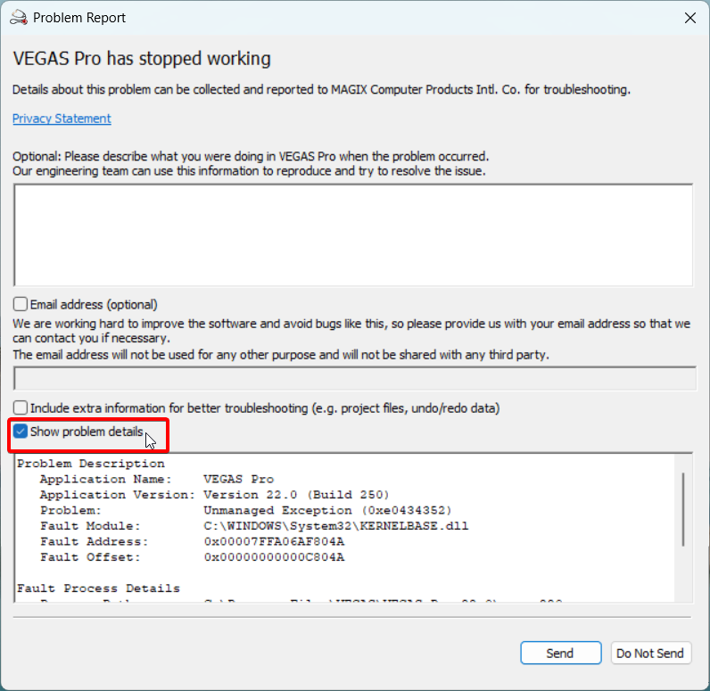
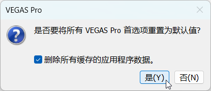
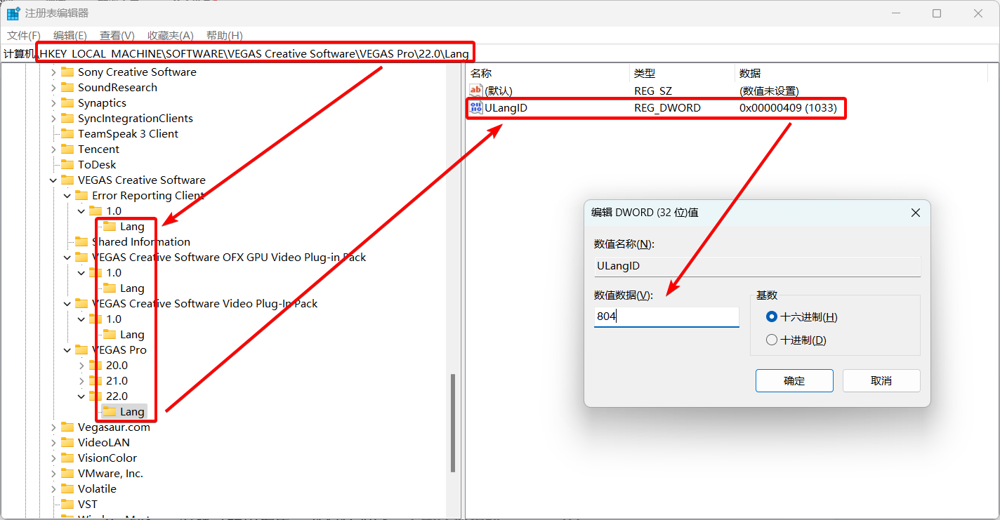
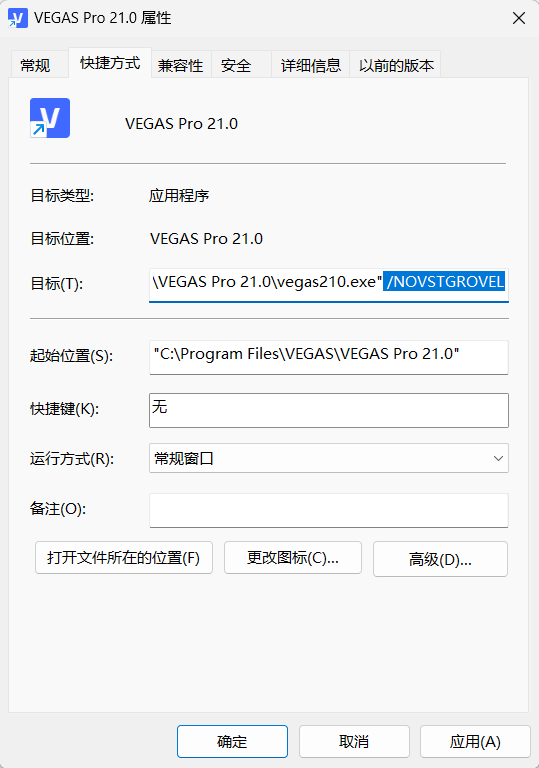
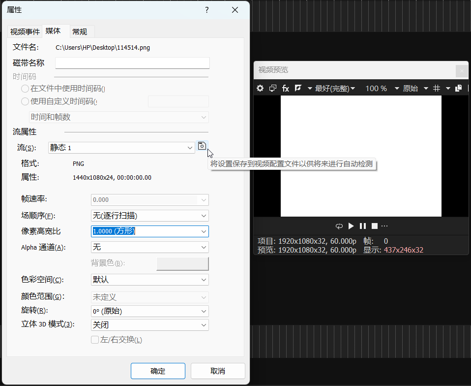
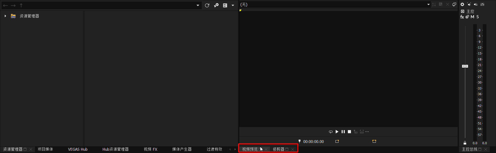
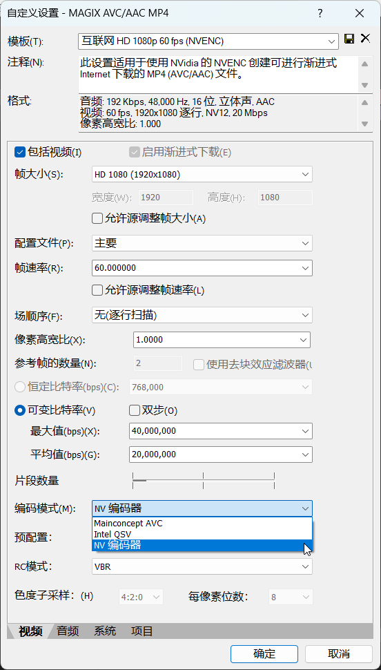
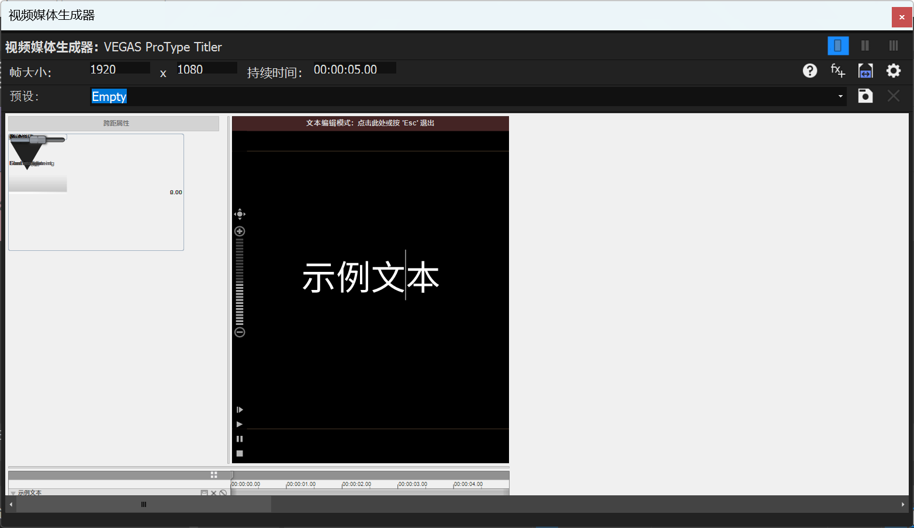
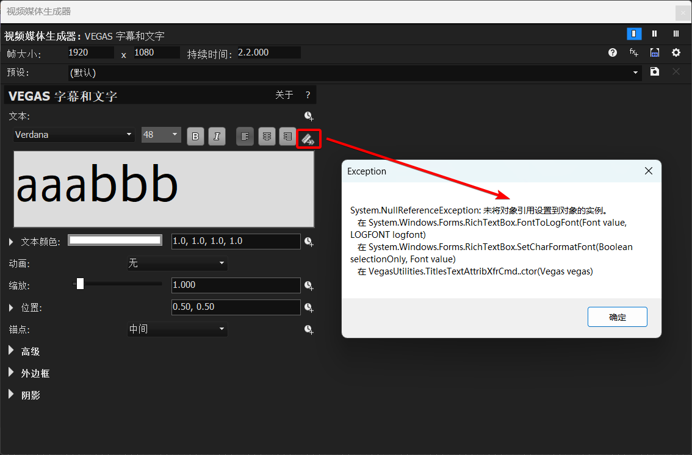

---
layout: doc
---

<style scoped>
:deep(div[class*="language-"]) pre,
:deep(div[class*="language-"]) code {
  word-break: break-all !important;
  white-space: pre-wrap !important;
}

:deep(p) code,
:deep(li) code,
:deep(td) code {
  word-break: break-all;
  white-space: pre-wrap;
}

:deep(.vp-doc) {
  word-break: normal;
  overflow-wrap: break-word;
}
</style>

# VEGAS Pro 各种疑难杂症及其解决方案的整理
<p align="right"><strong>版本号：2026.01&ensp;&ensp;作者：<a href="https://space.bilibili.com/12355745/">zzzzzz9125</a></strong></p>

## 零、前言

- 本文不是专门面向初学者的基础教程，而是针对 Vegas 各种疑难杂症的问题处理的指导，因此不会过多地介绍软件的基础操作。本文声明支持正版软件，[入正渠道](#十六、软件入正渠道)详见本文文末。

- 本文总共超过两万字，涵盖 Vegas Pro 软件的各种常见疑难杂症及其解决方案。本文首发于 B 站专栏 [cv27004832](https://www.bilibili.com/read/cv27004832/)，后整理成文档，供在线预览。如有疏漏之处，可于此专栏的评论区中指出。

- 在查阅本文时，建议参考左侧的章节目录分类查询问题，并合理运用 **`Ctrl + F`** 查找功能，搜索问题或报错的关键字和报错码，以便于快速找到解决问题的办法。本文所给出的路径一般以环境变量的方式表示，比如 **`%localappdata%\VEGAS Pro\`**。**将路径文本复制粘贴到 Windows 文件资源管理器的地址栏后按 `Enter` 键，即可实现快速跳转。**本文有时会提及特定版本的特定小版本号，比如 `23 build 302`，此处 `302` 即为小版本号。在 Vegas 的读条启动界面，就可以看到当前版本的小版本号。本文标有**<u>下划线</u>**的内容，可以进行超链接跳转。

- 本文允许规范转载和引用。**请在转载时附上原始出处链接。**

<br>

## 一、关于 Vegas 首选项优化

**这里不再列出所谓的“优化方案”，因为这些“优化方案”是没法保证一定对 VEGAS Pro 有正面优化的，并且有些信息可能已经过时，具有误导性。**

**根据 Magix 官方的说法，请尽量保持默认设置，默认设置是他们认为最适合普通用户的。**

**不存在能够适配所有电脑的首选项设置，所以即使你在其他地方找到了那些所谓的“优化方案”，也请根据你的具体情况更改。**

**同时，我也不建议直接使用别人已经改过的、那种所谓的“优化首选项”的注册表或者首选项设置文件。**

<br>

## 二、关于 Vegas 首选项和缓存目录、预设等的说明

### Vegas 首选项和缓存目录

注意，以下路径均使用了**环境变量表示法 `% %`**。将路径文本复制粘贴到 Windows 文件资源管理器的地址栏后按 `Enter` 键，即可实现快速跳转。也附上了实际路径可供参考。

- Vegas 的主要缓存目录：**`%localappdata%\VEGAS Pro\`**
- 即：`C:\Users\<用户名>\AppData\Local\VEGAS Pro\`
- 按不同版本会分不同文件夹存储，实现各版本独立，比如 **`%localappdata%\VEGAS Pro\23.0\`**。

<br>

对于 Vegas 首选项：
- 旧版（18 及以前）保存在注册表路径 **`HKEY_CURRENT_USER\Software\Sony Creative Software\VEGAS Pro\18.0\Metrics\Application\`** 内，比较难手动编辑。备份时，可以通过注册表编辑器 `regedit` 工具，手动备份该注册表路径的所有内容。

- 新版（19 及以后）保存在缓存目录 **`%localappdata%\VEGAS Pro\<版本号>\persist.prefs`** 文件内，文件内容格式为 `XML`，容易手动编辑。可以复制该文件以备份。

<br>

其他的跟 Vegas 有关的一些设置和预设文件目录，可供自行备份：

- 自己保存的 FX 预设、插件链预设、FX 收藏夹、渲染模板等：`%appdata%\VEGAS\`  
  即：`C:\Users\<用户名>\AppData\Roaming\VEGAS\`

- Vegas 的窗口布局设置、键盘设置等：`%appdata%\VEGAS Pro\`  
  即：`C:\Users\<用户名>\AppData\Roaming\VEGAS Pro\`

- 自己保存的 OFX 插件的 FX 预设：`%userprofile%\Documents\OFX Presets\`  
  即：`C:\Users\<用户名>\Documents\OFX Presets\`  
  或者 OneDrive 路径：`C:\Users\<用户名>\OneDrive\Documents\OFX Presets\`

vv13 及以下的版本的缓存目录会带 Sony 文件夹，如 **`%localappdata%\Sony\VEGAS Pro\`** 等。

**有关其他重要位置路径，可参考：[https://www.vegascreativesoftware.info/us/tutorials/posts--139290/](https://www.vegascreativesoftware.info/us/tutorials/posts--139290/)**

<br>

### Vegas 插件链预设的使用、导入和导出

1. 安装“索尼预设管理器”。（如果需要将插件链导入或导出为 `.sfpreset` 文件）

  - 下载链接：https://web.archive.org/web/20160826164938/http://dspcdn.sonycreativesoftware.com/current/extras/presetmngr20k.exe

2. 如图所示：


<p align="center">vv 插件预设管理器的使用图解 0.2 版</p>

<br>

### Vegas 内部首选项的进入方法

vv18 及以上：按住 `Shift`，进入上方菜单栏的选项-内部。

vv18 以下：按住 `Shift`，进入上方菜单栏的选项-首选项，切换到“内部”选项卡。

<br>

## 三、由某些 bug 导致的崩溃卡死、弹报错等问题的解决办法

（本段提供的解决办法属于万金油，遇到问题就可以试一下，并且不保证一定能解决问题。）

### 1. 关闭 GPU 加速

**`首选项 -> 视频`**，在 **`视频处理的 GPU 加速`** 这一栏中选择 **`关闭`**。这个选项主要用来管理视频特效是否使用 GPU 加速，虽然在 GPU 加速的加持下，特效的预览和渲染速度会流畅一些，但是在低版本的 Vegas 中的 **bug 比较多，容易造成崩溃**。一般解决问题的时候首先尝试**关闭 GPU 加速**。对于高版本 Vegas（比如 `22 build 250`），在显卡性能比较好，并且没有其他问题的情况下仍然建议开启。

<br>

### 2. 关闭 Vegas 的报错弹窗功能

比较常见的情况是：运行 Vegas 时 / **点击左上角 `文件 -> 渲染为` 时，直接弹出报错弹窗**。



**这时候请先务必勾选下方的 `顯示問題詳細資料`（`Show Problem Details`），获取报错内容。**

有时可能是报错弹窗功能本身所造成的问题，将此功能完全关闭可以解决。

关闭报错弹窗功能的两种办法：

- **在 Vegas 安装目录下找到 `ErrorReportClient.exe` 这个文件，随便重命名一下**。

- 在 Vegas 安装目录下找到 **`PRSConfig.exe`** 这个程序并运行，选 **`禁用`**（`Disabled`）。

两个办法任选一个即可关闭 Vegas 的报错弹窗功能。

有些时候问题可能仍然无法解决，请再次开启它，并重点观察和分析报错内容。**报错内容里有时能推断出一些有用的关键信息，见下文[某些报错的问题排查思路](#7-某些报错的问题排查思路)。**

<br>

### 3. 重装 Vegas

重装 Vegas 只针对 Vegas 软件本体安装不完全或者程序文件损坏这类问题，所以一般不太会用得到。只进行重装 Vegas 操作并不会重置首选项。

<br>

### 4. 重装硬件驱动

软件出问题也可能是硬件驱动造成的。音频问题可以尝试重装声卡驱动，视频问题可以尝试重装显卡驱动。

<br>

### 5. 重置首选项

遇到一些莫名其妙的问题，比如**音频导入进去以后完全是杂音**，这种情况可以尝试**重置首选项**解决。

**重置后会清理掉：【当前 Vegas 版本的所有首选项和缓存】。**

首选项的常规办法：按住 `Ctrl + Shift` 双击运行 Vegas，会弹出“是否重置”的选项，勾选 `删除所有缓存的应用程序数据`，点 `是`。



<p align="center">是否重置？(Y/N)</p>

不过依上述办法这样重置以后不会产生首选项设置的备份，原先的首选项设置将会完全清空，风险较大。所以我建议在重置前做好首选项的备份，见 [Vegas 首选项和缓存目录](#vegas-首选项和缓存目录)。

<br>

### 6. 安装 Microsoft Visual C++ 和 .NET Framework 运行库

Microsoft Visual C++ 运行库：https://learn.microsoft.com/cpp/windows/latest-supported-vc-redist

.NET Framework 修复工具：https://support.microsoft.com/topic/942a01e3-5b8b-7abb-c166-c34a2f4b612a


### 7. 换版本

**Vegas 版本与你的电脑是否合适，这个问题很随缘。**

公认最稳定的版本应该是 vv13，追求稳定性和功能性兼顾的建议用 **vv18**，新版不保证一定会很稳。自 `21 build 300` 的视频引擎更新以来，Vegas 的视频解码和渲染慢的问题正在逐步得到解决，这一更新会一直持续到 22 最终版。**目前我最推荐用 22 最终版（`22 build 250`），有很大的改进。**最新版的 23 仍然不是很稳定。

VEGAS 版本更新历史：https://www.vegascreativesoftware.info/us/forum/posts--104998/

<br>

### 7. 某些报错的问题排查思路

在尝试了本文中几乎所有办法（特别是 [Vegas 软件运行相关的 Q&A](#四、vegas-软件运行相关的-q&a) 这一章的办法）以后，报错仍然无法解决，可尝试这一节的办法。也有某些报错，如 `0xC0000005`，是没有固定确切的原因而引发的报错，遇到这种报错，使用本文中提到的大部分解决办法，仍然没有用，是再正常不过的了。这时想去找该报错的常见解决方法，直接百度对应报错码，你会搜到很多解决方案，但想找个能真正解决的，可谓是大海捞针。本节提供一个大致的报错问题排查思路：

1. 找到报错内容。如果开了[报错弹窗](#2-关闭-Vegas-的报错弹窗功能)，可以勾选报错弹窗的`顯示問題詳細資料`（`Show Problem Details`），可以得到报错内容。即使关闭了报错弹窗功能，有时也可以得到一些报错内容。这两个报错内容可能有所不同，会有额外的信息，建议同时检查一下。

2. 分析报错内容。要找到两个关键点：报错源和报错码。报错源可以看 `Fault Module` 这一行。比如报错源指向某个软件的组件，可以试着把这个软件卸载了；报错源指向 Vegas 自己的组件，可以试着重装 Vegas 或者换 Vegas 版本；报错源指向系统组件，就有些不确定了。报错码可以看 `0x` 开头的一串 8 位的十六进制数字。比如 `0xC06D007F`，可以考虑是视频插件的问题，把 OFX 插件从 OFX 文件夹里移出来；`0xE0434352`，可以考虑是 .NET 组件的问题，试着修复一遍 .NET Framework，或者是扩展无法加载的问题，把扩展从扩展文件夹里移出来。还有一些信息，比如报错内容中明确提及某个特定插件或者 `OFX` 这个关键词，也可以考虑是视频插件的问题。上述办法均无效的情况下，只能在网上搜索报错码找各种解决方案了，甚至有些问题可能只有重装一遍系统才能解决。

<br>

## 四、Vegas 软件运行相关的 Q&A

Q：Vegas 软件本体**如何汉化**？

A：Vegas 软件程序内部一共自带“英德法葡西波中日韩”9 种语言，但是官网提供的 Vegas 本体安装包，就只有国际语言版，即上述的前 5 种语言，**不含中文**。有以下三种汉化途径：

1. **使用中文安装包**。建议在[入正](#十六软件入正渠道)前仔细查看语言支持列表，看是否含有中文。比如目前官网提供的版本不包含中文，而国内代理思杰马克丁提供的版本以及 Steam 版均含中文。否则，只能尝试后两种途径。

2. **使用其他用户制作的汉化包**。

3. **修改注册表**。修改注册表可以调用出 Vegas 软件内部自带的中文，但相较于前两种途径，这个自带的中文可能会有不全、不准确的问题。

**手动修改注册表**的步骤：

在**确保已安装 Vegas 本体**的前提下，按 `Win + R` 键打开“运行”，输入 `regedit` 打开注册表编辑器。Vegas 的语言设置保存在以下注册表项的 `ULangID` 值内：

- 20 及以上：
  - **`HKEY_LOCAL_MACHINE\SOFTWARE\VEGAS Creative Software\VEGAS Pro\23.0\Lang`**
  - `HKEY_LOCAL_MACHINE\SOFTWARE\VEGAS Creative Software\VEGAS Creative Software Video Plug-In Pack\1.0\Lang`
  - `HKEY_LOCAL_MACHINE\SOFTWARE\VEGAS Creative Software\VEGAS Creative Software OFX GPU Video Plug-in Pack\1.0\Lang`
  - `HKEY_LOCAL_MACHINE\SOFTWARE\VEGAS Creative Software\Error Reporting Client\1.0\Lang`

- 19 及以下：
  - **`HKEY_LOCAL_MACHINE\SOFTWARE\Sony Creative Software\VEGAS Pro\19.0\Lang`**
  - `HKEY_LOCAL_MACHINE\SOFTWARE\Sony Creative Software\Sony Vegas Video Plug-In Pack\1.0\Lang`
  - `HKEY_LOCAL_MACHINE\SOFTWARE\Sony Creative Software\Sony Vegas OFX GPU Video Plug-in Pack\1.0\Lang`
  - `HKEY_LOCAL_MACHINE\SOFTWARE\Sony Creative Software\Error Reporting Client\1.0\Lang`

其中 `23.0` 和 `19.0` 代表当前 Vegas 版本号。

第一行是最主要的软件界面语言设置，不过其他三个也建议同时改。



若之前安装的是英文版，则 `ULangID` 的默认值应该是 `409`。将其**改成中文的 `804`** 即可。

<small>
其他语言编号详见微软的文档：<a href="https://learn.microsoft.com/openspecs/windows_protocols/ms-lcid">https://learn.microsoft.com/openspecs/windows_protocols/ms-lcid<br></a>
</small>

如果**改完语言注册表以后重新启动 Vegas，显示 `错误代码: -1`，无法正常启动**，可转到 Vegas 的安装目录中的 `language` 文件夹（默认为 `C:\Program Files\VEGAS\VEGAS Pro 23.0\language\`，其中 `23.0` 是版本号），将其中任意一个 `local_xx_XX.cfg` 文件（比如美式英语的 `local_en_US.cfg`）**重命名成 `local_zh_CN.cfg`**。

成功启动 Vegas 后，若发现自带视频插件的效果名称仍然为英文，可以尝试[清理插件缓存](#视频插件相关的-q-a)。Magix 旗下的 ACID Pro 等软件也同理，此处不再赘述。

<br>

Q：错误：安装时提示**电脑需要重启，才能继续安装**？  
`Setup has detected that the system is currently waiting for a reboot to complete a previous installation or update. To avoid problems, please reboot your system before installing.`


A：先试试重启电脑。若重启后无法解决，则需要更改注册表。打开注册表编辑器，找到 **`HKEY_LOCAL_MACHINE\System\CurrentControlSet\Control\Session Manager`** 项，**删除 `PendingFileRenameOperations`** 这一值，之后重启电脑。

<small>
参见：<a href="https://tieba.baidu.com/p/4339996851">https://tieba.baidu.com/p/4339996851</a><br>
</small>

<br>

Q：错误：**`安装过程中发生 -2147163964。未能注册模块 xxxxx.dll`**。


A：这种情况**重启一遍电脑再安装**一般就能解决。仍无法解决时可以**试试安装其他版本**。

<br>

Q：Vegas 怎么点都无法启动，**连加载窗口都不显示**？

A：这个是老问题，**Vegas 卡后台进程了**。**打开任务管理器，找到所有 Vegas 后台进程并杀除，然后尝试重新运行 Vegas。**

<br>

Q：Vegas 在启动时，“**正在初始化 GPU 加速的视频处理...**”这一步**崩溃/闪退**？

A：可以先尝试重装显卡驱动。若重装显卡驱动无法解决，也可以尝试这个修改注册表办法。打开注册表编辑器，分别找到 **`HKEY_LOCAL_MACHINE\SOFTWARE\Khronos\OpenCL\Vendors`** 项的 **`IntelOpenCL64.dll`** 值和 **`HKEY_LOCAL_MACHINE\SOFTWARE\Wow6432Node\Khronos\OpenCL\Vendors`** 项的 **`IntelOpenCL32.dll`** 值。将这两个值的数据**从 `0` 改为 `1`**，重启 Vegas 看能否解决。

<small>
参见：<a href="https://www.bilibili.com/video/BV11z411i74a/">https://www.bilibili.com/video/BV11z411i74a/<br></a>
</small>

<br>

Q：Vegas 在启动时，“**正在视频插件工厂...**”这一步**崩溃/闪退（报错码 `0xC06D007F`）**？

A：这一步是在加载视频插件，一般可以考虑是 OFX 视频插件的扫描问题，转到 OFX 路径：**`C:\Program Files\Common Files\OFX\Plugins\`，把可能出现问题的插件从这个文件夹移出来，再尝试启动 Vegas**。确定能够正常启动后，可以再试着把文件重新移回去，或者重装这个插件等。有具体报错内容的话，可以试着从中找到对应插件名称的关键词。  
**<small>（建议优先排查红巨星宇宙插件 `Red Giant Universe`，大部分人遇到的启动时崩溃问题都由它导致。）</small>**

<br>

Q：Vegas 在启动时，“**正在扫描 VST 插件...**”这一步**卡住/崩溃/闪退**？

A：可以尝试**在启动 Vegas 时禁用 VST 扫描**，方法如下：对着 Vegas 的**快捷方式 `右键 -> 属性`**，在 **`目标`** 这一栏的最后加上 **` /NOVSTGROVEL`** 命令（**注意要和前面隔开空格**），之后运行这个快捷方式。确定能够正常启动后，可以将有问题的插件从 [VST 路径](#vst-相关路径)里挪开，单独存放，等等。



<br>

Q：Vegas 在启动时，“**正在初始化 DirectX 插件...**”这一步**卡住/崩溃/闪退**？

A：同上，可以尝试**在启动 Vegas 时禁用 DirectX 插件扫描**，命令为 **` /NODXGROVEL`**。

<br>

Q：Vegas 在启动时，“**正在初始化 UI...**”这一步**崩溃/闪退（报错码 `0xE0434352`）**，或者**弹出 Vegas 主程序窗口以后立即闪退**？

A：有可能是扩展的问题，尝试**删除 `C:\ProgramData\VEGAS Pro\Application Extensions\`** 等[扩展文件夹](#十二、脚本-扩展相关)里的文件。可以全部删除，也可自行排除是哪个扩展的问题。

<br>

Q：Vegas 在启动时报错：**`无法初始化脚本宿主`** / 其他 **.NET Framework** 常见报错码（比如 **`0xE0434352`**）？

A：Vegas 脚本基于 .NET Framework，可以试着运行 .NET Framework 修复工具：https://support.microsoft.com/topic/942a01e3-5b8b-7abb-c166-c34a2f4b612a

<br>

Q：Vegas 在启动时，“**正在创建窗口...**”这一步**崩溃/闪退（报错码 `0xC0000005`，且报错源是 `C:\WINDOWS\SYSTEM32\ntdll.dll`）**？

A：请到 **`控制面板 -> 程序 -> 程序和功能`** 中确认是否安装过 **MSVC 1450 运行库**，即 **`Microsoft Visual C++ 2015-2022 Redistributable` 的 x86 以及 x64 的 14.50 版本**。微软分发了会导致 Vegas 直接崩溃的 **MSVC 1450 运行库**，该版本的运行库在安装编程软件 **Visual Studio 2026** 时会自动安装，也有用户因为其他原因，安装了该运行库。这个问题是微软导致的，需要等待微软的更新才能完全修复。经过一些受影响用户的测试，只卸载该运行库可能并没有用。以下是一种可行的临时解决办法（**不想研究 dll 文件怎么来的话，可以直接跳到最后一步，使用我提供的 `x64` 版 `vcomp140.dll`**）：

1. 转到 Visual Studio 下载页：[https://visualstudio.microsoft.com/downloads/](https://visualstudio.microsoft.com/downloads/)，找到并下载安装 Visual Studio 2022 生成工具（文件名是 `vs_BuildTools.exe`）。

2. 在安装过程中，会提示你是否安装额外的东西，此时转到 `单个组件`，搜索 `MSVC`，找到 `MSVC v143 - VS 2022 C++ x64/x86 生成工具(最新)` 并勾选，然后继续安装。


3. 安装成功后，转到 MSVC 的安装路径：`C:\Program Files\Microsoft Visual Studio\2022\Community\VC\Redist\MSVC\`，其中会有两个文件夹：`v143` 和 `14.44.35112`（具体取决于你安装的版本号），形如后者 `14.44.35112` 的是要找的文件夹。
4. 进入 `14.44.35112\onecore\x64\Microsoft.VC143.OpenMP` 文件夹，找到 **`vcomp140.dll`** 并复制，粘贴到你的 Vegas 安装目录中，之后重启 Vegas，看问题是否解决。

<small>
如果你正在使用 <code>ARM</code> 版 Windows，请选择 <code>ARM</code> 文件夹，而不是 <code>x64</code> 文件夹。如果你不知道 <code>ARM</code> 是什么，那你应该是 <code>x64</code> 用户，请使用 <code>x64</code> 版。
</small>

`x64` 版 `vcomp140.dll` 下载链接：[vcomp140.dll](/downloads/fixes/RenderAsDialog.dll)

<small>
参见：<a href="https://www.vegascreativesoftware.info/us/forum/posts--149890/#ca943290">https://www.vegascreativesoftware.info/us/forum/posts--149890/#ca943290<br></a>
</small>

<br>

Q：打开 Vegas 后**出现噪音/没声音了/…**？

A：**转到 `控制面板 -> 硬件和声音 -> 声音`，打开当前播放设备的 `属性`，在 `高级` 选项卡的 `独占模式` 中 `允许应用程序独占控制该设备`，或者将`默认格式`切换到 `2 通道，24 位，44100Hz`。**如果不行，可以试试**重装声卡驱动**。


<br>

Q：**某个工程文件一打开就报错/崩溃/闪退**？

A：可以试着**将该工程用到的任意素材文件重命名一下**，不让工程扫描到。重新打开工程文件时，**提示找不到媒体文件，这时不要管直接忽略，等成功打开后，再重命名回去/替换回去**。

<small>
参见：<a href="https://tieba.baidu.com/p/7511708251">https://tieba.baidu.com/p/7511708251<br></a>
</small>

<br>

Q：**Vegas 多开进程后会导致崩溃**？

A：这个问题会发生在所有的 Vegas 版本中，是特定的界面布局导致的。当预览窗口处于**未停靠（悬浮）状态**时，容易发生这样的情况。临时的解决办法是**在打开新的 Vegas 进程前，把旧的 Vegas 进程的预览窗口关闭或者停靠**，以避免可能的崩溃问题。

<br>

Q：**Vegas 启动后，报 WebView 错误（`msedgewebview2.exe`，或 `WebView2 初始化失败`等）**？

A：正版中的 VEGAS Hub 相关功能是基于微软的 Edge WebView 的。如果**不需要用 Hub 功能，只需到上方 `视图 -> 窗口` 中把 VEGAS Hub 窗口关闭**即可。也可以尝试删除 [Vegas 缓存目录](#vegas-首选项和缓存目录)里的 `WebView2` 文件夹，即 **`%localappdata%\VEGAS Pro\23.0\WebView2`** 这个路径，其中 `23.0` 代表当前的 Vegas 版本号。

<br>

Q：【**vv19**】工程做了一会儿，Vegas 窗口突然**随机出现花屏，UI 呈现故障效果，软件变得卡顿，无法继续做工程**，只能重启 Vegas？

A：这个是 **vv19 旧版（如 `19 build 341`）**特有的花屏问题，**更新到 `19 build 651`** 可解决。

<small>
参见：<a href="https://www.vegascreativesoftware.info/us/forum/posts--131391/">https://www.vegascreativesoftware.info/us/forum/posts--131391/<br></a>
</small>

<br>

Q：【**vv19、vv20**】Vegas 读完加载框后直接闪退，【**没有任何报错弹窗**】？

A：检查 Vegas 的小版本号，是否为 `19 build 648` 及以前版本或 `20 build 402` 及以前版本。

这个范围内的 Vegas 版本会有【**读条后直接闪退**】，【**断网运行或者改系统日期后才能成功打开**】的恶性 bug。

解决办法是**19 更新到 `19 build 651`，20 更新到 `20 build 403` 及以上版本**。（注：19 最终版为 `19 build 651`，20 最终版为 `20 build 411`。）

<br>

Q：【**`22 build 122` 及以上**】Vegas 无法运行，也没有加载框？

A：Windows 更新的问题，下载并运行 vc_redist.x86.exe 和 vc_redist.x64.exe，修复 C++ 运行库：https://learn.microsoft.com/cpp/windows/latest-supported-vc-redist

据反馈，也可能需要更新其他软件（如 OBS 等）。

<small>
参见：<a href="https://www.vegascreativesoftware.info/us/forum/posts--147255/">https://www.vegascreativesoftware.info/us/forum/posts--147255/<br></a>
</small>

<br>

## 五、文件导入相关

<br>

### 文件无法正常导入/导入进去乱码/闪绿色等情况的一般处理思路：

#### 1. 启用/关闭旧版 AVC 和 HEVC 解码

- vv18 及以上：**`首选项 -> 文件 I/O`，启用/关闭  `旧版 AVC 解码` 和 `旧版 HEVC 解码`。** 

- vv15-17：进入[内部首选项](#vegas-内部首选项的进入方法)，具体操作如下：

  搜索 `Reader`，分别找到：  
  - `Use So4 Audio Reader for Intermaediate/HEVC`
  - `Enable So4 Compound Reader for AVC/M2TS`
  - `Enable Mx Compound Reader for HEVC/ProRes` <sup>仅 17</sup>

  `TRUE` = `使用新版解码`，`FALSE` = `使用旧版解码`。默认为 `TRUE`。可尝试更改此选项。
  
- vv14 及以下完全使用的是旧版解码，无法更换解码器。

自 `21 build 300` 以来，“旧版解码器”与“新版解码器”的含义完全互换。原先的“旧版 AVC 和 HEVC 解码器”已经变成了新版的默认解码器，而原先的“新版 AVC 解码器”变成了“旧版 AVC 解码器”，原先的“新版 HEVC 解码器”则变成了“实验性 HEVC 解码器”。

遇到解码问题，比如原素材扔进去，**整个变绿或者黑屏**了，或者**扔进去没有视频流**等视频无法正常解码的情况，甚至是**视频的音频解码问题**（也有人遇到过），可以尝试**启用或者关闭这两个旧版解码**。

如仍无法解决，可以尝试切换下面的 **`硬件解码器`** 选项（**可能需要关闭旧版解码**），也有可能可以解决。

<br>

#### 2. 禁用重采样

左上角 `文件 -> 属性`，在 `重采样` 这一栏中选择 **`禁用重采样`**。

禁用重采样主要针对的是**和帧有关的问题**，如果启用了重采样功能，比如将 30fps 的素材扔进 60fps 的工程里，**Vegas 就会自动在原素材的两帧之间生成帧混合**（肉眼上逐帧预览，可以看见类似于**两帧淡入淡出**的效果）。**此功能可能会造成帧的生成错误，造成闪帧（闪绿色/黑色）等情况，一般建议禁用。**

在 vv13 及以前的版本中，`项目属性` 里**无法直接修改整个工程的重采样设置，只能选中时间轴上的素材，`右键 -> 开关 -> 禁用重采样`**。

<br>

#### 3. 安装对应编解码器

比如 QuickTime 相关格式要求安装 QuickTime 7.7.9，并在安装时勾选 QuickTime 插件。

关于是否安装 K-Lite 编解码器包这个问题，仍然有争议性。Vegas 官方论坛中的一些用户说“有可能会和 Vegas 自带的编解码器冲突”，不建议安装。

<br>

#### 4. 原素材重新转码

**素材本身没法导入/导入进去有解码问题/导入素材后很卡**等情况，如果上述几种办法都没有解决，可以尝试使用转码软件进行重新转码。建议的转码设置：视频编码为 AVC、音频编码为 AAC、封装格式为 mp4，恒定帧率。如果只是音频解码有问题，也可以**直接转出音频 wav 文件**，再扔回 Vegas 里，与原视频按 G 打组。

<br>

#### 5. 重置首选项

比较常见的情况：**音频导入进去完全是杂音**。这种情况下可以尝试 **[重置首选项](#5-重置首选项)**。

<br>

### 文件导入相关的 Q&A

Q：Vegas**没办法从文件夹里拖放导入文件**，只能用 `打开` 按钮？

A：如果是用管理员权限运行的 Vegas，那就会造成无法拖放文件的情况。解决办法是**不用管理员权限运行 Vegas**。

注意，如果你使用的是**便携版 Vegas（标有 `Portable` 字样）**，就可能必须得用管理员权限才能启动 Vegas，会导致没法拖放导入文件。某些人提供的“解决办法”是通过修改注册表关闭 UAC 模式（Windows 用户帐户控制）这样解决的，但此处不建议使用此办法，**建议更换为常规版本，不要使用便携版的 Vegas**。

**便携版 Vegas 的几个问题：必须用管理员权限运行；程序不能多开；不识别系统环境变量；某些插件（比如 Voukoder 等）需要手动放置连接器，不能自动安装。能不用，尽量不用。**

<br>

Q：尝试导入文件时报错：“**警告：打开一个或多个文件时发生错误。文件无法打开。请确保文件存在并且您对此文件/文件夹有访问权限。**”

A：请检查 Vegas 软件本体的**安装路径**中是否**只含有**【**半角英文字符**】。如果含有任何中文之类的其他字符，**卸载重装 Vegas，更换到只含半角英文字符的路径**。

<br>

Q：想**导入 mkv 素材**，无法导入。

A：vv17 及以上版本，可以在 **`首选项 -> 文件 I/O` 中 `启用 MKV 读取器`**，重启 Vegas 后再试试看能否成功导入。

此功能 bug 较多，因此也有可能出现无法正常导入的情况。无法正常导入时，只能用其他软件提前转码。

注：`21 build 187` 及以上版本已经默认支持 mkv 文件导入，无须手动启用。

另：关于 mkv 文件的转码

一个视频文件可以看作是有两层，里边那一层是编码流，外边那一层是容器。

因此无法导入文件的情况也有两种，一种是编码流不支持，一种是容器不支持。

比如一个视频编码流为 **AVC（H.264）**，容器为 **mkv** 的文件，无法导入进 Vegas，这个是**容器不支持**的情况，**里面的 AVC 编码流是支持**的，因此我们在转换文件时可以选择只转换外边的容器，而不转换里边的编码流。如果是 [FFmpeg](https://ffmpeg.org/)，则可用 `ffmpeg -i input.mkv -c:v copy output.mp4` 这样的命令实现此操作。如果是其他带 GUI 的格式转换软件，则被称作“复制流”（Copy）。“复制流”不涉及到视频编码的转换，转换过程很快，因此非常推荐。

又比如一个视频编码流为 **VP9**，容器为 **mkv** 的文件，无法导入进 Vegas，这个是编码流和容器都不支持的情况，因为 Vegas 本来就不支持 VP9 编码。即使通过上述“复制流”的办法转换成 mp4 文件，也无法导入进 Vegas。这种情况**只能同时转换编码流和容器**。比如下载 YouTube 上的视频得到的 mkv 文件，其视频编码流有可能是**VP9**，这样的文件就只能同时转换编码流和容器，这样才能正常导入进 Vegas 里。如果不清楚视频文件内具体是什么编码，可以用[格式查看工具 MediaInfo](https://mediaarea.net/en/MediaInfo) 查看。

<br>

Q：由**OBS**录制的视频导入进 Vegas，**视频长度有问题，特别短**？

A：原因在于 OBS 中使用了分片 MP4 作为录制保存文件，而 Vegas 无法正常解码。可以**在 OBS 设置中改为其他输出格式**。如果已经这样录制了素材，则可以使用上述的复制流办法，比如 `ffmpeg -i input.mp4 -c copy output.mp4`，这样也能正常导入进 Vegas。

<small>
参见：<a href="https://www.vegascreativesoftware.info/us/forum/posts--144992/">https://www.vegascreativesoftware.info/us/forum/posts--144992/<br></a>
</small>

<br>

Q：**无法导入某些编码的 mov 文件**？

A：首先你要确保已经安装了 QT Lite 或者 QuickTime。一般推荐安装 **QT Lite 4.1.0** 比较方便。对于 vv17 及以上的版本，由于新解码器已支持 ProRes 编码的 mov 文件，而 QuickTime 的其他所有编码不再被默认支持，需要在 **`首选项 -> 停止使用的功能`** 中 **`启用 QuickTime 插件`**，才可以正常导入其他 QuickTime 格式的 mov 文件。

注意，如果你安装的是 Apple 官网的 `QuickTime 7.7.9`，请在安装时勾选 `QuickTime 插件`。

**自 23 大版本以来，Vegas 已经实质上地放弃了对 QuickTime 的兼容，再也无法导入和渲染 QuickTime 编码的 mov 文件。**

<br>

Q：导入原本**带 alpha 通道的 mov 或者 png 格式**的素材后，在 Vegas 中**无法正常显示 alpha 透明通道**？

A：对着**素材 `右键 -> 属性`，上面切换到 `媒体` 选项卡，找到 `alpha 通道` 这一栏，改为 `直接(无蒙版)`**。（注：`alpha 通道` 这一栏，**只要不选 `未定义` 或者 `无`**，应该都能正常显示 alpha 通道。）

另外，在 **`项目媒体`** 窗口中，是可以多选修改媒体属性的，也可以利用这个办法统一修改。

<br>

Q：在**网页端抖音等平台**，直接用 IDM 等下载工具下载得到的视频（**音频编码为 `AAC LC SBR (HE-AAC)`**），导入进 Vegas，**音频会随机出现错乱，有杂音**，或者**被错误识别成了单声道**？

A：这个**完完全全是 Vegas 软件的 bug**，并且截至目前的最新版（`23 build 302`）仍未修复。**经过测试，上述其他所有办法均无效，只能通过转码出音频文件后再导入进 Vegas 来解决。**通过抖音 APP 下载的视频不会受到影响。

<small>
参见：<a href="https://www.vegascreativesoftware.info/us/forum/posts--140457/#ca884682">https://www.vegascreativesoftware.info/us/forum/posts--140457/#ca884682<br></a>
</small>

<br>

Q：4:3 的视频/图片素材导入进去，**被左右拉伸**成 16:9 的了，怎么改回去？

A：这是由于 4:3 的素材导入进 16:9 的工程里，可能会因一些特定配置参数而被自动拉伸至 16:9。解决办法是**对着素材右键-属性，切换到“媒体”选项卡，找到“像素高宽比”这一栏，从 `1.3333` 改到 `1`，然后点击 `流` 一栏右边的保存按钮（`将设置保存到视频配置文件以供将来进行自动检测`），这样就可以保证之后导入的 4:3 素材不再被自动拉伸**。同样地，该属性也能在 **`项目媒体`** 窗口中，多选媒体文件后再修改。



<p align="center">其实“像素高宽比”的翻译是错误的，应该为“像素宽高比”，即“宽:高”。</p>

如果显示“**尝试保存视频配置文件时出现未知错误**”：

1. 按下 **`Win + R`** 进入运行。

2. 输入（`23.0` 等数字指 Vegas 版本号，文件路径外边要带英文半角引号 `""`）：  

  - **`notepad "C:\ProgramData\VEGAS Pro\23.0\Vegas profiles.ini"`** <sup>17 及以上</sup>
  - **`notepad "C:\ProgramData\VEGAS\VEGAS Pro\16.0\Vegas profiles.ini"`** <sup>14 及以上</sup>
  - **`notepad "C:\ProgramData\Sony\Vegas Pro\13.0\Vegas profiles.ini"`** <sup>13 及以下</sup>

3. 输入完后不要点击 `确认`，而是按下 **`Ctrl + Shift + Enter`**，这样就能用管理员权限打开该文件。手动修改 `4:3` 的默认导入配置，将该文件里的 `1.3333333333` 值全改成 `1`，保存。
  - 注意，不使用管理员权限打开文件会导致记事本无法写入原文件，而弹出“另存为”窗口。


<small>
参见：<a href="https://www.vegascreativesoftware.info/us/forum/posts--128760/">https://www.vegascreativesoftware.info/us/forum/posts--128760/<br></a>
</small>

<br>

## 六、软件操作和显示相关的 Q&A

Q：**视频预览窗口怎么什么都看不见了**？



A：请检查是否切换到了 **`修剪器`** 窗口，若是，请**自行切换回 `视频预览` 窗口**。如果你想使用类似于旧版（14 及以下）的 `修剪器` 与 `预览窗口` 分离的窗口布局，可到上方 **`视图 -> 窗口布局`** 中选择 **`源窗口布局`**。

<br>

Q：不小心把**xxxx 窗口关闭了/拖拽下来了**，怎么**找回来/停靠回去**？

A：请到上方 **`视图 -> 窗口`** 中自行开启你需要的窗口。Vegas 的窗口布局是可以被高度自定义的，已停靠的窗口可以直接拖拽下来，未停靠的窗口在拖动时按住 **`Ctrl`** 也可以停靠回去。自 23 大版本更新后，任意窗口都可以停靠到时间轴的上下左右位置，而在旧版本中，只支持停靠到时间轴的上方。

<br>

Q：点击**平移裁切按钮/FX 按钮/xxxx 按钮**，**无法弹出窗口？**/**xxxx 窗口不知道去哪了**？

A：这种情况一般是不小心把窗口拖到 Windows 任务栏下方了，没法再拖上来。
比较方便的解决办法是**先点击一下对应的按钮，之后马上按 `Alt + 空格`，选择 `移动`**，然后把窗口拖上来。或者也可以把 Windows 任务栏隐藏了再拖上来。实在无法解决，可以试试上方 `视图 -> 恢复默认布局`。


<br>

Q：加了 FX，为什么在预览窗口中，**FX 效果显示不全，像左右分割了一样**？


A：如上图所示，请检查是否启用了**`分割屏幕视图`**功能。

<br>

Q：不知点到什么了，单个视频轨道**被分成了 AB 两轨**，如何恢复？


A：一般这种情况下是不小心双击了素材边缘，再**双击一遍素材边缘**就可以解决了。

如果双击素材边缘不管用，可以在该轨道的左侧（轨道头，有“级别”和一大堆按钮的那边）**`右键 -> 展开轨道层`**，把这个选项去掉，应该也能解决。

为了避免误触，vv18 及以上，可以在 **`首选项 -> 常规`** 中滑到最低下，**将 `双击事件边缘切换扩展编辑模式` 这个选项关闭**。

<br>

Q：**部分 FX 效果**（(自带)文字、电视模拟器 FX 等 DXT 类插件）的**窗口显示不全**？

A：
1. 安装 **sserife.fon** 字体。
    - 下载链接：https://github.com/taveevut/Windows-10-Fonts-Default/blob/master/sserife.fon

2. 若安装该字体后不管用，请转到 **`控制面板 -> 区域 -> 管理 -> 更改系统区域设置`**，确保 **`Beta 版:使用 Unicode UTF-8 提供全球语言支持`** 这个选项保持未勾选状态，如下图所示。


<small>
参见：<a href="https://www.vegascreativesoftware.info/us/forum/posts--138828/">https://www.vegascreativesoftware.info/us/forum/posts--138828/<br></a>
</small>

<br>

Q：项目属性/自定义渲染模板/首选项设置等**窗口太大，没法显示完全**，**按不到确认键**？


A：Vegas 窗口大小会根据 Windows 屏幕设置自动缩放，如果 Windows 屏幕 DPI 缩放比例过大，也会导致 Vegas 的窗口变得很大，在特大缩放比例下部分设置窗口显示不完全。如果只需按“确认”，可以直接按键盘上的 **`Enter` 键**进行代替。如果必须要完整显示窗口，就只能提前修改屏幕的 DPI 缩放比例，**在 Windows 设置中将屏幕缩放比例调为 100%**，Vegas 内改完设置后再调回原来的值。或者也可以**单独将 Vegas 程序的 DPI 缩放改为 100%**，对着 Vegas 主程序或者快捷方式进入 `右键 -> 属性 -> 兼容性 -> 更改高 DPI 设置`，然后如下图所示：


<br>

Q：从其他软件**切屏**回 Vegas 后，**需要缓冲好久**，才能恢复正常？

A：**`首选项 -> 常规`，取消勾选 `在没有活动应用程序时关闭媒体文件`。**注意，未启用这个选项时，**Vegas 会一直占用着当前工程使用的媒体文件，从而无法对媒体文件本身进行修改删除等操作**。（不影响 Vegas 程序内的替换和删除等。）

<br>

Q：想从 **`项目媒体`** 窗口里往时间轴上**拖放视频**，但是却**误操作成了“修剪”**了？

A：为人诟病的老问题了，只要是在视频画面上拖动，就会被当成是“修剪”来处理。

常规的解决办法：**按 `Ctrl + Z` 撤销，然后拖动时拖视频画面下方的文件名，不要在视频画面上拖动。**

21 新增了一个 **`旁通悬停擦洗`**（`Bypass Hover Scrub`）的按钮，启用后就能保证不会误操作，不过这样就无法在鼠标悬停时预览视频画面，只能看到封面缩略图。


<p align="center">其实这个按钮是 vv20 加的，但是 vv20 按了这个按钮以后完全没有效果。</p>

<br>

Q：**Vegas 播放时按空格，为什么光标会返回起始点？我想把空格键改成光标停到当前位置。**

A：Vegas 的“暂停”代表“停止播放，光标停留在当前位置”，“停止”代表“停止播放，光标返回起始位置”。

在 22 及以下版本中，默认情况下，**`Enter` 键是“暂停”，`空格` 键是“停止”**。在 `21 build 108` 及以前的版本中，可以调整 **`首选项 -> 常规`** 中的 **`使用空格键和 F12 进行播放/暂停而不是播放/停止`** 设置来交换 `Enter` 键和 `空格` 键的功能。

自 `21 build 187` 更新后，这个选项被移到了**预览窗口下方的传输栏内**，和播放、暂停、停止按钮放在了一起。如果没有，请展开右边的三个点。


在 23 大版本更新后，和旧版不同，Vegas 的默认行为已经变成了 **`Enter` 键是“停止”，`空格` 键是“暂停”**。这个选项也随之变成了 `使用空格键和 F12 进行播放/停止而不是播放/暂停`，并且在 `首选项 -> 常规` 中以及传输栏内，都有这个设置选项可以调整。

<br>

Q：**复制平移/裁切关键帧后发生崩溃**？

A：Windows 11 更新的问题，**升级到 `22 build 250`** 可以解决。

- 旧版 Vegas 可以使用临时解决办法：**右键 Vegas 程序或者快捷方式进入 `属性`，上方切换到 `兼容性`，在 `兼容模式` 这一栏选择 `Windows 8`**。

<small>
参见：<a href="https://www.vegascreativesoftware.info/us/forum/posts--148746/">https://www.vegascreativesoftware.info/us/forum/posts--148746/<br></a>
</small>

<br>

Q：<sup>22 及以上</sup>**左键在时间轴上拖动，变成事件选择了，不能在时间轴上选择区域了**？

A：在 22 更新后，鼠标左键在时间轴上拖动的操作变成了框选时间轴上的事件，而鼠标右键才是时间轴上选择区域。如果用旧版用惯了，不习惯这个新版逻辑，可以**勾选 `首选项 -> 编辑 -> 使用鼠标右键切换到选择编辑工具`，交换左右键**，变成类似于 Reaper 默认的操作逻辑。
若是旧版遇到这个问题，你先确认一遍你鼠标编辑工具选没选对，敲两下 D 键。

这次更新以后，还出现了一个新的小问题，也就是实际的事件选择范围，与你鼠标划的区域稍有差异，实际的事件选择范围会略小于鼠标划的区域。这是因为新版额外引入了一个选区偏移值。到[内部首选项](#vegas-内部首选项的进入方法)，搜索并找到 **`Default SelectionMode Offset`**，改成 **`0`** 即可。

<br>

## 七、预览相关

### 预览画面闪绿色、闪黑、素材乱飘等问题的一般处理思路

1. **[关闭 GPU 加速](#1-关闭-gpu-加速)**、**[禁用重采样](#2-禁用重采样)**、**[启用/关闭两个旧版解码](#1-启用关闭-avc-和-hevc-旧版解码)**，这三种办法先试试看。

2. 切换预览窗口左上角的预览质量，比如 `最好(完整)` 等，看看是否变正常了。

3. **特定插件的 bug**，请尝试移除可能导致问题的视频效果。

4. 将原素材全部重新转码，再替换。

5. 预览莫名其妙闪帧、素材乱飘的问题是很糟心，如果上述几种办法都无法解决的话，那估计只能开摆了。

<br>

### 预览相关的 Q&A

Q：**添加 FX/修改字幕文本/修改 FX 等操作**后，**预览窗口中的素材无变化，只有把 FX 窗口关闭了**，才能在预览窗口中看到更改后的结果？

A：一般此问题出现在**某些版本的 N 卡驱动**中，以下是几种不同的解决办法。

1. **[关闭 GPU 加速](#1-关闭-gpu-加速)**，此办法简单方便。**（有核显也可用核显的 GPU 加速，亦能解决。）**

2. 如果需要在**保证 GPU 加速功能正常启用的情况下**解决此问题，则需要修改 OpenGL 设置。

进入[内部首选项](#vegas-内部首选项的进入方法)，搜索并找到 **`Enable OpenCL/GL Interop`**，改成 **`FALSE`**。

或者也可以在 **N 卡控制面板**中更改相关设置，具体操作如下：

打开 **NVIDIA 控制面板**，点击左侧的 **`管理 3D 设置`**，在右侧切换到 **`程序设置`** 选项卡。在“自定义程序”那一栏中点击“添加”，选择 Vegas 主程序并确定，将下方的 **`OpenGL GDI 兼容性`** 功能设置，从 `使用全局设置` 更改到 **`优先兼容性`**，然后重新运行 Vegas 程序，即可解决此问题。（如果电脑里有多个 Vegas 版本，则需要分别设置。）


3. 将 N 卡驱动的版本回退至 `522.30` 及以前，或更新至最新版。重装驱动时，**必须选择“自定义”安装**，并且勾选 **`执行清洁安装`** 选项。此选项会将 N 卡驱动的所有配置选项全部恢复为默认值，因此**不建议使用此办法**。

<small>
参见：<a href="https://www.vegascreativesoftware.info/us/forum/posts--138196/">https://www.vegascreativesoftware.info/us/forum/posts--138196/<br></a>
</small>

<br>

## 八、渲染相关

### 渲染插件 Voukoder 推荐

在使用 Vegas 自带的渲染模板时，我们**通常需要不断地更改分辨率、帧率、码率等参数**，使得渲染模板匹配原工程的项目属性，并且达到预期的码率效果。但有这么一个渲染插件，可以使渲染模板的分辨率、帧率等参数**自动匹配项目属性，并且支持使用更高级的 CRF、CQP 等参数来控制码率**，在**不需要太操心渲染参数**的前提下完成渲染操作。这个渲染插件就是 **Voukoder**。


Voukoder 一共有两个版本：Voukoder Classic 和 Voukoder Pro。
- Voukoder Classic 是免费的，支持 Vegas Pro 12 ~ 22，但是已经被原作者 Vouk 删库了。  
  有其他用户做了 GitHub 仓库备份：  
  [https://github.com/FORARTfe/voukoderFREE](https://github.com/FORARTfe/voukoderFREE)  
  [https://github.com/FORARTfe/voukoder-connectorsFREE](https://github.com/FORARTfe/voukoder-connectorsFREE)  
  需要同时安装 Voukoder 本体（比如 `Voukoder 13.4.1`）和 Voukoder 连接器（比如 `connector-vegas22-1.0.0.msi`）。
- Voukoder Pro 目前是付费的，官网链接为：[https://www.voukoder.org/](https://www.voukoder.org/)。  
  Voukoder Pro 1 曾经宣称免费，但自 Voukoder Pro 2 开始转为付费软件，并且每一个大版本都需要额外付钱。

还有其他类似于 Voukoder 的渲染插件，比如 [DebugMode FrameServer](http://www.debugmode.com/frameserver.html) 和 [MagicYUV](https://www.magicyuv.com/)。这两款渲染插件我不太用，可能会适用于更专业的用户。

<br>

### 渲染时崩溃/假死/渲染错误，无法正常渲染出视频文件，一般的处理思路

- 渲染崩溃：渲染途中软件**突然发白，报错崩溃**。

- 渲染假死：渲染途中**进度条突然不动**，任务管理器中 CPU 和 GPU 的利用率很低，**点击“取消”后无法正常取消渲染，只能通过任务管理器强行杀除 Vegas 进程**。

- 渲染错误：渲染后有**闪帧、闪绿屏**等情况。

渲染前应该做的事：

- 确保项目属性和渲染模板中没有会导致问题的值。比如**场顺序是否是逐行扫描**、**宽高值是否能被 `4` 整除**（一些编码器的最小单位是 `4*4`）、**帧率是否是常见帧率**（尤其是莫名其妙带小数点的，除了那些常规的 `23.976`、`29.97`、`59.94` 以外）。

- **确保渲染模板和项目属性完全一致**，比如渲染模板的宽高不与项目属性一致，会导致蓝宝石插件的位置偏移问题。

- 在修改自带渲染模板的码率时，一定要保证**码率最大值比平均值大一些**，不能设置成一样的。

1. 渲染崩溃时，如有**报错弹窗**，见上文[关闭 Vegas 的报错弹窗功能](#2-关闭-vegas-的报错弹窗功能)。

2. **[关闭 GPU 加速](#1-关闭-gpu-加速)。**

3. **渲染模板换编码器。**
    
  <p align="center">根据电脑的显卡配置，能使用的编码器可能会有所不同。</p>

4. 修改卡住的那一帧附近，比如删减 FX、删减事件等。

5. 换其他渲染格式（wmv 格式等）。
  - 注意，wmv 格式的默认渲染模板是：**分辨率 `1440*1080`，像素高宽比 `1.3333`**，虽然最后渲染出来的画幅仍为 16:9，但依照此参数直接渲染容易出现问题，应手动改成**分辨率 `1920*1080`，像素高宽比 `1`** 这样的常规参数。

6. **<sup>推荐</sup>用[Voukoder 渲染插件](#渲染插件-voukoder-推荐)渲染。**

7. **<sup>推荐</sup>嵌套渲染法。**
  - 开一个新工程，**把原工程 veg 文件直接扔进去，等创建好代理以后直接渲染**。嵌套渲染会比常规渲染慢一些，如果电脑配置不够会很折磨。

8. 分段渲染法。
  - 渲染假死时，可以**将原工程“拆”成一小段一小段分别进行渲染**，再开一个新工程，把所有段落**拼接起来重新渲染一遍**。
  - 如果不是渲染假死，而是随机的渲染错误，比如渲了两次，一次是前一段有问题后一段没有，一次是后一段有问题前一段没有问题，也可以把这两个段落拼起来重新渲染一遍。

9. **渲染图像序列**，哪里卡住就从哪里开始重新渲染，**这样至少能保留已渲染文件**，最后再**以图像序列的形式导入进 Vegas 重新渲染一遍**。每渲染完一次图像序列，都记得**输出到新的文件夹**，否则旧的图像序列会被新的覆盖，因为 Vegas 总是从 `000000` 开始编号。
    
  <p align="center">导入图像序列的方法。导入后相当于一个视频文件，可自行设置帧率等参数。</p>  

10. **用[Voukoder 渲染插件](#渲染插件-voukoder-推荐)，自定义模板，修改输出的封装格式为 mkv**，哪里卡住就从哪里开始重新渲染。
  - mkv 不同于其他格式，**在渲染假死/崩溃以后，留下的文件能够正常播放和重新导入**。**注意，低版本 Vegas 无法直接导入 mkv。**

11. 找别人代渲染。
  - 可以使用 `文件 -> 导出 -> .veg`，整理当前工程使用的媒体文件到新的文件夹内。之后将其打成压缩包，并发送给你信任的其他 Vegas 用户。

总结：遇到渲染问题，先试试看**办法 1、2、3** 能不能解决，无法解决时优先推荐尝试使用**办法 6 和办法 7**，其余的办法可作为参考，万不得已时只能用**办法 8、9、10、11**。

<br>

#### 渲染失败时的文件修复

如前所述，能够在渲染失败（假死/崩溃）后直接保留已渲染进度的格式，只有图像序列和 mkv 封装格式这两种，其余格式（mp4、mov、avi、wmv 等），在渲染失败后，会保留已渲染的缓存文件，但这种缓存文件是无法直接正常播放和重新导入的，即使能够播放，也会出现部分画面损坏的问题。但是，也有这样的视频修复软件，可以将这些渲染失败的缓存文件，通过**另一个同渲染模板的成功正常渲染的视频片段样例**，修复成正常的视频片段。我试过能正常修复的软件有 [Digital Video Repair](https://risingresearch.com/zh/dvr/)（免费）和[万兴易修](https://repairit.wondershare.com/)（付费，效果更好一些）等。也可自行尝试其他同类型软件。

<br>

### 渲染相关的 Q&A

Q：点击**`渲染为`**（23 及以上称为**`渲染`**）后，**打开渲染模板列表窗口时，报错/崩溃**？

A：有**报错弹窗**时，先试试上文中的**[关闭报错弹窗](#2-关闭-Vegas-的报错弹窗功能)**。
若仍然不行，可以尝试暂时移除编解码器路径 **`...<Vegas 安装路径>\FileIO Plug-Ins\`** 里的所有文件夹，再重新运行 Vegas，插入字幕事件，看点击 `渲染为` 时是否崩溃。若此时未崩溃，可以逐步把编解码器移回去，重启 Vegas，插入字幕，点击 `渲染为`，**看移入哪个编解码器后会导致问题**。排查出来后，只能不使用该编解码器，不把该文件夹放进去，但可能会使 Vegas 无法导入或渲染某些格式的文件，这个注意。（可以优先排查 `mxavcaacplug`。）

<br>

Q：渲染立即报错：**`创建媒体文件 xxx.mp4 时发生错误。无法确定错误的原因。`**

A：自定义渲染模板，**取消勾选 `启用渐进式下载` 选项**。或者试试看 **[Voukoder 渲染插件](#渲染插件-voukoder-推荐)**。

<br>

Q：渲染立即报错：**`创建媒体文件 xxx.mp4 时发生错误。错误 0x80660008 (消息缺失)`**

A：如果你正在使用 **N 卡的 NVENC 编码器**，且你的**显卡驱动版本大于 `590`**，则 **22 及以下版本的 Vegas** 中自带的渲染模板，**无法调用 NVENC 编码器**，**只能选择调用其他编码器的渲染模板进行渲染**。目前的解决办法只有**降级显卡驱动版本到 `581.57` 及以下**，或者**升级 Vegas 版本到 23 及以上**。也可以用 **[Voukoder 渲染插件](#渲染插件-voukoder-推荐)**的 NVENC 编码器进行渲染，不会报错。

<small>
参见：<a href="https://www.vegascreativesoftware.info/us/forum/posts--150382/">https://www.vegascreativesoftware.info/us/forum/posts--150382/<br></a>
</small>

<br>

Q：尝试**渲染 m2ts 视频文件**报错：**`COM 对象无法初始化。`(`The COM object could not be initialized.`)**

A：从 **Win11 24H2 版**开始，微软移除了 Vegas 及其他软件所依赖的 **AC-3 编解码器**。如果用户正在**使用全新安装的 Win11 24H2 或更高版本**，则系统中不会包含这个编解码器，导致 Vegas **无法解码 m2ts 视频文件的 AC-3 音频编码音频**，也导致**渲染 m2ts 视频文件时报错**。可以参考[**这篇英文教程**](https://www.elevenforum.com/t/ac-3-dolby-digital-codec-no-longer-included-with-windows-11-version-24h2.25597/post-459390)重新添加 AC-3 编解码器，或者也可以**升级到 22 最终版（`22 build 250`）及以上版本**，已包含新的 AC-3 编解码器。

<small>
参见：<a href="https://www.vegascreativesoftware.info/us/forum/posts--147963/">https://www.vegascreativesoftware.info/us/forum/posts--147963/<br></a>
</small>

<br>

Q：渲染到一半**打算停止渲染**，但是**想保留已渲染的视频文件**。

A：**SeMW 扩展**的渲染显示窗口中有此功能。


SeMW 扩展官网：https://www.semw-software.com/en/extensions/

注意：经过测试，该功能**不能解决渲染假死时无法取消渲染的问题**，遇到此问题时只能通过任务管理器强行杀除 Vegas 进程。

<br>

Q：如何渲染**带 alpha 通道的 mov 文件**？

A：
- **QuickTime 插件 <small>（22 及以下版本通用。画面静态时，压缩效果比其他格式好，文件小。）</small>**

  1. 安装 QT Lite 或者 QuickTime。一般推荐安装 **`QT Lite 4.1.0`** 比较方便。高版本 vv 还需要在 `首选项 -> 停止使用的功能` 中 **`启用 QuickTime 插件`**。
  
  2. 在选择渲染模板界面的左侧中选择 `QuickTime`，右侧随便找一个模板，自定义模板，更改相关参数，如下图所示：

  
  
  3. 保存模板。渲染。

  因为兼容性比较差，QuickTime 格式已经被列入为 `停止使用的功能`。经测试，Vegas 自身如果导入进超过一百多个 QuickTime 格式的 mov 文件，会出现各种问题，如文件无法读取、界面异常卡顿等情况；且将其导入进 Vegas 时，默认不会显示 alpha 通道，需要手动改。从兼容性的角度来看，建议使用 Apple ProRes 格式。

  **自 23 大版本以来，Vegas 已经实质上地放弃了对 QuickTime 的兼容，再也无法导入和渲染 QuickTime 编码的 mov 文件。**

- **Apple ProRes 模板 <small>（18 及以上版本。若不存在对应模板，则说明无法通过此办法渲染。）</small>**

  如下图所示：

  

- **Voukoder 渲染插件 <small>（18 及以上版本，且 Voukoder Classic 版本需在 12.0 及以上。）</small>**

  在 Voukoder 渲染插件的渲染模板中找到标注 **`4:4:4 10 bit 带 alpha 透明通道`** 的模板，渲染。也可以自定义渲染模板，输出容器选择`QuickTime (.mov)`，视频编码器选择 `ProRes KS` 或者 `QuickTime Animation`。

<br>

Q：预览时画面或者渲染出来的文件，与**原素材的颜色不一致，有色差**？

A1：vv17 及以下版本中，由于项目属性和渲染模板的**色域**问题，在预览和渲染时有可能会与原素材**产生色差**。

解决办法有以下三种：

1. **使用 Voukoder 渲染插件的“去色差”模板。**

2. 升 vv18 及以上版本。旧版的工程在新版 vv 中打开后，需要在左上角 `文件-属性` 中将 `像素格式` 这一栏从 `旧版 8 位(视频级别)` 改成 **`8 位(全范围)`**”，并且渲染时**不要使用旧版 vv 所创建的渲染模板**。

3. 给原素材套用**色阶 FX** 的 **`计算机 RGB 到演播室级 RGB`** 预设。

<small>
参见：<a href="https://www.vegascreativesoftware.info/us/forum/posts--142942/">https://www.vegascreativesoftware.info/us/forum/posts--142942/<br></a>
</small>

<br>

A2：若原素材是 **HDR 素材**，请将**项目属性的`色彩空间` <sup>图 1</sup>** 更改至与原素材 <sup>图 2</sup> 一致。这会将整个项目更改为 10bit 色深，渲染也会比原先的 8bit 色深慢很多。


或者，也可以不改项目的色彩空间，而是给原素材添加转换色彩空间的 LUT。这里用自带的 `LUT 筛选器` FX 或者高版本的 `颜色分级` 功能都可以，重点在于你要找到能将原素材的色彩空间转换成 `Rec.709` 标准的 LUT 文件。这样做会失去原素材的 HDR 细节，所以如果本来就没打算最终输出 HDR 视频，建议在一开始录制素材时就不要录制 HDR 素材。

<br>

Q：渲染出来的视频，**怎么变色了（红的变紫、蓝的变黄等）**？


A：A 卡驱动的问题。可以尝试以下几种方法：

- **[关闭 GPU 加速](#1-关闭-gpu-加速)**。
- 将 A 卡驱动版本回退至 **23.7.2** 及以前，或者升级到 **23.11.1** 及以后。
- 目前 `21 build 187` 及以上版本已修复此问题，因此也可以选择升级 Vegas 版本。
- **在渲染前**，给视频输出总线加一个自带的 **`通道混合` FX，预设选 `RGBA -> BGRA`**。

<small>
参见：<a href="https://www.vegascreativesoftware.info/us/forum/posts--142292/">https://www.vegascreativesoftware.info/us/forum/posts--142292/<br></a>
</small>

<br>

Q：【**vv18 及以下**】**无法渲染高度大于 `2304` 的视频（想渲染竖屏 4K）**？

A：对于旧版，如果你尝试自定义原生的渲染模板时，将高度更改为 `2304` 以上的值，会自动恢复为 `2304`，不让修改，也就是无法渲染竖屏 4K。最方便的办法还是**将项目属性改为你想要的值以后，使用[Voukoder 渲染插件](#渲染插件-voukoder-推荐)**，而不是用原生渲染模板。

这里再介绍一个使用原生渲染模板的“卡 bug”办法：

1. 在渲染界面的左侧选择能够自定义宽高的渲染模板，比如 **`MAGIX AVC` 或 `MAGIX HEVC`** 这两个格式。在右侧找个你想要的最贴近的模板，点击 `自定义模板`。

2. 先将除了高度值以外的其他所有参数修改为你想要的值，并**修改最上方的模板名称，但不要点击右侧的保存按钮**。

3. 这时，修改高度值为所需的大于 `2304` 的值。输入完以后，不要按 `Enter` 或者 `Tab` 键，也不要点击任何其他位置，**保证输入光标在高度值的输入框上闪烁（即仍处于选中状态）时，点击模板名称右侧的保存按钮**。

4. **保存完以后，点下方的 `取消`**。这样，你会发现它没有自动跳转到你保存的模板，但是模板确实被添加到了模板列表里。

5. 使用这个新的模板渲染。如果在保存模板后点了 `确定`，则会自动转到一个额外带 `*` 号的模板，这个模板是错的，不要用，仍需要你在模板列表里找到你保存的不带 `*` 号的模板。

- 注意：这个办法无法超过编码器的最大限制。比如对于 `NVENC` 编码器来说，最大限制是 `4096*4096`。

<small>
参见：<a href="https://www.vegascreativesoftware.info/us/forum/posts--149413/#ca939692">https://www.vegascreativesoftware.info/us/forum/posts--149413/#ca939692<br></a>
</small>

<br>

Q：进行过渲染操作后，尝试播放工程时报错：**`开始播放时发生错误。没有启用对此设备的请求。`**

A：Vegas 在渲染完毕后会请求一遍麦克风权限，如果电脑插了麦克风，而 Vegas 没有麦克风权限，则报错。解决办法是**在 Windows 设置中开启麦克风权限**。也可以尝试在 `首选项 -> 音频设备` 中切换其他音频设备，或者点右下角的 `全部默认`，再次渲染后，看能否永久解决。（切换一次可以临时解决，但不是永久的。）实在不行，可以尝试重装声卡驱动。

<br>

Q：**Voukoder 渲染插件**（或自带的渲染模板）渲染出来的视频，在本地播放器上看没问题，上传到哔哩哔哩等视频网站上全分辨率观看，怎么会出现**上下条纹**？

A：Voukoder 渲染插件是自动匹配项目属性的。在 vv17 及以下版本中，项目属性的默认模板， `场顺序` 一栏默认为 `上场优先`，属于隔行扫描。本地播放器一般都支持隔行反交错，所以看上去是没问题的。而哔哩哔哩等视频网站则不支持，所以能直接看到明显的隔行交错条纹。如果是用 Voukoder 渲染，需**将 `项目属性` 的 `场顺序` 改为 `逐行扫描`** 后重新渲染。如果是 Vegas 自带的渲染模板，**也不要选择模板名称中带 `i` 的，应选择带 `p` 的**。

<br>

Q：**自带渲染模板没有图像序列**？

A：该 bug 已于 vv19 修复。以下是可供低版本尝试的几种解决办法，不保证一定有效：

1. 安装（卸载重装）HEIF 图像扩展：[https://apps.microsoft.com/detail/9pmmsr1cgpwg](https://apps.microsoft.com/detail/9pmmsr1cgpwg)。

2. 使用图像序列渲染脚本。
  - 下载链接：https://www.vegascreativesoftware.info/us/forum/vegas-pro-19-missing-image-sequence-as-a-render-option--133068/?page=3#ca863786

3. 先渲染为其他格式（`.mov` 等），再用 [FFmpeg](https://ffmpeg.org/) 进行转换。

<small>
参见：<a href="https://www.vegascreativesoftware.info/us/forum/posts--133068/">https://www.vegascreativesoftware.info/us/forum/posts--133068/<br></a>
</small>

<br>

Q：渲染模板中，**wav 和 avi 渲染模板的输出格式变成了.wdp**？

A：目前已知的有效解决办法只有**通过 Windows 更新工具重装一遍系统**。

- 更新工具下载链接：https://www.microsoft.com/software-download

会将当前系统更新至最新版。整个下载安装过程需要好几个小时。通过这个办法重装的系统可以保留原先已安装的软件、文件和绝大部分设置等，不用过于担心。

暂不清楚具体的修复原理。

<small>
参见：<a href="https://www.vegascreativesoftware.info/us/forum/posts--83436/">https://www.vegascreativesoftware.info/us/forum/posts--83436/<br></a>
</small>

<br>

Q：【**Win7 vv18 及以上**】**一点`渲染为`就报错**：**`创建媒体文件时发生错误。错误 0x80131501 (消息缺失)`**


A：正常情况下 Win7 最高**只支持到 vv17**，vv18 以后一点渲染就会弹出此报错弹窗。

不过也有个偏门的办法，可以将旧版 vv18 的渲染组件 dll **替换到新版 vv 的安装目录内**，这样就可以正常渲染了。

但这种办法不一定能保证软件本身的稳定性，所以还是建议能升级 win10 的就升级吧。

<small>
参见：<a href="https://www.vegascreativesoftware.info/us/forum/posts--128221/">https://www.vegascreativesoftware.info/us/forum/posts--128221/<br></a>
</small>

`18 build 284` 版 `RenderAsDialog.dll` 下载链接：[RenderAsDialog.dll](/downloads/fixes/RenderAsDialog.dll)

<br>

## 九、字幕相关的 Q&A

Q：字幕文件无法正常导入/导入进去是**乱码**？

A：将字幕文件用记事本打开，**另存为 UTF-8 编码**，再尝试导入。

<br>

Q：用“**字幕和文字**”编辑文字时，明明选择了对应的字体，但**预览窗口内的文字字体仍旧毫无变化，无法切换字体**？

A：这个是“字幕和文字”的问题，“字幕和文字”对各种字体的支持性不够好，切换字体时可能就会发生这种情况。

解决办法：
- **先在 Word 文档里把字体样式改好，再复制粘贴到 Vegas 字幕和文字里。**  
  - 没有 Word 的话，也可以用其他能带富文本格式的编辑工具。

- 或者也可以换用 **(自带)文字** 或者 **PTT 字幕**，这两个文字编辑工具不易发生这样的情况。
  - 高版本需在 `首选项 -> 停止使用的功能` 中启用这两个功能。

- 在某些情况下，也可能是 Windows Unicode 设置导致的。转到 **`控制面板 -> 区域 -> 管理 -> 更改系统区域设置`**，确保 **`Beta 版: 使用 Unicode UTF-8 提供全球语言支持`** 这个选项保持未勾选状态，如下图所示。


vv20 里的“字幕和文字”有个新功能是“**一键更改同轨道字幕的属性**”，此新功能也会受到该 bug 的影响，导致部分字体无法正常使用此功能。

<br>

Q：点击上方的 **`插入 -> 从文件插入字幕`**，**不能弹出插入字幕的窗口**，点了没有任何反应？

A：这个是比较少见的 bug，并且到目前为止似乎仍未修复。甚至可能之前一直能正常使用这个功能的，突然间就用不了了。目前已知能够解决此问题的办法只有**重置首选项**。

<small>
参见：<a href="https://www.vegascreativesoftware.info/us/forum/posts--137861/">https://www.vegascreativesoftware.info/us/forum/posts--137861/<br></a>
</small>

<br>

Q：使用“**致谢字幕**”时，一编辑文字，**Vegas 就卡死崩溃**？

A：微软输入法的问题。在**微软输入法的设置中找到 `兼容性` 一栏，启用 `使用以前版本的微软拼音输入法` 选项**，即可解决。

<br>

Q：将文本文件导入进“**致谢字幕**”时，**文字内容显示为乱码**？

A：将文本文件用记事本打开，**另存为 ANSI 编码**，再尝试导入。

<br>

Q：如图所示，在高分辨率屏幕上使用“**PTT 字幕**”时，**界面错乱/界面字体小，看不清**？



A：DPI 缩放的问题，当系统缩放 DPI >= 150% 时就会出现。可参考下图，对着 Vegas 主程序或者快捷方式进入 `右键 -> 属性 -> 兼容性 -> 更改高 DPI 设置`，**单独设置 Vegas 的缩放选项，将 `缩放执行` 改为 `系统(增强)`。**


<br>

Q：【**vv20、21**】**字幕和文字“一键更改同轨道字幕的属性”功能报错（如下图）**？



A：问题在于当前文本框内的**富文本包含多种文本格式（如字体、字号不同等）**，文本格式无法正常转移。可尝试**先统一文本格式**后再使用该功能。**21 最终版 build 315 已修复此问题。**旧版（包括 20 以下，没有这个功能但是想用的）可以用我写的同类型脚本，没有这个报错，不过也不支持多种文本格式的转移。脚本安装路径见[脚本](#十二、脚本-扩展相关)章节。

- 【单轨道匹配字幕属性】脚本下载链接：https://github.com/zzzzzz9125/VegasScripts/blob/main/Transfer%20Subtitle%20Attributes.cs

  - 使用方法：选中轨道上的单个“字幕和文字”事件以后运行脚本，可以自动将该轨道其他字幕事件的属性与该事件匹配。

<small>
参见：<a href="https://www.vegascreativesoftware.info/us/forum/posts--145461/">https://www.vegascreativesoftware.info/us/forum/posts--145461/<br></a>
</small>

<br>

另：（vv18 及以上）将 `插入文本媒体` 功能更换为其他文本工具的方法：

上面已经提到，Vegas 的常规文本工具一共有三种：字幕和文字、(自带)文字和 PTT 字幕。如果你在视频轨道上 `右键 -> 插入文本媒体`，默认生成的是“字幕和文字”事件；如果要使用其他两个文本工具，则必须从“媒体生成器”里拖进时间轴才行，有时会有些麻烦。此处介绍一个将“插入文本媒体”功能更换为其他文本工具的方法。

进入[内部首选项](#vegas-内部首选项的进入方法)，搜索并找到 `Text Media Generator GUID` 这一栏，将该值修改为三个文本工具所对应的 GUID 值。（默认为“字幕和文字”的 GUID 值）

三个文本工具所对应的 GUID 值如下：

字幕和文字：`{Svfx:com.vegascreativesoftware:titlesandtext}`

(自带)文字：`{0FE8789D-0C47-442A-AFB0-0DAF97669317}`

PTT 字幕：`{53FC0B44-BD58-4716-A90F-3EB43168DE81}`

当然，在已知对应 GUID 的情况下，也可以填写任意一个媒体生成器 FX 的 GUID。这样的话，点击“插入文本媒体”按钮时，就能够直接生成其对应的媒体生成器事件。

<br>

## 十、视频插件相关

Vegas 的视频插件一共分两类。一类是 DirectX Transform（即 DXT）类插件，是专门为 Vegas 开发的插件形式。一类是 OFX 类插件，是通用的插件形式。有些旧插件有可能会采用 DXT 类插件形式，比如 NewBlue 2012 版、Neat Video 3.1.1 版等；而新版插件一般都使用 OFX 插件形式，比如新版 NewBlue 等。某些 Vegas 自带的旧效果，比如软对比 FX、PTT 字幕等，也属于 DXT 类插件。

VEGAS Pro 效果名称速查表：https://docs.qq.com/sheet/DUFRQUUFxVENpaVZM

<br>

### Vegas 插件缓存文件

- 扫描缓存：`%localappdata%\VEGAS Pro\23.0\svfx_plugin_cache.bin`

- 名称缓存：`%localappdata%\VEGAS Pro\23.0\plugin_manager_cache.bin`

- 缩略图：`%localappdata%\VEGAS Pro\23.0\FX Thumbnails\fx_thumbnail_cache.bin`

其中 `23.0` 代表当前的 Vegas 版本号。

插件缓存是 Vegas 用来存储已扫描的插件和 FX 效果的信息的。Vegas 界面如果卡在 `正在创建视频插件工厂…` 这一步，就表明是在**重新生成插件缓存**，会自动扫描新安装的插件。

<br>

### OFX 相关路径

**公共 OFX 路径**：`C:\Program Files\Common Files\OFX\Plugins\`

**独立 OFX 路径**：`...<Vegas 安装路径>\OFX Video Plug-Ins\`

注意，OFX 插件本身可能会包括两部分：插件本体与 OFX 接口。OFX 路径指的是 OFX 接口文件所存放的路径。如果里面没有对应文件，Vegas 将**扫描不到**对应的插件。公共 OFX 路径里的 OFX 效果，也会被 PR、达芬奇等其他支持 OFX 的软件扫描到；而 Vegas 的独立 OFX 路径，只会被当前版本的 Vegas 扫描到。

OFX 接口文件的路径结构如下：

```
<OFX 路径>/
├── xxx.ofx.bundle/
│ └── Contents/
│ ├── Presets/
│ │ ├── PresetPackage.xml
│ │ ├── PresetPackage.zh-CN.xml
│ │ └── ...
│ ├── Resources/
│ │ ├── xxx.xml
│ │ ├── xxx.zh-CN.xml
│ │ └── ...
│ └── Win64/
│ └── xxx.ofx
└── yyy.ofx.bundle/
 └── ...
```

其中，`Win64\xxx.ofx` 是 OFX 插件的接口文件。`Presets\PresetPackage.xml` 是插件自带的预设文件，`Resources\xxx.xml` 是语言翻译文件（通常为英语，不过插件汉化者一般会直接编辑这个文件，来达到强制汉化的目的）。两个 `.zh-CN.xml` 是汉化版 Vegas 优先读取的文件。

注意，OFX 路径一般需要管理员权限才能编辑，所以对于 `xml` 文件，不建议直接使用没有管理员权限的记事本打开。我个人比较推荐用 `Visual Studio Code`，保存时会提醒使用管理员权限保存。

修改完语言翻译文件后，需要删除之前提到的**插件名称缓存**并重启 Vegas，才能看到修改后的结果。

自己保存的 OFX 插件的 FX 预设：`%userprofile%\Documents\OFX Presets\`

<br>

### DXT 相关信息

**自带 DXT 路径**：`...<Vegas 安装路径>\Video Plug-Ins\`

准确地说，DXT 插件并没有像 OFX 那样强制规定了存放的文件夹。它们是单独的 dll 文件，需要依赖于 dll 注册。所以，我们可以把其他外置的 DXT 插件存放到任意文件夹，之后运行 `regsvr32 xxx.dll` 注册，这样 Vegas 就能识别到这个 DXT 插件了。这对于一些需要手动注册的 DXT 插件很有用，比如 [Route Animation](https://www.vegascreativesoftware.info/us/forum/posts--105615/) (`RouteAnimationX64.dll`)。

<br>

### 视频插件相关的 Q&A

Q：已经通过注册表将 Vegas 界面的英文改成中文了，但**自带的插件名称仍然是全英文的**，怎么改成中文？

A：**删除上述 Vegas 插件缓存中的名称缓存**，重启 Vegas。偷懒一点的话可以直接**重置首选项**。

<br>

Q：**已经卸载了某个插件**，但是 Vegas 的 FX 界面里**还显示着存在**这个插件效果，并且一点就崩溃？

A：检查**OFX 路径里的对应文件**有没有清理干净，如果清理了也仍旧存在，可以尝试**删除上述 Vegas 插件缓存文件**。

<br>

Q：**在视频 FX/转场 FX/媒体生成器 FX 窗口中，浏览到某个插件效果时，直接崩溃？**

A：这个一般是**加载缩略图**时发生的崩溃。没有直接解决崩溃的办法，只能自己尝试避免崩溃。如果不想用这个插件系列，那就找到其对应的 OFX 文件（外部插件找公共 OFX 路径，Vegas 自带的找独立 OFX 路径），移除。如果仍然想用这个插件系列，但不想使用这个效果，可以**尝试修改 `xml` 翻译文件**，给它排到最后面，避免在浏览效果时点到它。  
<small>也可以使用**效果搜索插件 [VPConsole](https://www.ratinfx.com/vpconsole/)**，作为自带效果搜索功能的平替。</small>

<br>

Q：**插件搜索框一用就白屏卡死**，根本没法用？

A：当安装的插件过多时，低版本 Vegas 一使用插件搜索框就容易白屏卡死，需要等好久才会恢复正常。**vv18 已修复此问题**，因此建议升级至 vv18 及以上版本，搜索功能流畅可用。  
<small>也可以使用**效果搜索插件 [VPConsole](https://www.ratinfx.com/vpconsole/)**，作为自带效果搜索功能的平替。</small>

<p align="center"><iframe src="//player.bilibili.com/player.html?bvid=BV1U4XhYgEG5&autoplay=false" scrolling="no" border="0" frameborder="no" framespacing="0" allowfullscreen="true"></iframe></p>

<br>

Q：**使用自带的 AI 效果，提示要安装 VEGAS 深度学习模型组件**？  
`This plug-in requires additional data. Please log into your Service Center account and download the Deep Learning Models component from the My Products section.`

A：对于高版本自带的 AI 效果，**需要额外安装对应版本的深度学习模型（Deep Learning Models）**才能使用。

<small>官方 AI 深度学习模型下载链接：https://www.vegascreativesoftware.info/us/forum/posts--104782/</small>

<br>

Q：**自带的 `LUT 筛选器` FX，无法识别到选定的 `.cube` 文件**？

A：检查该 `.cube` 文件的完整路径中是否**只含有【半角英文字符】**。如果含有任何中文之类的其他字符，请将其**放置到只含半角英文字符的路径**，再重新选中它。

<br>

Q：**蓝宝石插件的某些效果会忽略 alpha 通道，覆盖掉底下的背景？**

A：如图所示，进入该效果的 `帮助`，单独取消掉该效果的 `GPU`。


如果没有用，那只能**关闭 Vegas 自己的 `GPU 加速`**了。

<br>

Q：独立版 Mocha 是能够正常运行的，但 **OFX 插件版 Mocha 无法通过 Vegas 调用，会闪退**？

A：可以尝试**回退/更新显卡驱动版本**。

<br>

Q：**vv21** 一添加 **`3D LUT Creator` 插件**就**崩溃/闪退**？

A：可在旧版中通过插件链保存这个 FX，然后使用时应用该插件链。此 bug 已在 22 中修复。

<small>
参见：<a href="https://www.vegascreativesoftware.info/us/forum/posts--144354/">https://www.vegascreativesoftware.info/us/forum/posts--144354/<br></a>
</small>

<br>

## 十一、音频插件相关

Vegas 的音频插件一共分两类。一类是 DirectX 插件，是比较旧的插件形式。一类是 VST 插件，是现在通用的插件形式。除了 Vegas 自带的“不带任何前缀”和“ExpressFX 系列”的音频 FX 属于 DirectX 插件以外，其余音频插件为 VST 插件。vv16 及以上自带的 eFX 系列，也属于 VST 插件。对于 VST 插件，低版本的 Vegas 只支持 VST2 插件，而 vv20 及以上版本可以支持 VST3。所有 Vegas 版本均不支持 VSTi。

<br>

### VST 相关路径

- **公共 VST 路径**：`C:\Program Files\VSTPlugins\`

<small>
如果其他软件改了公共 VST 路径，则会按照改过的来。可自行查询注册表项 <code>HKEY_LOCAL_MACHINE\SOFTWARE\VST</code> 的 <code>VSTPluginsPath</code> 值所对应的路径字符串数据。
</small>

- **独立 VST 路径（16 及以上）**：`...<Vegas 安装路径>\MAGIX Plugins\`

<br>

也可以在 `首选项 -> VST 效果` 中手动设置 VST 路径。在低版本 Vegas 中，VST 路径最多只能设置 3 个；vv20 及以上的新版则无该限制。

<br>

自己保存的 VST 插件的 FX 预设：
- `%userprofile%\Documents\VST2 Presets\`
- `%userprofile%\Documents\VST3 Presets\`

<br>

Q：如何不通过 Vegas 首选项，在外部手动编辑 VST 路径？

A：转到注册表项：
- `HKEY_CURRENT_USER\Software\VEGAS Creative Software\VEGAS Pro\23\Metrics\x64\VstCache\SearchPaths` <sup>20 及以上</sup>
- `HKEY_CURRENT_USER\Software\Sony Creative Software\VEGAS Pro\19.0\Metrics\VstCache\SearchPaths`<sup>19 及以下</sup>
- 其中 `23` 和 `19.0` 均代表当前的 Vegas 版本号。

有 `Path 1`、`Path 2`、`Path 3`等项，分别对应 Vegas 首选项中的 VST 路径。


`CheckSum` 这个值是 Vegas 用来检查是否需要重新扫描该路径的校验和值，可以忽略掉。重点关注的是 `Path` 值和 `Flags` 值。`Path` 值是该 VST 路径设置所指向的绝对路径字符串，`Flags` 值则决定了是否扫描该路径，值为 `3` 是扫描，值为 `0` 是不扫描。可自行修改这些值。

如果发现你的 VST 扫描出现了潜在的问题，通过 Vegas 首选项内的重新扫描按钮没法解决，你可以删除注册表项 `VstCache` 中的 `Mappings` 项，之后重启 Vegas 重新扫描，看能否解决。

<br>

### 音频插件相关的 Q&A

Q：高版本无法扫描 **32 位的 VST 插件**？

A：**`首选项 -> 音频 -> 启用对 32 位 VST 插件的支持（实验）`**。

<br>

Q：高版本中某些 **VST 插件界面显示不全**？

A：似乎是 VST2 特有的问题，如果该插件有 VST3 版的话，**建议使用 VST3 版**。

<br>

Q：**DirectX 插件没有在音频 FX 列表中显示**/**有但是添加时显示无效**/**插件变成 Demo 版了，添加后有滴滴声**？

A：**卸载 Vegas**后，删除 **`C:\Program Files (x86)\VEGAS\Shared Plug-Ins\Audio_x64\`**（vv13 及以下为 `C:\Program Files (x86)\Sony\Shared Plug-Ins\Audio_x64\`）里的所有文件，再**重装 Vegas**。（如果有多个版本的 Vegas，只需卸载一个，提前卸载只是为了之后能够安装上。）

<small>
参见：<a href="https://www.vegascreativesoftware.info/us/forum/posts--143986/">https://www.vegascreativesoftware.info/us/forum/posts--143986/<br></a>
</small>

<br>

Q：在主控添加**限制器 FX（自带的 `eFX_Limiter` 或其他限制器 VST）**后，给任意一个音频轨道**添加声像包络和包络点**，会导致**滋滋声**？

A：这是一个很离谱的 bug，当**声像包络点类型为“平滑淡化”或“急剧”时就会出现问题**。解决办法是**将包络点类型修改为其他的**。

<br>

## 十二、脚本/扩展相关

Vegas 支持用户以 C#（或 JScript、Visual Basic）语言编写自定义脚本，以优化工作流程。其中只能由用户主动运行的被称为脚本（Script），功能较为简单；可以在 Vegas 程序启动时就一同运行的被称为扩展（Extention），能实现更复杂的功能，比如在 Vegas 内创建可停靠窗口等。

本文只介绍脚本/扩展安装时遇到的某些问题。如需基础教程，可见：[https://www.vegascreativesoftware.info/us/forum/posts--104563/](https://www.vegascreativesoftware.info/us/forum/posts--104563/)。

脚本可用安装路径列表：

- **`C:\ProgramData\VEGAS Pro\Script Menu\`**

- `C:\ProgramData\VEGAS Pro\23.0\Script Menu\`

- `%userprofile%\Documents\Vegas Script Menu\`

- `%appdata%\VEGAS Pro\Script Menu\`

- `%appdata%\VEGAS Pro\23.0\Script Menu\`

- `%localappdata%\VEGAS Pro\Script Menu\`

- `%localappdata%\VEGAS Pro\23.0\Script Menu\`

- ...`<Vegas 安装路径>\Script Menu\`

扩展可用安装路径列表：

- **`C:\ProgramData\VEGAS Pro\Application Extensions\`**

- `C:\ProgramData\VEGAS Pro\23.0\Application Extensions\`

- `%userprofile%\Documents\Vegas Application Extensions\`

- `%appdata%\VEGAS Pro\Application Extensions\`

- `%appdata%\VEGAS Pro\23.0\Application Extensions\`

- `%localappdata%\VEGAS Pro\Application Extensions\`

- `%localappdata%\VEGAS Pro\23.0\Application Extensions\`

其中 `23.0` 指对应 Vegas 版本号。加粗的路径是我最推荐的路径，但是 `ProgramData` 文件夹默认是隐藏文件夹，这个注意。Sony 版（13 及以下）的路径需要在 VEGAS Pro 文件夹的上一层添加 **`Sony`** 文件夹，比如 `C:\ProgramData\Sony\VEGAS Pro\Script Menu\` 等。若显示没有对应文件夹，则需要转到上一级路径，手动创建。

由于 Magix 在 14 中对于脚本 API 的更改，Sony 版和 Magix 版的脚本和扩展是不直接兼容的。Sony 版使用 `Sony.Vegas` 命名空间，而 Magix 版使用 `ScriptPortal.Vegas` 命名空间。对于现成的脚本代码文件（`.cs`、`.js` 或 `.vb`），可以手动用记事本编辑其中的文件内容，使其兼容。对于已经编译成 `.dll` 的脚本或扩展文件，只能修改原项目以后重新编译。

<br>

## 十三、工程文件的备份和恢复

最重要的放在开头：

<p align="center"><big><b>养成良好的随手 <code>Ctrl + S</code> 的习惯！</b></big></p>

本段旨在帮助解决 **保存后原工程文件消失了或者无法正常打开**、**软件崩溃但没来得及保存** 等需要恢复工程文件的情况。

<br>

### 1. 工程旁边的 `.veg.bak` 文件

此文件是**倒数第二次**的工程保存文件，是工程文件的小备份。需要恢复工程时，可以将 `.veg.bak` 文件**重命名**为 `.veg` 文件，然后用 Vegas 打开。如果没有随手 `Ctrl + S` 的习惯的话，这个备份可能会隔了很久很久。

<br>

### 2. Vegas 默认的 5 分钟自动保存文件

Vegas 会每隔 5 分钟进行一次自动保存，以便于软件崩溃后的工程恢复。

一般情况下直接恢复工程的办法：软件崩溃后**不要直接打开原工程**，**重新运行 Vegas 开个新的工程**，Vegas 加载完后会提示“**有工程可以恢复**”，恢复即可。

不过像上面这样子操作有些麻烦，如果直接打开了原工程，就根本不会弹出这个“恢复工程”的提示，此时若直接在原工程上修改，则**可能会导致自动保存文件被覆盖**，造成无法通过此办法恢复的情况，因此我更建议**自己手动去文件夹里找**。

比较简单的办法是，进入【**[Vegas 缓存目录]**(#vegas-首选项和缓存目录)】(**`%localappdata%\VEGAS Pro\`**)<small>（或者实在不想找目录的话就在 **C 盘搜索 `autosave`**）</small>，按时间排序，看到有 `.veg` 文件或者 `.veg.bak` 文件，复制粘贴出来，按照 [1](#_1-工程旁边的-veg-bak-文件) 的办法**重命名**为 `.veg`，打开，确认无误后再另存为到其他地方去。

自动保存间隔默认是 5 分钟，如需更改，可进入[内部首选项](#vegas-内部首选项的进入方法)，搜索并找到 `msAutoSaveInterval`，该选项的默认值是 `300000` 毫秒，可自行更改至想要的值。

<br>

### 3. 高级保存（vv16 及以上）

我**目前最推荐**的工程恢复办法，但需要提前设置好。

优点：

- 备份恢复文件能直接设置在**工程同目录**下，不需要再手动去 [Vegas 缓存目录](#vegas-首选项和缓存目录)里找。

- 可以方便快捷地更改备份间隔。


<p align="center">上方菜单栏的<b><code>工具 -> 高级保存</code></b>。</p>

高级保存功能共分为两项功能：实时保存和高级备份。

- **`实时保存`**：**做一步操作自动按一步保存**，完全保证工程文件为**实时最新**状态。  
  因为是做一步就保存一步，在做大工程时用此功能**可能会很卡**，因此**不建议启用**。

- **`高级备份`**：为工程创建额外的 `.veg` 备份文件。

  一共分好几档：**按分钟/按小时/每日/实时**。
  
  - `按分钟备份`：**每隔 `x` 分钟**自动存 1 个 `.veg` 备份，**只保留 1 个小时以内**的备份文件，1 个小时以外的备份文件将自动清理。
  
  - `按小时备份`：**每隔 `x` 小时**自动存 1 个 `.veg` 备份，**只保留 10 个小时以内**的备份文件，10 个小时以外的备份文件将自动清理。
  
  - `每日备份`：**每天打开/关闭 Vegas 时**自动存 1 个 `.veg` 备份，备份最大数量为 `x`，超过此数量时自动清理最旧的文件。
  
  - `实时备份`：**每做一步就备份一步**，备份成单独的 `.veg` 文件，备份最大数量为 `x`，超过此数量时自动清理最旧的文件。跟“实时保存”相同，“实时备份”**可能会导致大工程很卡，不建议启用**。

注意，高级备份的这几个档位的备份文件是**相互独立**的。

- **`按分钟备份`** 会将文件存储在指定目录的 `MinorBackups` 文件夹。

- `按小时备份` 会将文件存储在指定目录下的 `MajorBackups` 文件夹。

- `每日备份` 会将文件存储在指定目录下的 `CriticalBackups` 文件夹。

- `实时备份` 会将文件存储在指定目录下的 `RealtimeBackups` 文件夹。启用 `实时备份` 后无法再启用其他档位的功能。

**启用 `高级备份` 后，会关闭 Vegas 默认的 [5min 自动保存](#_2-vegas-默认的-5-分钟自动保存文件)功能。**

如有其他问题，可以点击 **`高级保存` 窗口右上角的问号，自己查帮助文档**。

<br>

### 4. 使用增量保存（vv18 及以上）

增量保存功能是从 vv18 开始有的，快捷键是**`Ctrl + Alt + S`**。有点类似于另存为，但是比另存为方便，会**自动按照序号另存为新的文件**，而不覆盖掉原始工程文件。快捷键不习惯的话，也可以到上边**选项-自定义键盘**，修改成你想要的快捷键。默认的快捷键和 QQ 自带的录屏冲突。

<br>

### ~~5. 自己时不时地手动备份工程文件~~

<br>

## 十四、工程版本的降级

正常来说，高版本的 Vegas 是能直接打开低版本的工程文件的，并且兼容性很好；而低版本却没法直接打开高版本的工程文件。本章将提供降级工程版本的几种办法。

<br>

### 1. Vegas 工程文件版本降级工具


该工具原项目链接：https://sr.ht/~mrpapersonic/msvpvf/

通过此工具，可以修改工程文件内的版本标识，来达到降版本的目的。但是，此工具并没有对工程文件的结构做出任何调整更改，因此即使能够把工程文件的版本标识降下来，大多数情况下也会显示文件损坏，无法正常打开。原作者在此处引入一个代的概念，认为只有同代之内的 Vegas 工程文件版本才存在降级兼容性：Vegas 工程文件无法跨代降级，只能在同代版本之间进行降级。根据原作者提供的“代”的概念，结合我测试下来的结果，各代的分界线大概是这样：`8 - 11 | 12 - 14 | 15 - 16 | 17 | 18 | 19 - 21 build 208 | 21 build 300 - 22 | 23`。<small>（由于各版本的不同小版本号仍有差别，甚至会出现断点在某两小版本号之间的情况，因此测试结果不一定准确。）</small>可以看到中间一大段实在是太散了，因此实用性较低，但针对某些特定版本确实能够正常使用。

我自己汉化、编译的【Vegas 工程文件版本降级工具】下载链接：https://github.com/zzzzzz9125/msvpvf/releases/

下面两种办法就不是真正意义上的工程版本降级了，而是工程里内容的转移。

<br>

### 2. 跨版本复制粘贴法

Vegas 本身是支持软件多开的，软件多开以后可以将事件跨工程复制粘贴过去，因此甚至可以借用这个功能，多开几个不同版本的 Vegas，达到跨版本复制粘贴的效果。

该办法的适用版本范围比上面那个更广泛一些，但是只支持事件的复制粘贴，不支持轨道本身的复制粘贴。

<br>

### 3. 跨版本插件链法

插件链功能介绍见第二章的 [Vegas 插件链预设的使用、导入和导出](#vegas-插件链预设的使用、导入和导出)。我们可以通过保存插件链的形式，实现工程内音视频 FX 的插件链的迁移。插件链支持各种位置的音视频 FX，但无法在工程内批量完成，只能逐条手动保存再读取。一般可以和办法 2 结合着用，办法 2 用于转移事件，办法 3 用于转移轨道 FX。

版本降级肯定会带来一些不可避免的兼容性问题，一般有这两个方面：

- 更新的新功能。比如 21 的调整事件，降级到低版本以后会变成空白事件；20 升级了 VST 引擎，20 及以后的工程内的所有 VST 效果，降级到低版本以后也无法正常识别，等等情况。

- 内部 API 或者 GUID 变化。比如 vv13 和 vv14 之间就是一个分界线，前者是 Sony 的，后者是 Magix 的，两者无法跨工程复制粘贴。又比如 vv17 将所有自带的 OFX 效果的 GUID 从 `sonycreativesoftware` 改成了 `vegascreativesoftware`，因此涉及到改动的效果带到低版本中也通通无法正常识别。

版本升级则基本不会发生上述情况。

<br>

## 十五、其他 Q&A

Q：Vegas 导入素材后会在素材旁边生成一个 **`.sfk` 文件**，有没有什么办法**隐藏掉**？

A：

- **旧版**：没有。`.sfk` 是音频峰值文件，Vegas 内**没有任何设置**可以使 `.sfk` 文件隐藏到其他地方去，只能放素材文件旁边。手动删除后，重新打开这个工程时，仍然会重新生成。  
  <small><s>连自家的 Sound Forge 都能直接隐藏峰值文件，就 Vegas 不能，这是否有点...</s></small>

- **新版（`21 build 300` 及以上）**： `首选项 -> 常规`，新增 **`不要创建.sfk 文件来存储峰值数据`** 和 `隐藏新的 .sfk 文件` 这两个选项。若只勾选第二个选项，则会将新生成的 `.sfk` 文件的属性设为隐藏，电脑启用过“隐藏文件显示”以后仍然可见。若勾选了第一个选项，则不再生成 `.sfk` 文件，但每次重进工程时均需重新创建峰值，不过一般影响不大，因此**建议勾选**。

<br>

Q：导入音频/视频文件后，文件音频流上**看不了音频波形，显示“峰值不可用”**，但播放后能听见音频？

A：如果**素材文件被放在了需要管理员权限的文件夹**，会导致 Vegas 无法正常生成 `.sfk` 文件，从而造成无法显示音频的波形，出现 **`峰值不可用`** 的情况。解决办法是**把素材移到不需要管理员权限的文件夹内**。

<small>
另：有关 <code>.sfk</code>、<code>.sfl</code>、<code>.sfap0</code>、<code>.sfvp0</code> 等文件的相关介绍，可见：<a href="https://vegasaur.com/sweeper">https://vegasaur.com/sweeper<br></a>。
</small>

<br>

## 十六、软件入正渠道

1. Vegas 官网：https://www.vegascreativesoftware.com/us/

    官网只售卖最新版本的 Vegas，且不支持国内支付方式。目前官网在定价捆绑包上一共有两个版本，即普通版（不含任何后缀，旧称 `Edit` 版）和套装版（`Suite`）。其中普通版仅包含 Vegas Pro 软件本体，套装版则包含额外软件和插件。在此基础上，还分买断版（`Lifetime` / `Perpetual`）和 365 订阅版（`Subscription`）。官网也支持以旧换新，拥有旧版序列号时购买最新版可以打折。官网提供的安装包并不包含中文版，但可以手动修改注册表来改成中文界面。一个 Vegas 本体序列号能够同时激活两台设备，并且设备不用时，可以在 Magix 账号内解绑，解绑有时间冷却。
    
    官方各版安装包链接：https://www.vegascreativesoftware.info/us/forum/posts--104782/

2. 国区代理：https://vegaschina.cn/  
    注意，国内代理商思杰马克丁有风评问题，建议自行考虑是否通过该渠道入正。  
    **国区代理的序列号只能激活国区代理所提供的安装包。激活后可获得能够绑定在 Magix 账号上的官网版序列号。官网版序列号支持激活官网版安装包，也支持官网的以旧换新优惠。**

3. 其他区代理，如日区：https://www.sourcenext.com/product/vegas/video/vegas-edit/  
    不支持国内支付方式。日区代理相较于官网版更便宜，但似乎不支持改注册表来换成中文界面。

4. Steam 版：https://store.steampowered.com/app/4006040/  
    vv23 国区定价￥678，自带官方中文（Steam 商店里的语言列表有误）。但 Steam 版有不允许软件多开的问题，且不支持自行修改注册表，也不支持新版的文字转语音/语音转文字和 Vegas Hub 等云服务功能。

5. [Humble Bundle](https://www.humblebundle.com/)、[Fanatical](https://www.fanatical.com/) 等优惠网站的不定期的骨折优惠捆绑包。

    价格在 20-30 美元不等，支持支付宝，可以买到比当前最新 Vegas 版本低两个版本号的软件本体以及捆绑的其他内容，同时也支持官网的以旧换新优惠。比如最新是 21，就会给 19 打骨折，然后在优惠网站上销售。每年只有不定期的几次短暂促销，且每次促销的链接和捆绑包内容也各不相同。

以上入正渠道均会随机触发打折优惠活动，详情可实时关注该帖子：https://www.vegascreativesoftware.info/us/forum/posts--109642/

<br>

## 十七、Vegas 交流群/交流网站

Vegas Pro 官方论坛：[https://www.vegascreativesoftware.info/us/vegas-pro-forum/](https://www.vegascreativesoftware.info/us/vegas-pro-forum/)

Vegas Pro Reddit 讨论区：[https://www.reddit.com/r/VegasPro/](https://www.reddit.com/r/VegasPro/)
